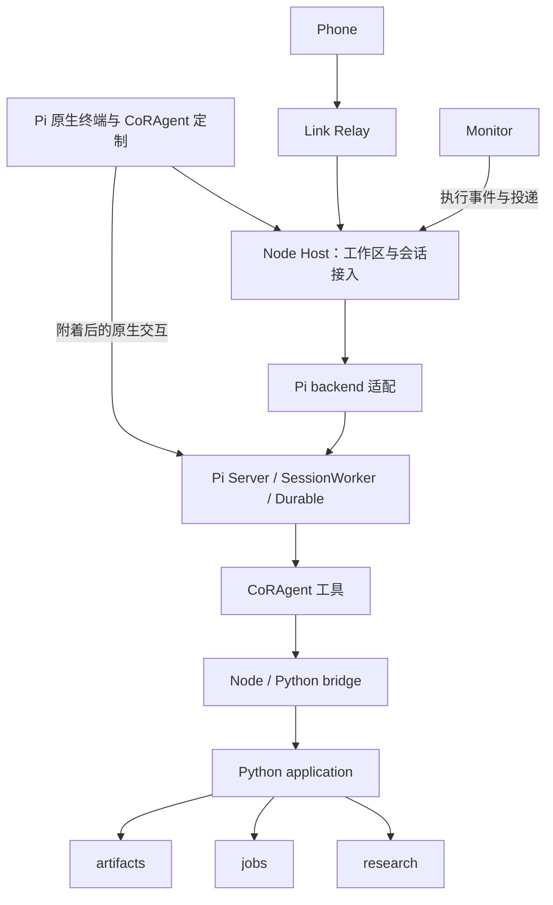

# CoRAgent 代码结构与命名重构方案

日期：2026-10-09。

状态：已进入实施与验收。本文件保留设计依据和验收条件；当前实现、验证结果及未验证范围以[实施记录](CORAGENT_REFACTOR_STATUS.zh-CN.md)为准，不表示已经部署。

最新约束：用户已明确手机端会随后同步修改。本方案直接采用新的产品、协议和凭据命名，不要求兼容旧版手机端，不为旧命名增加双协议或别名实现。

设计依据是当前工作区源码，包括尚未提交的 Research Memory 改动。实施时必须先记录新的基线，不能直接按旧 Git HEAD 覆盖当前工作区。

## 1. 设计结论

保留现有 Pi SDK、Pi Server、Durable Harness、SessionWorker 和原生终端。CoRAgent 自己的代码收敛为：

1. 一个 Node Agent 应用：Host、Pi 集成、工具适配、原生终端定制及连接入口。
2. 一个 Python 分发包：使用 `research_agent` 命名空间，内部保留研究、计算、材料、应用协调、基础设施、启动六个职责边界。
3. 一个共享 Link 库和一个独立 Relay 服务。
4. Pi 原生 Skills/资源包、科学执行声明、Web 组件和手机客户端。

能力复用原则：Pi 已提供且适用于当前 Durable 通路的能力优先直接使用。自有代码只保留科研业务、安装边界和必要的适配，不把现有 extension 框架仅仅换名搬家。具体安排见第 8.4 节。

产品名称采用 **CoRAgent**，Python import 名称采用 **research_agent**。`Pi` 保留在上游依赖、集成目录、配置及补丁名称中。

本次重构的成功标准是：一个功能的修改位置更集中；一份事实只有一个负责人；新增普通文件无需同步维护多份路径清单；安装后的真实 Pi、终端和后台流程保持工作，Phone 按新合同后续联调。

### 1.1 技术路线：Pi 宿主集成与原生扩展结合

当前推荐继续使用 Pi SDK/Server/Durable 承担 Agent 运行，以 Pi 原生资源包和当前运行通路支持的扩展承载科研能力；Host/Relay 保留多端接入和安装级生命周期。SDK 与 extension package 并非互斥选项，package 是能力分发方式，SDK/Server 决定宿主如何运行和控制 Agent。

| 路线 | 适合的目标 | 对当前项目的代价与判断 |
| --- | --- | --- |
| 普通 Pi Agent + extension package | 以本地终端为主，为标准 Pi 增加科研工具、Skills 和命令 | 最直接复用普通 CLI 的行为；但手机接入、设备管理、后台会话与 Monitor 仍需宿主服务，不能只打包 extension 就替代现有系统 |
| Pi SDK/Server/Durable + 科研扩展 | 多端共享后台 Agent，会话由服务持有，同时保留 Pi 终端和科研工具 | 与当前产品目标最匹配；要集中实验性接口、减少自定义 prompt/loader/registry 包装，并维护能力验收 |
| LangChain，持久流程结合 LangGraph | 优先建设自有 Agent 产品、显式图流程或需要其生态集成，愿意重新选择终端与服务架构 | 可提供模型/工具抽象与流程能力，但不会直接保留 Pi 终端、Pi 工具语义和现有 Durable 会话；需要运行时迁移及恢复语义重新验收，不适合作为本次结构整理的替代动作 |

当前方案的成本不能只称为“SDK 开发成本”：普通公开 `createAgentSession` SDK 与项目采用的 source-only experimental Server/Durable 是不同入口。固定版本、内部路径和实验性服务缺口是需要持续承担的集成成本；重构只能缩小受影响范围，不能把接口变为稳定接口。

科研 Skills、资源和可分发能力优先采用 Pi package 组织；业务工具调用同一份 Python application。普通 CLI ExtensionAPI、Durable 工具注册与 session/TUI facet 分开适配，不能假设同一入口文件在所有模式通用。本轮只交付现有 Server/Durable 通路，不为了“可插件化”额外建设第二套 CLI 运行模式或自定义插件发现框架。以后确需支持普通 Pi CLI 时，再添加薄入口并单独验证，其业务实现可以共享。

如果产品目标改成单机终端科研助手，应重新评估普通 Pi Agent + package，以减少自有宿主代码；如果需求变成以明确的图流程和人工审批节点为中心、并愿意放弃当前 Pi 终端/运行时约束，再评估 LangGraph。当前没有仅因目录混乱就更换 Agent 引擎的依据。

## 2. 范围和明确保留的能力

### 2.1 实施范围

- 重组 Node 源码与内部依赖，集中 Pi 实验性接口接入。
- 合并 Python 源码根目录，将六个顶层 import namespace 迁入 `research_agent`。
- 将工具定义、参数适配和结果处理按 research、jobs、artifacts 集中。
- 将 Skill 资源、Durable 工具插件和科学执行声明拆开，复用 Pi 的原生加载/注册能力，移除重复 extension 外壳。
- 合并经确认不承担额外语义的转发包装。
- 统一产品名称、内部类名和内部配置访问方式。
- 简化构建清单、资源定位、安装入口、测试发现和生成类型的维护。
- 更新必要的文档、扩展清单、CI 和跨仓库联调配置。

### 2.2 保留项

| 项目 | 本次安排 |
| --- | --- |
| Pi 版本 | 固定当前 `v1.0.4`、提交 `7c10bd4337495ee613f2224843ecdf349b80d1df`；升级另立任务 |
| Agent loop、模型调用、压缩 | 继续由 Pi 执行 |
| 会话、Durable SQLite、输入消费状态 | 继续由 Pi 持有 |
| Pi Server 与 SessionWorker | 继续使用当前集成方式，调整适配代码的组织位置 |
| 原生终端 | 继续使用 Pi 编辑器、渲染和交互能力，整理自己的定制 |
| Node Host | 继续拥有公共 Host API，不迁到 Python |
| Python bridge | 继续采用受管 Python 进程与现有消息语义 |
| 研究存储 | 保持 Research Memory 数据结构、事务与引用语义；自有持久化类型标识的改名单独登记版本影响 |
| 科学计算 | 保持本地、远程及已配置平台的执行方式 |
| Relay | 保持现有 Link 通路，不切换 Radius |
| Web 与 Phone | 保留产品能力；自有协议统一新命名，Phone 后续同步修改 |

不加入新的数据库方案、通用插件框架、消息队列产品、全局事件溯源或第二套会话状态机。目录调整不包含把既有旧图/notebook 数据迁移成 Research Memory 的功能。

## 3. 当前问题与源码依据

| 观察 | 源码依据 | 对维护的影响 |
| --- | --- | --- |
| 六个 Python 目录由同一个 wheel 发布 | [pyproject.toml](../pyproject.toml)、[wheel 构建](../scripts/_wheel.py) | 每个源码根需要重复登记、复制和设置搜索路径 |
| Node 工具定义和执行散落 | [工具定义](../packages/agent-runtime/host-api/tools.mjs)、[工具实现](../apps/app-server/pi-native-tools.mjs) | 修改一个工具需要跨多个历史 package 查找 |
| 工作区与 bridge 存在包级双向依赖 | [workspace](../packages/agent-core/workspace.mjs)、[bridge](../packages/runtime-bridge/python_kernel_bridge.mjs) | `agent-core` 的名字无法表达真实依赖方向 |
| bridge 用仓库文件路径启动 Python | [bridge 启动器](../packages/runtime-bridge/python_kernel_bridge.mjs)、[Python worker](../packages/coragent-runtime/coragent_runtime/bridge_worker.py) | 移动目录会影响启动；源码布局与安装环境耦合 |
| Pi 内部路径在多个应用文件中导入 | [Worker](../apps/app-server/pi-session-worker.mjs)、[backend](../apps/app-server/coragent-harness-backend.mjs) | 上游升级和路径调整的检查范围不清楚 |
| 发布规则包含大量具体文件路径 | [npm 清单](../package.json)、[发布清单](../scripts/package_inventory.py) | 新增或移动文件需要多处人工同步 |
| 启动器负责较多互不相同的事项 | [launcher](../packages/coragent-bootstrap/coragent_bootstrap/launcher.py) | 安装定位、服务连接、终端启动等修改容易相互影响 |
| 空目录和旧命名残留 | `agent-contracts`、`research-state`、旧 UI 子目录等 | 难以识别当前有效模块 |
| Skill、工具插件、科学执行声明共用 extension 名称 | [core manifest](../extensions/core/manifest.json)、[chemical manifest](../extensions/chemical/manifest.json)、[server tools manifest](../apps/app-server/server-tools/extensions.json) | 资源包被当成执行框架，出现多份发现和工具清单 |
| 已使用 Pi 的 Skill loader，但仍手写 Skill 提示和路径别名 | [Worker](../apps/app-server/pi-session-worker.mjs)、[提示组装](../apps/app-server/system-prompt.mjs)、[路径解析](../apps/app-server/skill-paths.mjs) | 重复维护 Pi 已有的描述、位置和相对路径规则 |

以上是组织与维护问题，不等于相应运行能力已经损坏。现有测试结果不能自动作为新结构的验收证据。

## 4. 运行架构与所有权



图表示逻辑职责，不能据此增加进程。保留当前 Host、Pi 协调器、SessionWorker、受管 Python worker、Monitor 和 Job supervisor 的实际生命周期。

| 事实或资源 | 唯一负责人 | 其他模块可以做什么 |
| --- | --- | --- |
| Pi 会话、对话、模型执行、输入消费 | Pi Durable / SessionWorker | 请求操作、读取投影、订阅状态 |
| 工作区路由、客户端接入、会话绑定 | Node Host | 通过 Host 接口请求 |
| 原始需求、Node、Result、关系和读依据 | Python research | 通过应用命令读写；生成只读视图 |
| 已提交 Job 的执行及收集回执 | Python jobs，与 application 协作接入研究语义 | 查询、提交明确的取消或收集请求 |
| 固定文件内容、材料来源和清单 | Python artifacts | 注册、读取和引用具体版本 |
| 事件待投递身份和重试 | Python application.monitor；Host 执行入队接入 | 查询投递状态；通过 Pi 证明实际消费 |
| workspace 文件事务 | Python foundation.transactions | bridge 调用同一个写入方 |
| 设备绑定、令牌和撤销 | Relay | 查询设备、申请配对、撤销连接权限 |

Host 的其他变更回执、Job 回执与 Pi 输入回执保留各自职责。不得为了“统一”而把它们合成一个推测所有操作状态的表。

## 5. 目标目录

```text
coragent/                         # 目标仓库显示名；本次文档不移动工作区
  package.json                         # Node 依赖、任务及产品版本
  package-lock.json
  coragent                       # 新的规范客户端入口
  libexec/
    coragent-host                # 服务入口

  apps/
    agent/
      main.mjs                         # 进程组装、监督与关闭
      host/
        server.mjs                     # Host RPC 分发
        sessions.mjs                   # Host 会话操作与订阅
        workspaces.mjs                 # 工作区初始化/目录客户端
        admission/                     # 输入、Monitor、会话准入
        monitor/                       # Node Monitor 接入与通知
      pi/
        source.mjs                     # 固定 Pi 源码与依赖解析
        backend.mjs                    # Pi backend 的应用接口
        worker.mjs                     # Pi Worker 入口
        setup.mjs                      # Harness 和扩展组装
        coding-tools.mjs               # 七个 Pi 基础工具的唯一注册入口
        tool-adapter.mjs               # 普通 Pi 工具到 Durable 的最小接口适配
        services/                      # 提供给原生客户端的自有服务
        client.mjs                     # 原生客户端启动与附着
      tools/
        research/                      # 研究工具参数、执行、输出整理
        jobs/                          # Job 工具适配
        artifacts/                     # Artifact 工具适配
        registry.mjs                   # 仅汇总实际工具工厂
        context.mjs                    # 可信调用上下文
        envelope.mjs                   # 公共执行边界
      terminal/
        main.mjs                       # 终端连接/退出的产品入口
        commands/                      # 自有 slash 命令
        renderers/                     # 工具显示
        status/                        # footer、usage、Monitor
        themes/
      bridge/
        client.mjs                     # 绑定 workspace 的命令客户端
        transport.mjs                  # JSONL、超时和进程清理
        transactions.mjs               # Python 事务调用接口
      resources/                       # Pi 资源入口适配、受管路径与发布校验
      transport/
        host-client.mjs                # 通用 Host RPC 客户端
        ssh.mjs                        # SSH 与 Unix socket 代理
        link.mjs                       # Host 侧 Link 桥
        browser.mjs                    # 现有浏览器连接适配
      platform/
        environment.mjs                # 新命名的启动配置入口
        resources.mjs                  # 发布资源定位

    agent-cli/                         # 保留现有 CLI/网页 provider 薄入口

  backend/
    pyproject.toml                     # 单一 Python 构建项目
    src/
      research_agent/
        __init__.py
        _version.py                    # 由产品版本生成并校验
        research/
        jobs/
        artifacts/
        application/
          api.py                       # 命令分发与公共错误边界
          bridge_worker.py             # -m 启动的 Python worker
          execution.py                 # 研究关联与任务业务协调
          evidence.py                  # 材料业务协调
          monitor.py                   # 执行事件与 outbox
          context.py                   # 组合领域数据供 Agent 使用
        foundation/
        bootstrap/

  packages/
    link/                              # Node Host 和 Relay 共用

  services/
    relay/                             # 独立服务、独立 package/lock

  contracts/
    commands/                          # 业务命令和工具参数的共享声明
    host/                              # 新命名的 Host 协议文档与 fixtures
    link/                              # Link 协议文档与 fixtures
    ...                                # Web、Monitor、科学执行声明等合同

  skills/
    research-memory/                   # 研究记录工具的详细用法
    research-workflow/                 # 从 orchestration 整理的科研工作流程
    email/                             # 邮件说明及附属资源
  prompts/
    coragent.md                  # 必须常驻的简短产品原则
  domains/
    chemical/
      package.json                     # Pi 原生 pi.skills 等资源声明
      skills/                          # 化学 Skills、脚本和参考资料
      execution.json                   # executor/validator 等科学业务声明
      environments/                    # 已有科学环境锁与要求
  components/coragent-web/                   # 保持独立 Web 组件边界
  config/
    pi-source.json
    pi-patches/
    identity.json                      # 产品自有协议、服务和凭据前缀的规范名称
    source-layout.json                 # 少量源码根、入口、资源规则
  scripts/                             # 构建、安装、生成与校验
  tools/test/                          # 现有统一测试入口
  tests/                               # 按功能归属整理，保留测试分层
  docs/
```

该树是职责定位，不要求机械创建所有示例文件。只有出现实际内容才建目录；小模块保持一个文件。业务源码不再每个目录都增加独立 manifest 或版本。

## 6. 迁移映射

### 6.1 当前 packages

| 当前路径 | 目标 | 处理方式 |
| --- | --- | --- |
| `packages/agent-contracts/` | 无 | 清理空目录；有效合同归各自实际协议 |
| `packages/agent-core/` | `apps/agent/host/` 和共享协议校验入口 | workspace 业务客户端归 Host；ID/模式规则由合同定义，bridge 不反向 import Host |
| `packages/agent-runtime/host-api/` | `apps/agent/tools/`、`terminal/commands/`、`pi/` | 按函数实际职责拆分，合并重复提示词组装 |
| `packages/agent-runtime/transactions/` | `apps/agent/bridge/transactions.mjs` | 保留事务语义与 Python 唯一写入方 |
| `packages/agent-runtime/agent-core/`、`agents/` | 无 | 清理已废弃空目录 |
| `packages/agent-ui/themes/` | `apps/agent/terminal/themes/` | 移动主题及资源引用 |
| `packages/runtime-bridge/` | `apps/agent/bridge/` | 分离传输、workspace 绑定和事务接口 |
| `packages/research-memory/research_memory/` | `backend/src/research_agent/research/` | 领域行为与存储格式保持一致 |
| `packages/job-runtime/job_runtime/` | `backend/src/research_agent/jobs/` | 保留平台接口、worker、执行环境和回执 |
| `packages/artifact-store/artifact_store/` | `backend/src/research_agent/artifacts/` | 保留 payload、manifest、版本与来源语义 |
| `packages/coragent-runtime/coragent_runtime/` | `backend/src/research_agent/application/` | 命令、执行、证据、上下文和 Monitor 协调 |
| `packages/coragent-foundation/coragent_foundation/` | `backend/src/research_agent/foundation/` | 公共事务、IO、布局、环境和扩展目录 |
| `packages/coragent-bootstrap/coragent_bootstrap/` | `backend/src/research_agent/bootstrap/` | 启动、probe、link 配置、会话保护 |
| `packages/coragent-link/` | `packages/link/` | 保留帧结构，协议标识与凭据前缀同步改名 |
| `packages/research-state/` | 无 | 确认所有实际内容已退出后清理 |

### 6.2 当前 apps/app-server 的主要文件

| 当前文件或文件组 | 目标区域 |
| --- | --- |
| `pi-app-server.mjs` | `apps/agent/main.mjs`，仅做进程组装和监督 |
| `coragent-host.mjs` | `host/server.mjs`、`host/sessions.mjs`、`host/workspaces.mjs` |
| `coragent-harness-backend.mjs` | `pi/backend.mjs` |
| `pi-session-worker.mjs` | `pi/worker.mjs` 与 `pi/setup.mjs` |
| `pi-runtime-deps.mjs` 及散落的 Pi 路径导入 | `pi/source.mjs` |
| `input-admission`、`session-admission`、`monitor-admission` | `host/admission/` 中的接入策略；Pi hook 绑定放 `pi/setup.mjs` |
| `decision-context`、`user-sources` | 工具/业务上下文适配；Pi hook 注册集中在 `pi/` |
| `pi-native-tools`、`server-tools/core-tools` | `tools/research`、`tools/jobs`、`tools/artifacts` 与 registry |
| `execution-runtime`、`evidence-runtime`、`research-native-kernel` | 检查 workspace/恢复/身份语义后，分别并入工具适配或 bridge client |
| `system-prompt` 与 host-api 下的同类文件 | `pi/` 下的单一提示词组装入口 |
| `coragent-client-queries` | `pi/services/`；其消费的纯查询逻辑可在对应业务适配中 |
| `pi-native-client` | `pi/client.mjs` |
| `coragent-terminal-client`、`coragent-terminal-session`、`coragent-terminal-errors` | `terminal/` |
| `coragent-native-client-facet`、`coragent-command-panel` | `terminal/commands/`，通过公开 Pi 接口消费 |
| `coragent-tool-renderers`、`coragent-document-view` | `terminal/renderers/` |
| `coragent-status-presentation`、`coragent-monitor-subscription` | `terminal/status/` |
| `coragent-host-client`、`coragent-host-proxy` | `transport/host-client.mjs`、`transport/ssh.mjs` |
| `coragent-link-host`、`coragent-browser-gateway` | `transport/link.mjs`、`transport/browser.mjs` |
| `pi-monitor-worker` | `host/monitor/` |
| `workspace-catalog`、`workspace-mode-tools` | `host/workspaces.mjs` 与必要的小模块 |
| `extension-manifest-loader`、`server-extension-loader`、`skill-paths` | 按 8.4 拆解：Pi 负责 Skill 加载与工具注册；资源校验归 `resources/`，执行描述归 `domains/`；删除重复加载和 read 路径别名 |
| `job-query-recovery` | `tools/jobs/`；保留恢复与查询约束 |

迁移清单实施时必须枚举当时全部文件，给每个文件标记 moved、split、merged 或 retired。此表指导归属，不作为遗漏文件的许可。类型声明、测试 fixtures、worker 路径和扩展加载器必须与实现一起更新。

### 6.3 当前 extension 与资源

| 当前路径/机制 | 目标 | 处理方式 |
| --- | --- | --- |
| `extensions/core/skills/research-memory/` | `skills/research-memory/` | 保留当前 Research Memory 语义，按 Pi Skill 规范加载 |
| `extensions/core/skills/orchestration/` | `skills/research-workflow/` | 明确为科研指导；去重，稳定必需原则移入简短产品 prompt |
| `extensions/core/manifest.json` | 根 `package.json` 的 `pi.skills` 与发布资源清单 | 删除自有 core extension 身份和强制双 Skill 启动门槛 |
| `extensions/email/` | `skills/email/` | 普通 Pi Skill，保留脚本和实际邮件配置能力 |
| `extensions/chemical/` | `domains/chemical/` | Pi 资源声明与科学执行声明分离；保留环境锁、脚本和验证能力 |
| `apps/app-server/server-tools/extensions.json` | `tools/registry.mjs` 的实际工厂 | 移除内置工具的第二份人工清单，直接注册 Durable tools |
| `extensions/profile.ts` | 实际 Pi 资源声明及必要的产品配置 | 去掉重复的 Skill 路径/版本列表；剩余真实消费者再分别迁移 |
| 各 Skill `resources.json` | 确定性发布资源清单 | 完整性校验保留，但不要求每个普通 Skill 手工维护自有格式 |

### 6.4 Python 命名空间

```text
research_memory   → research_agent.research
job_runtime       → research_agent.jobs
artifact_store    → research_agent.artifacts
coragent_runtime      → research_agent.application
coragent_foundation   → research_agent.foundation
coragent_bootstrap    → research_agent.bootstrap
```

更新范围包括 import、`python -m`、子进程 argv、远程上传 worker、测试 monkeypatch、`importlib.resources`、wheel 检查、扩展脚本和文档示例。

实现阶段不在新 wheel 中长期保留六套旧 namespace 别名。旧 release 继续使用其原有完整 wheel；新 release 安装新的 wheel overlay。跨 release 的回退依靠完整发布物，而不是让一个 Python 进程混用两套实现。

## 7. 模块接口与依赖规则

### 7.1 Node 应用

- `main` 创建依赖并注入；其他模块不通过 import `main` 获取实例。
- `host` 依赖 Pi backend 的应用接口，不拼接 Pi 源码路径。
- `pi` 负责上游 Server/Worker/Harness、内部 API 和生命周期适配。
- `tools` 依赖 workspace 绑定的 bridge client 与可信 context，不管理 Pi Server 生命周期。
- `bridge/transport` 依赖标准库与传输合同，不 import Host、Pi 或工具实现。
- `terminal` 使用原生 Pi 客户端以及需要的公共工具元数据；工具模块不 import 终端组件。
- `transport` 负责连接，不决定研究结果或维护另一个输入状态机。
- `resources` 只做受管资源路径与发布完整性边界；Skill 解析/展示使用 Pi，工具/服务实际装配由 `pi/setup` 调用。
- `packages/link` 只含可共享的传输规则；不 import Agent 应用或 Relay 数据库。

Pi 的公开 SDK 类型和公共工具 API 可以在必要的适配位置使用。实验性源码路径、内部 transaction primitive、非公开 compaction API 等只允许在 `pi/` 适配边界出现。测试可直接验证相应边界，但不能成为运行时的间接入口。

Pi backend 提供的能力以现有接口为基准：连接/关闭、会话列出/创建/读取/附着、输入提交/状态、打断、模型操作与事件订阅。不会为了统一命名强行更改请求语义。

### 7.2 Python

```text
CLI / bridge_worker
        ↓
    application
   ↙     ↓      ↘
research jobs artifacts
   ↘     ↓      ↙
     foundation
```

- `application` 组合领域数据，拥有命令分发、研究与 Job 的绑定、执行准备和 Monitor 协调。
- `research` 不 import `application`、执行启动器或平台实现。
- `jobs` 保持通用执行能力；研究 Node 的业务校验由 `application` 承担。
- `artifacts` 管固定材料及来源；研究结论关联由 `application` 与 `research` 完成。
- `foundation` 不反向 import 业务模块。
- 领域间现有必要依赖先登记；新依赖优先通过参数、明确 DTO 或 application 协调，不新增彼此内部实现的循环 import。
- `bootstrap` 只处理启动、环境、安装布局和入口选择；它不编排科研流程。

依赖检查基于 import 关系，并验证生成代码、动态模块加载和打包后的入口；不只搜索旧目录名称。

### 7.3 生命周期

Python worker 以受管解释器执行 `python -m research_agent.application.bridge_worker`。源码测试只配置一个受控 `backend/src` 搜索根；安装测试必须从 wheel 加载，不能依赖 checkout 上的源码兜底。

每个 bridge 的所有者明确关闭子进程、流、定时器和待决请求。保持当前 workspace 隔离，不为了减少进程而把全部会话合并进一个全局 Python worker。超时不自动证明业务失败，不能自动重放有副作用的请求。

Pi worker 清理、Host 清理与原生终端退出分开：退出客户端释放连接；关闭 Host/worker 遵循现有 durable 恢复约定；Job 是否独立存活由当前 Job supervisor 合同决定。

## 8. 命令、类型和工具定义

### 8.1 三种合同分别管理

| 合同 | 面向谁 | 内容 |
| --- | --- | --- |
| 工具参数 | 模型与 Pi | 模型可填写字段、描述、输出约束 |
| 应用命令 | Node/Python、CLI | 业务参数、可信 context、返回值与错误 |
| Host/Link 协议 | Phone、终端、Relay | 连接、路由、事件与请求关联 |

三者共享能够一致表达的字段定义，但不能因为生成代码而把可信 `workspace_id`、session identity、producer token、read basis 等暴露给模型填写。

### 8.2 唯一来源

在 `contracts/commands/` 按 research、jobs、artifacts 保存命令声明和共享 JSON Schema。选择仓库既有工具可完整支持的 schema 特性；保留封闭字段、required、枚举、数值边界和条件校验语义。

从声明生成：

- Python 命令目录与结构校验所需资源。
- TypeScript 参数/结果类型和结构校验输入。
- 能直接共享的工具参数 schema。
- 协议 fixtures 与文档索引。

工具描述、Pi effect/replay 元数据、结果裁剪和展示由工具模块维护。验证版本并发、权限、科学语义和副作用的规则仍在业务实现里。已经存在的 `update_tool_types` 功能纳入生成入口，不另建第二个类型生成权威。

生成器提供 `--check`；测试同时包含非法输入与稳定的手写 golden cases，避免生成物自己证明自己正确。字段合并只有在模型参数和命令字段确实同义时进行。

### 8.3 一个功能的目标修改范围

| 修改 | 应主要涉及 | 不应被迫涉及 |
| --- | --- | --- |
| 研究结果保存规则 | `research/results` 与领域测试 | Pi 路径加载、Relay、安装布局 |
| 研究工具参数 | 对应命令声明、`tools/research`、测试 | 多份手写类型和参数枚举 |
| 新平台 | `jobs` 的平台实现、配置和测试 | Node Host 的平台条件分支 |
| Node 与 Job 关联规则 | `application/execution` 和测试 | 通用 Job worker 的科研逻辑 |
| Pi 升级 | `pi/`、补丁、相关验证 | 全仓散落的 experimental imports |
| 终端 footer | `terminal/status` | Python 领域实现 |
| 普通源码文件新增 | 所属模块及测试 | 多处文件路径列表 |

这些是评审标准，不以“调用层数越少越好”代替正确性。

### 8.4 直接复用 Pi 的 Skills、资源与 Durable 扩展能力

#### 当前事实

当前 `extensions/core` 有两个 Skill：`research-memory` 和 `orchestration`。前者已经说明 Node、不可变 Result、关系、读依据和五个研究工具，不能把它当作旧 `research-state` 的实现。后者是科研工作流程指导，不是执行任务图或运行第二个 Agent loop 的调度器。

当前几个 manifest 的内容不同：

| 资源 | 当前内容 | 新设计定位 |
| --- | --- | --- |
| core | 2 个 Skills | 产品自带的普通 Pi Skills |
| email | 1 个 Skill 及脚本资源 | 普通 Pi Skill |
| chemical | 13 个 Skills、12 个 executors、4 个 validators、2 个 acceptance profiles | Pi 资源包 + 科学执行声明 |
| core-tools | 一份自有 factory manifest，列出研究/Job/Artifact 工具 | 直接组成一个或多个 Pi Durable extensions |

数量来自方案编写时的源码，实施时重新盘点。没有依据把 chemical 当成只有 Markdown 的目录，也不能把 Pi 会话持久化等同于科研问题、证据和科学验证。

当前已经复用了 Pi：Worker 调用 `loadSkills()`；工具通过 `createRegistry()`、`defineExtension()`、`registry.install()` 注册；上下文与输入相关代码使用 Durable hooks。需要收敛的是这些接口外面的重复清单和加载框架。

#### Pi 原生能力与自有职责

| 能力 | 目标实现 |
| --- | --- |
| `SKILL.md` 解析、frontmatter、描述和路径 | Pi `loadSkills()` |
| available skills 提示、按需读取与相对路径说明 | Pi `formatSkillsForPrompt()` 或当前通路的原生 prompt sections |
| Skill、prompt、theme 的资源声明 | Pi `package.json` 的 `pi.skills` / `pi.prompts` / `pi.themes` |
| 工具注册、执行 hooks | Pi Durable `defineExtension` / `defineTool` / registry / hooks |
| session/TUI 服务和插件生命周期 | 当前 Server 通路的 Chord facets 与 Pi plugin 机制 |
| 研究对象、Job、材料及科学执行描述 | CoRAgent 自有业务模块 |
| 发布固定版本、受管目录、文件摘要和安装权限边界 | CoRAgent 构建/安装与薄资源适配 |

Pi 1.0.4 的普通 `ExtensionAPI`、Durable `defineExtension` 和 experimental session/TUI facets 是不同接入面。不能因为它们都叫 extension，就假定普通 CLI 插件直接放进当前 SessionWorker 可以运行。每一项复用先在当前固定版本的真实 Worker 中验证，不引入第二套 Agent runtime。

#### Skills 与产品原则

保留两个角色明确的 Skill：

- `research-memory`：怎样使用研究工具、记录 Result、处理冲突和引用材料。
- `research-workflow`：怎样拆解科研问题、选择领域 Skill、检查计算证据并形成结论。

它们按任务需要读取。运行时必须始终执行的要求由工具/API 校验保证；必须始终告诉模型的少量原则由 `prompts/coragent.md` 通过 Pi prompt section 装配。把文件放进 `prompts/` 或声明 `pi.prompts` 并不等于自动成为系统指令，必须区分原生用户模板与显式常驻 section。

删除 Worker 对两个 Skill 名称的硬编码启动依赖。资源损坏仍由安装完整性检查或 Pi 资源诊断报错；该检查不再把某两个 Skill 的存在当作模型调用和会话恢复的前提。不会再要求每轮先读两份 Skill 才能调用工具，也不把 Skill 中的文本当作权限控制或执行状态机。

Pi 提供通用 Agent loop，但不包含 CoRAgent 的科研方法说明与研究数据模型。这部分内容需要我们维护；通过原生 Skill 机制表达即可。

#### 资源发现与路径

根 `package.json` 用 `pi.skills` 声明产品 Skills；chemical 使用本地 Pi 资源包声明。安装时解析固定的本地包和版本，取得允许的 Skill 路径，再由当前 Worker 的薄资源入口交给 Pi loader。

优先复用固定版本中可用的 Pi 包解析接口；若 experimental Harness 没有自动消费普通 package resources，则只补充这一段明确的路径适配，不能恢复一套自定义 Skill 语法/注册表。不能直接实例化会顺带加载普通 CLI 扩展的 ResourceLoader 而假定它适用于 Durable。

使用 Pi 原生描述提供的 Skill 绝对路径，以及 Skill 目录相对引用规则。迁移文档和 references 后，移除原生 `read` 工具上的自定义 `skill:<name>/...` 别名转换。科学执行请求中已有的资源身份/引用是另一种业务合同，须独立核对消费者，不能随着 read 别名一起删除；实际脚本仍须解析到受管且校验过的文件。

保持安装级资源的明确选择，不因复用 loader 就自动把任意 workspace 的可执行插件带入 Host。按需正文加载、同名诊断、禁用 Skill 和重新加载行为都通过真实 Worker 验证。普通 CLI 文档中的 `/skill` 和 `/reload` 能力不自动视为 experimental TUI 已经具备。

#### 内置工具与可选插件

研究、Job 和 Artifact 工具由实际工厂创建后直接注册到 Pi Durable registry。删除 `core-tools` 的动态导入 factory 外壳和人工工具名重复列表；仍保留工具碰撞检查、可信 workspace/session 注入、参数校验、权限/副作用边界、取消和结果裁剪。

可选可执行插件采用当前 Pi session/TUI facet 或 Durable 接入方式。先盘点已安装消费者；当前 core/email/chemical manifest 均未声明 `server`，不能为了一个未使用的通用 `server` 字段长期维护第二套插件加载框架。若实施时发现真实外部消费者，迁移到对应 Pi 接入面并验证，不静默丢弃其能力。

发布文件摘要校验继续在统一安装/资源层执行。SHA-256 完整性记录不等于发布者签名，重构说明与错误信息不能混淆两者。

#### 科学执行声明

chemical 的 executor、validator、acceptance profile 继续保留，放到 `domains/chemical/execution.json`，只描述 Job 所需的脚本、输入输出、环境、验证和版本。它不再兼管通用 Skill 发现、TUI、工具注册或 Agent 编排。

Node 侧只读取必要的资源/入口合同。科学执行声明的业务校验由 Python application/jobs 统一持有，避免 Python 为获得科学定义再启动 Node extension loader。具体脚本、输入和依赖的完整性继续在准备/执行边界校验。

#### 本项验收

- 普通 Skill 只需 Pi 标准目录及资源声明；新增 Skill 不需要再改 core manifest、profile 和人工 skills 清单。
- 原生 Skill 描述出现一次，正文按需读取，相对 references 与脚本路径可用。
- 两个科研 Skill 的重复内容减少，必要约束存在于明确的 prompt 或代码校验中。
- 研究、Job、Artifact 工具在真实 Durable registry 中正常执行，无重复注册或第二个 bridge 实例。
- chemical 的执行准备、资源身份、验证、环境检查和证据语义保持，跨语言不再循环发现目录。
- 安装后的路径校验、受管资源选择、摘要验证与插件访问边界仍成立。
- 删除旧加载框架前，所有实际资源和外部插件消费者已在迁移清单中有去向。

参考固定 Pi 源码中的 `packages/coding-agent/src/core/skills.ts`、`src/experimental/durable/prompt.ts`、`src/experimental/durable/harness-setup.ts`、`src/experimental/services/README.md`，以及 `docs/skills.md`、`docs/packages.md`。这些上游文件负责证明 API 能力；对应的真实 Worker 测试负责证明本项目中的集成有效。

### 8.5 Pi 能力覆盖与差异验收

使用 Pi SDK 不等于自动继承普通 Pi CLI 的全部功能。本方案保留 Pi 引擎和当前 Server/Durable 接入，但不能把普通 `InteractiveMode`、实验性 `ExperimentalClientTui` 与 SDK 当作同一功能面。当前固定源码为 Pi v1.0.4；整理目录不会自动升级上游或补齐实验性服务。

| 能力 | 当前接入与边界 | 重构要求 |
| --- | --- | --- |
| Agent 执行、模型、流式输出、压缩、Durable 会话 | 由 Pi Harness、ModelRuntime、SettingsManager 和 SQLite storage 承担 | 继续使用 Pi 实现，通过真实会话验证配置与恢复行为 |
| 原生工具 | Worker 明确注册 read/write/edit/bash，并加入科研工具 | 记录实际工具清单，不把依赖包中存在的其他工具视为已启用 |
| Skills 与系统提示 | 使用 Pi loader，但 `includeDefaults: false`，资源范围和提示由本项目定制 | 按第 8.4 节复用原生解析与提示格式；明确默认资源发现策略 |
| 终端交互 | 使用官方实验性远程客户端，复用原生编辑器和渲染 | 逐项记录命令、快捷键、主题、渲染和插件支持；不得宣称等同普通 CLI |
| 插件、提示模板与包资源 | 普通 CLI ExtensionAPI 与 Durable/session/TUI facet 入口不同 | 逐项确认当前入口支持并实际加载；声明资源不等于接入成功 |
| 树导航、分支与完整历史 | 上游实验性服务尚缺完整导航；Transcript 只覆盖最近 reset/compaction 后的活动上下文 | 区分 Durable 底层原语与产品可用功能；需要时单独设计导航与历史分页 |
| 子 Agent | 上游实验性服务目前只暴露 root conversation | 不把底层能创建 conversation 当作终端/Host 已具备子 Agent 产品能力 |

P0 建立能力清单，逐项记录：上游版本和入口、当前配置、实际可见行为、属于上游限制还是本项目未接入、迁移后的验证方式。未核实的 MCP 或第三方插件等能力不得标记为已支持。P4 必须证明已接入能力没有因适配收敛而丢失，并记录仍存在的差异。

对于本项目替换掉的 Pi 默认配置，逐项说明科研约束或安装边界是否确实需要该定制；没有必要的包装回归原生实现。对于上游实验性服务缺口，单列后续功能任务，不在目录重构中重写一套 Agent 引擎，也不以“100% 继承 Pi”作为未经验证的完成声明。

核心能力是不允许退化的交付条件：Pi 驱动的模型请求、增量输出、工具调用、工具结果回传及后续模型生成必须形成完整循环。`read/write/edit/bash` 必须保留 Pi 原生实现并在安装产物的真实 Worker 中可用，不能仅以注册成功或 mock 测试通过作为验收。自有 hook、科研上下文和工具适配不得截断该循环；取消、错误传播和工具执行策略的变化必须显式记录并验证。

工具范围以所用入口为准：固定版本的 `pi-durable/tools` 中，`CodingTools` 包含 `read/write/edit/bash`；普通 coding-agent 工具目录还提供 `grep/find/ls`。当前 Worker 明确注册前四项；目标将 grep/find/ls 三项一并接入，形成第 8.6 节规定的七工具基线。上游未来新增工具仍需升级审查与接入验证，不自动启用。

依据：项目 `config/pi-source.json`、`docs/TERMINAL.zh-CN.md`、`apps/app-server/pi-session-worker.mjs`、`apps/app-server/pi-native-client.mjs`，以及固定上游源码的 `packages/coding-agent/src/experimental/services/README.md`。

### 8.6 补齐搜索与目录工具

#### 目标与实现归属

默认基础工具清单固定为 `read/write/edit/bash/grep/find/ls`，七项均纳入本轮交付，不把新增三项留为可选后续工作。基础工具不依赖科研 Skills；科研工具通过同一个 Pi registry 追加。基线只支持 research 工作区，本次不新增 light 模式。

| 工具 | 实现来源 | 接入方式与依赖 |
| --- | --- | --- |
| read/write/edit/bash | Pi Durable 原生工厂 | 保留现有能力，统一在 `pi/coding-tools.mjs` 组装 |
| grep | Pi coding-agent `createGrepTool` 或对应 ToolDefinition | 经最小 Durable adapter 接入；使用 Pi 的 schema、搜索、忽略规则和结果裁剪；需要 `rg` |
| find | Pi coding-agent `createFindTool` 或对应 ToolDefinition | 经同一 adapter 接入；保留 glob 与 `.gitignore` 语义；需要 `fd`，核对上游支持的系统命令别名 |
| ls | Pi coding-agent `createLsTool` 或对应 ToolDefinition | 经同一 adapter 接入；使用 Pi 文件系统实现，无额外 `ls` 程序依赖 |

`apps/agent/pi/coding-tools.mjs` 是实际基础工具对象的唯一组装入口，直接交给 Durable registry；工具名、碰撞检查和能力清单从这些对象派生。上游内部路径统一通过 `pi/source.mjs` 解析。`tools/registry.mjs` 继续汇总科研工具，不能再维护另一份基础工具实现或清单。未来上游提供 Durable 原生搜索工具时，只替换此边界并运行相同行为验收。

#### 最小 adapter 的合同

普通 Pi 工具的 `execute(toolCallId, params, signal, onUpdate)` 与 Durable 的 `execute(params, api, context)` 不同，不能直接把工厂返回值塞进 registry，也不能套用当前只接受 Durable execute 形状的科研 tool envelope。

- 复用上游 name、description、parameters 和必要的参数预处理；保持模型可见 schema，不能放宽为任意 object。
- 使用 Durable `api.callId`、`context.abortSignal`；工具 cwd 绑定实际 Worker 执行环境，不能取客户端 cwd 或让模型伪造可信上下文。
- 保留结果 content/details、截断提示和错误状态；如有进度回调，明确其为累计快照还是增量，转换到 Durable 输出时避免重复累加。工具取消和异常传播遵循 Durable 生命周期。
- `grep/find/ls` 首先覆盖现有 Host 本地执行环境，SSH 客户端连接时仍在远端 Host 工作区执行。如果以后使用容器或虚拟文件系统，必须显式接入对应 operations；不静默搜索 Worker 宿主文件系统。
- 检查现有资源访问 hook 对新增搜索和列目录入口的适用范围；保持受管资源约束，不把 hook 宣称为 shell 隔离沙箱。
- 首轮保持现有基础工具顺序执行策略，避免本次接入同时改变读写顺序。`grep/find/ls` 在只读行为验证后允许标记安全重跑，但恢复后结果可能随文件变化；现有 `bash` 仍按任意命令处理，保持默认 unsafe，不在响应丢失后自行重试。
- 工具提示从实际注册对象贡献，搜索优先使用对应工具，shell 用于执行命令；不要求先读取科研 Skill 才能调用基础工具。

#### 运行依赖与安装

当前 Linux 发行物将 `rg`、`fd` 纳入依赖准备与安装检查，记录版本和实际解析路径。优先复用已有软件；本机正式软件遵循 `/home/iaw/soft` 约定，测试所需的安装和依赖全部置于 `/home/iaw/project/TSPi/local_debug`。具体路径通过运行环境传入，不写死在工具业务代码中。

Pi 的搜索工具在缺少依赖时可能通过 `ensureTool` 下载程序。依赖应在安装阶段准备完成，使用上游提供的离线设置验证运行期无需下载，相关缓存路径也必须符合测试/安装目录约束。缺少 `rg/fd` 时报告对应依赖和修复路径，不静默删掉工具；完整安装验收不得通过。运行时依赖缺失需要正常返回错误给模型和客户端。

本轮不接入 PowerShell，不安装或要求 `pwsh`；命令执行继续使用现有 `bash`。

#### 实施与验收

1. P0 记录现有四工具行为、上游工厂接口和 `rg/fd` 可用性，形成前后对照。
2. P4 分为两个可审阅变更：集中现有基础工具注册；增加最小 adapter 并接入 grep/find/ls。每步验证原有四工具不退化。
3. P6 从独立安装产物启动真实 Worker，在现有 research 工作区确认七工具可见且可调用；原生 TUI 正确展示工具名、参数、输出、截断、错误和取消。兼容时复用 Pi renderer，否则使用已有通用工具卡片。
4. 验证搜索的匹配/无匹配、正则与 literal、glob、忽略文件、隐藏文件、中文和空格路径、目录参数、结果限制与裁剪。`ls` 保留上游包括隐藏文件的行为，不能误套搜索的忽略规则。测试 cwd 不受客户端或进程启动目录影响。
5. 验证 rg/fd 缺失时的明确错误和搜索取消后的进程清理，不得遗留子进程；现有 bash 的退出、超时与取消行为继续通过回归检查。
6. 真实模型通过七工具完成受控任务，并将结果带回 Pi 继续生成；配合确定性工具调用检查覆盖模型未自然选择的分支。验证重启期间 shell 不被应用适配层擅自重放；全部测试服务与进程按仓库规定清理。

以上是规划，尚未注册新工具、安装依赖或执行运行测试。

### 8.7 Skill、科学执行入口与计算平台的绑定

#### 当前链路

当前实现不是 Skill 与计算机器一对一绑定。Skill 是方法说明；`extensions/chemical/manifest.json` 的 executor 用 `skill` 字段关联来源，用 `backend`、`runtime`、脚本、输入输出及 requirements 声明执行需求。准备器选择 executor id/version 和命名 environment，通过安装级 `etc/job.toml` 的 `environments.<name>.backends.<backend>` 解析实际程序、Python 环境、激活脚本与提交资源。

```text
Skill 方法说明
  → executor id/version（backend + runtime + inputs/outputs + requirements）
  + 选定 environment
  → job.toml 中该 environment 的 backend binding
  → 探测、固定资源/输入与环境证据，生成 prepared request
  → job_start(node_id, request_file, request_sha256)
  → Python application 校验并交给 Job platform 执行
```

其中 `environment` 是安装配置的目标名称，例如 local、remote；Job 请求的 `platform` 当前保存这个名称，目标 `kind` 才决定 LocalProcessPlatform 或远程 SSH/调度器适配器。backend 表示软件/执行能力，例如 xtb、gaussian、pyscf、structure、validation，不是机器名，也不是 Pi 模型 backend。请求中的 `environment` 字段另指进程环境变量映射，迁移文档必须说明这层现有命名差异，不能按同名字段直接重写协议。

例如 `chemical.xtb@1` 的 `skill=xtb`、`backend=xtb`、`runtime=python`：它是 Python wrapper 调用绑定的 xTB 可执行程序。选 local 时解析 `environments.local.backends.xtb`，选 remote 时解析对应远程绑定；Python 优先采用 backend 自身配置，再采用所选目标的公共 Python 配置，不能回退到任意系统 Python。同一个执行入口可在多个配置完整且探测合格的目标运行。

Skill 与 executor 是一对零或多的说明关系，多项 executor 也可以复用同一 backend；一个目标可以提供多个 backend。CREST/QBICS 的 Skill 存在并不代表当前已有随包 executor 或目标已安装该软件。一个科研流程的不同 Job 可以选择不同目标；单个已准备 Job 的绑定需要固定。

#### 重构后的职责

| 内容 | 所有者与位置 | 不承担的职责 |
| --- | --- | --- |
| 方法步骤、选择依据、结果解释 | Pi 加载的 `domains/chemical/skills/` | 不保存具体 SSH 目标、机器路径或队列，不自行提交/脱离 Job Runtime 调度 |
| executor/validator/profile 的声明与脚本资源身份 | `domains/chemical/execution.json` 及域内脚本 | 不绑定具体安装机器，不依赖第二套 Pi Skill 注册表 |
| 目标、程序与 Python 路径、激活脚本、资源和队列 | 安装级 `etc/job.toml` | 不放进可共享的 Skill 正文或仓库真实凭据配置 |
| 科学目录解析、执行准备、验证、Node/材料关联 | `backend/src/research_agent/application/` | 不由 Node Host 复制一套科学语义 |
| 配置解析、目标环境探测、staging、进程/调度器、回执与恢复 | `backend/src/research_agent/jobs/` | 不按 Skill 名称编写化学流程分支 |

科学目录可在 application 内设置 `execution_catalog.py`，结合域声明与受管安装资源记录解析；普通 Job platform 继续通用。当前 `registered_executor` 通过 `entry.skill` 查询 Skill 的 resourceDigests，这个依赖要显式拆开：执行声明引用自己的入口与资源清单/摘要，Skill 关联仅用于说明和导航。移除 Pi 自定义 Skill manifest 后仍能独立验证执行资源完整性。

继续使用现有 job.toml 配置合同和 backend 名称，不额外建立 `skill-platform.json` 或维护 Skill×平台的重复映射表。将目录解析的权威移到 Python 时，安装器、准备 CLI 与 Worker 消费同一份执行声明和资源身份，不能各自扫描出不同的目录。

#### 解析与执行约束

1. 准备时明确 executor/version 与目标名称；若使用配置默认值，在生成请求前解析成具体目标并记录。缺少目标或 backend 时给出明确诊断，不自动换机器、换软件或降低科学方法。
2. 分开表示“已安装执行声明”“目标配置完整”“平台可达”“执行环境已验证”。`job_probe` 只证明平台探测结果，不能把它当成求解器就绪或科学成功。可用能力视图从目录与配置派生，并附探测时间/指纹及错误原因，不持久化另一套权威绑定表。
3. 保留现有准备、提交和真正执行时的检查：配置摘要、程序/激活脚本、Python/lock/安装回执、requirements、脚本与输入字节、输出合同。缓存探测结果不能绕过关键时刻的环境漂移校验。
4. 资源默认值只在准备/提交边界合并一次：目标→backend→允许的显式请求。已准备请求不能在 job_start 时偷换 platform、环境变量、解释器、队列、资源或 command；`allowed_queues` 不等于默认队列。
5. 更改配置后，新提交须重新准备；已经接受的 Job 通过既有回执、原目标/目录和调度器身份查询与恢复，不将旧请求重新解析到新目标，也不重复派发。若失去旧目标访问配置，应明确报无法核对，不将 unknown 当作失败后重跑。
6. 远程机器的解释器和程序在远端验证，本机 Python 或 Host 环境不代替远端依赖。科研脚本可在 Job 内同步调用求解器，不能另起未受管后台进程或绕过 Runtime 提交调度器任务。
7. 生产计算按明确配置执行；本地测试按 local_debug 保密规则运行，不能为验证远端绑定而默认上传私有测试输入或日志。

#### 迁移验收

P0 列出实际 executor→backend→目标配置关系与现有校验；P4 将执行声明/资源校验独立于 Pi Skill loader，并迁移绑定准备链。最低验收包括：同一 executor 在本地/远程目标正确解析、多 executor 共用 backend、缺少绑定、Python 选择优先级、声明/输入/环境漂移、资源覆盖被拒、目标可达但依赖缺失、队列配置及既有 Job 恢复。不同目标的 unit/contract 场景用隔离合成数据和模拟传输，真实远端验收单列且遵守外发授权。

现有依据：`config/job.example.toml`、`job_runtime/config_contract.py`、`job_runtime/config.py`、`coragent_runtime/executors.py`、`coragent_runtime/execution_environment.py`、`coragent_foundation/extension_catalog.py` 与相关执行环境、声明式 executor、远程 Job 测试。文档补充不代表绑定代码已迁移或新环境已验证。

## 9. 统一命名与切换策略

### 9.1 源码及产品名称

| 项目 | 目标 |
| --- | --- |
| 产品显示名 | `CoRAgent` |
| 仓库建议名 | `coragent`；代码重构不依赖远端仓库改名 |
| 根 npm 包 | 建议 `@iawnix/coragent`，保持 private；不在本计划中发布注册表 |
| Python distribution | `coragent` |
| Python import | `research_agent` |
| 规范命令 | `coragent` |
| 旧 `research-agent` 入口 | 所有启动调用更新到 `coragent`，新发行物不保留旧命令别名 |
| 配置前缀 | `CORAGENT_*`，不兼容读取旧 `RESEARCH_AGENT_*` 变量 |

版本号在实施时确定，不从本方案虚构一个新发布版本。Pi npm 包名、Pi 原生环境变量、第三方许可证及外部程序名称保持其真实名称。

### 9.2 协议和凭据直接采用新名称

这是明确的命名切换，不做新旧协议同时接受。版本数字暂时保持现有合同版本，名称变化本身已构成不兼容边界；若另外改变消息结构或语义，再单独递增相应版本。

| 当前标识 | 目标标识 | 消费者 |
| --- | --- | --- |
| `research-agent-host/2` | `coragent-host/2` | Host、Node 客户端、CLI、Phone、协议 fixtures |
| `research-agent-link.v1` | `coragent-link.v1` | Host Link 桥、Relay、Phone WebSocket 与配对响应 |
| `rah_` | `cah_` | Host 注册、令牌保存、Host Link 认证 |
| `rad_` | `cad_` | Phone 配对、令牌校验、Relay 设备认证 |
| 自有 `research-agent.<service>` | `coragent.<service>` | Pi 中的自有服务提供方和客户端消费方 |
| 自有 `research-agent-<kind>/<version>` | `coragent-<kind>/<version>` | 扩展、发布、Monitor 等合同的生产者和消费者 |
| 自有 `research-agent.<document-kind>` | `coragent.<document-kind>` | Durable 中自有文档注册及其读写方，需核对存量数据边界 |

`cah_` 表示 CoRAgent Host，`cad_` 表示 CoRAgent Device。保留令牌随机性、长度约束、hash 存储、短期单次配对和独立撤销的安全语义，不通过字符串替换把旧凭据转换成新凭据。

以下名称不含旧产品品牌，继续使用：`/v1/link`、`/v1/pairings`、`/v1/pairings/redeem`、`/v1/devices`，以及 workspace/session/device UUID、`client_message_id` 等业务字段。Pi 自有协议、包名和 service/document ID 保持上游定义。

规范自有标识写入 `config/identity.json`，记录生产者、消费者与 fixture；Node/Python 的生成常量来自该文件，Phone 获得同一份合同交接说明。历史文档、迁移映射、拒绝旧协议的测试和外部仓库实际路径允许出现旧名，运行时不能因此保留旧值兜底。

手机端具体调整见[Phone 协议改名交接说明](CORAGENT_PHONE_PROTOCOL_MIGRATION.zh-CN.md)。该说明描述目标合同，并不表示服务端已经切换。

### 9.3 环境变量

旧 `RESEARCH_AGENT_*` 变量逐项分为公开配置、内部进程传递、自有 Pi 补丁约定和测试配置，统一迁移为 `CORAGENT_*`：

1. 公开配置在唯一入口转换成规范配置对象；不同时读取新旧前缀。
2. 安装器、systemd 模板、launcher、Host、worker、测试 runner、CI 和扩展脚本同步更新。
3. 安装级受管路径的禁止覆盖规则保持；改名不放宽校验。
4. 自有 Pi 补丁中的旧产品变量也同步调整；Pi 原生 `PI_*` 变量按上游合同保留。
5. 本机测试根改为 `/home/iaw/project/TSPi/local_debug`，旧测试根已按用户要求删除，不设置回退或兼容链接。
6. 旧配置不自动转换或兜底；缺少必需新配置时明确报错。发布说明列出新旧映射。

### 9.4 安装与发布身份

新发行物统一使用新命名：`.coragent-release.json`、`.coragent-package-release.json`、对应的 `coragent-*` schema 和 archive 名称；Host service 使用 `coragent.service`，Relay service 使用 `coragent-relay.service`。带旧产品名的其他 manifest 和 service 标识在 P0 清单中一并登记更新，不保留双读取器。

默认交付为新命名的独立安装。旧安装、配置、会话和 Relay 数据库不因本次代码修改而被自动搬迁、改写或清空。需要切换现有安装时，单独列出切换步骤，重新注册 Host、配对设备，并明确哪些存量数据可原样使用、哪些因自有 schema/document kind 改名而需要独立迁移。

保留数据结构和科学语义不代表持久化类型标识可以直接互换。新代码不把旧 Durable document kind 或旧 schema 当成新数据隐式接受；不能因为读取不到新 kind 就忽略旧待消费输入、重复提交任务。未支持的旧状态应明确拒绝。

旧 release 由其原有 bootstrap、维护入口、配置、数据和 wheel 运行。恢复旧安装是一整套恢复，不只切换 `current` 就宣称完成。新旧进程不得同时拥有同一可写数据根。远端 GitHub 仓库改名、域名变更和注册表发布仍是独立外部操作。

### 9.5 版本号的唯一来源与发布规则

当前工作区核对结果：根 package、Python `_version.py` 和 Web 为 `0.18.0`，Relay package 为 `0.1.0`，core 扩展为 `1.0.0`，chemical/email 扩展为 `0.17.0`，上游 Pi 为 `1.0.4`。这只是源码声明，不证明任何版本已发布或正在运行；当前 changelog 为未发布条目。本节规范目标规则，本次不修改这些运行时版本值，也不指定下一次正式发布号。

#### 一个产品版本，按一次发布管理

根 `package.json.version` 是本仓库唯一手工选择的产品版本。Agent/Host、Python wheel、Web、Relay 及随产品交付的资源包使用同一个发布序列；同一产品发行快照中各组件声明由工具同步，package-lock 根元数据、Python `_version.py` 和安装/发行 manifest 自动生成或验证。不为每个业务目录维护独立产品版本。Relay 可独立部署，但其版本表示它来自哪次产品发行，不强迫已部署 Relay 与 Host 同时升级；连接兼容由协议合同判断。

旧 extension 外壳删除后，不保留 core/chemical/email 人工递增的版本序列；需要 package version 的产品内资源包跟随产品版本，资源变更用内容摘要追溯。科学执行器或数据格式确有语义版本时继续按其合同维护，不能为了数字一致而覆盖。Phone 属于独立仓库，其应用版本和平台 build number 独立管理，通过协议范围及联调记录关联，不要求与 Host 版本相等。第三方依赖一律保留自己的版本。

#### 区分四种身份

| 身份 | 来源与用途 | 变更时机 |
| --- | --- | --- |
| 产品版本 | 根 package.json，例如当前源码声明 0.18.0 | 一次明确发布准备统一设置，不随普通提交或测试递增 |
| 构建身份 | 源码摘要、commit/dirty、依赖/patch 摘要、产物 SHA-256 与 release_id | 每次不同构建内容；区分同产品版本的本地试验产物 |
| Pi/依赖版本 | Pi pin、commit、patch 集合和依赖 lock | 明确升级依赖时；不能用产品版本替换 Pi 版本 |
| 协议/schema 版本 | Host、Link、数据格式等各自的实际兼容合同 | 对应合同变化时独立审查；不是产品版本，也不是字段修订号 |

`config/pi-source.json.protocolVersion` 必须先核实其实际生产者/消费者，不能直接当成 Host 或 Link 版本。主方案中协议命名切换遵循第 9.2 节；即使数字仍为 /2，完整协议标识改名也构成兼容性变化，发布说明必须记录。

#### 日常开发与正式发布

- 普通修复、目录整理、测试与文档修改只记入未发布条目，不由每次任务各自 bump。内部测试构建保留产品声明，明确标注 development/dirty 与唯一构建身份，不能冒充正式 release。
- 准备一次发布时，根据自上次实际发布以来的全部变更选择版本。当前 0.x 阶段采用明确约定：兼容修复升 patch；功能加入或不兼容变更升 minor，不兼容项单列迁移说明。达到 1.x 后不兼容变更升 major。改名不自动重置到 0.1.0，也不自动宣布 1.0.0。
- 预发布使用规范版本映射。例如 `0.19.0-rc.1` 的 Python 形式为 `0.19.0rc1`；这只是映射示例，不是指定下一版。校验比较规范映射后的版本，不能要求不同生态的预发布字符串逐字相同。优先仅支持 stable 与 rc，避免维护多套自定义后缀。
- 发布准备由唯一版本工具修改源值并生成关联声明；构建和 CI 只执行 check，不自动修正或偷偷提升版本。工具只更新归属字段，不重解依赖锁或覆盖其他工作区改动。生成结果必须幂等且可审阅。
- 正式版本要求干净、可追溯的源码快照；一次版本冻结对应一组明确平台/组件产物摘要。验收与发布使用同一组字节，不能测试后重建替换。源码变化后重新准备候选构建；已正式发布版本的 tag 和附件不可覆盖，修复走新版本。
- 发布前核对 tag、changelog、package、wheel、Web/Relay 声明及 manifest，并保留测试报告和 Pi pin。没有实际 tag/发行证据时只能称源码版本或候选版本，不能称已发布版本。创建 tag、上传产物、部署仍按对应发布任务授权执行。

#### 运行时展示与验收

目标 `coragent --version` 显示该 CLI 安装的产品版本；诊断输出分别列出实际连接的 Host、Relay、Web/Phone 自报版本、各自 build ID、安装根以及 Pi 版本/commit/patch。不能从当前仓库 package.json 推断正在运行的服务版本，不能把本地 CLI 的版本当远端 Host 版本。

`tools/version.py` 为拟新增的唯一维护入口：`set <version>` 更新源值并生成关联字段；`check` 只验证。两者尚未实现。CI 检查遗漏和不一致，预发布映射也纳入校验。版本检查不要求所有 schema、依赖或独立 Phone 版本相等；历史发布文档不批量替换版本，固定旧版本测试 fixture 也不无差别改写。

## 10. 构建、资源与安装设计

### 10.1 源码布局和安装布局分离

源码采用 `backend/src/research_agent`；安装仍使用不可变 release、选定的 `current`、受管 Pi runtime 和 wheel overlay。新命名安装采用独立根目录；已有 workspace 和会话目录不自动移动或接管。

`config/source-layout.json` 只登记少量稳定边界：Node 应用源码根、Python 项目/源码根、Link/Relay 根、公共入口与资源根。固定文件由所属模块定位，禁止把每个函数或源码文件都登记成新的中央目录服务。

版本遵循第 9.5 节，以根 `package.json` 为唯一产品版本来源，生成 Python `_version.py` 并校验 wheel、Agent、Web、Relay、资源包和 suite 属于同一发布版本；预发布采用规范映射。Python 的构建配置位于 `backend/pyproject.toml`；依赖版本继续由既有 lock 管理。

### 10.2 文件清单

- 按源码归属目录和允许后缀收集，保留确定顺序。
- 明确排除整个 `local_debug/`，以及测试缓存、临时目录、虚拟环境、密钥、日志和无关 node_modules；不得上传私有测试数据到 GitHub、CI artifacts 或外部模型。
- 保留路径逃逸、软链接、重复 archive member 和非普通文件的现有防护。
- 发布摘要、文件列表和 npm `files` 所需部分由同一归属规则生成。
- 手写断言只维护启动入口、必要资源与禁止混入的边界，不再枚举所有普通源文件。
- 精确 SHA-256、安装 ownership、Skill/领域脚本内容摘要继续校验；通过统一发布资源清单生成，不保留重复的自有 Skill manifest。
- 若生成后的 npm 字段写回 `package.json`，仅更新归属字段，不能覆盖脚本、依赖和用户维护的无关字段。

### 10.3 Python wheel 与运行环境

- wheel 只有一个 `research_agent` 源码顶层，递归发现所需子包。
- JSON、模板和合同资源按真实消费者登记；由 `importlib.resources` 读取包内资源。
- 对新的 wheel distribution 创建独立 overlay，不能把它覆盖安装进仍供旧 release 使用的解释器环境。
- 安装后从工作区外启动，验证 `__file__` 来源于安装环境，并验证源码 checkout 不可见时仍可运行。
- bootstrap 的基础布局/环境发现保持可在最小环境中运行，避免尚未选择解释器就 import 科学依赖。
- 远程 worker 的分发方式逐项验证；不能假定远端已安装完整新包。

### 10.4 测试结构

本轮保留统一 `tools/test/runner.py` 和 suite 分层，先更新实际路径。Node 测试可按 host、pi、tools、terminal、bridge、link 分组；Python 测试按 research、jobs、artifacts、application、bootstrap 分组。

路径移动不导致重写测试语义。测试应验证行为、协议和安装产物，不以旧文件存在、旧文件名或某个私有函数名称为主要断言。

## 11. 实施阶段和交付单元

所有阶段开始时都重新检查工作区和基线。以下拆分可以形成独立可审阅的提交；每个阶段完成后必须达到可构建、可运行状态。

| 阶段 | 主要工作 | 交付物与退出条件 |
| --- | --- | --- |
| P0 基线与清单 | 记录当前源码/未提交变更；枚举全部迁移文件；整理协议和环境变量消费者；运行既有基线检查 | 迁移清单、已知失败清单、release/依赖 pin 记录；不会丢失已有 Research Memory 改动 |
| P1 构建与路径归属 | 建立源码/资源归属规则，减少 wheel 与发布清单硬编码，仍支持当前目录布局 | 新旧清单等价，包内容和摘要校验通过；新增正常文件不再多处登记 |
| P2 Node 目录迁移 | 移入 `apps/agent`，整理 bridge/terminal/tools/Host 的物理归属；更新类型、入口、资源、Pi worker 启动路径 | 保持现有协议与行为；真实 Worker、原生终端、Host/SSH/Link 测试通过 |
| P3 Python namespace 迁移 | 切到 `backend/src/research_agent`；更新全部 import、CLI、bridge -m、扩展、远程 worker、wheel 与 bootstrap | 单一 wheel，源码与安装环境均可用；没有隐式旧 namespace 依赖 |
| P4 功能与适配收敛 | 集中 Pi 内部 API；拆工具；补齐七个 Pi 基础工具；改用 Pi 原生 Skill 提示和 Durable 注册；拆出科学执行声明与平台绑定解析；合并纯转发 | 第 8.4—8.7 节验收与 import 检查通过；研究/Job/材料/Monitor 行为与基线一致 |
| P5 合同与配置收敛 | 共享声明、生成类型、环境变量、新协议、凭据和发布身份统一命名 | 新合同正反向测试与生成物 --check 通过；旧协议明确拒绝；Phone 交接清单齐全 |
| P6 安装与跨端验收 | 独立新安装验证原生终端、Web、Relay、新协议测试客户端和恢复旧安装步骤 | 服务端验收完整；真实 Phone 联调单列，等待手机更新不阻塞服务端重构交付 |
| P7 文档与收尾 | 更新架构/贡献/运维文档、核对改名覆盖、清理空目录和无效路径断言 | 所有必要检查通过，无运行时旧名兜底；明确生产切换与 Phone 联调状态 |

执行顺序：P0 → P1 → P2 → P3 → P4 → P5 → P6 → P7。

P2/P3 中涉及的安全接口不能为了保持阶段规模而暂时绕过。某个文件迁移需要关联改动时，作为同一阶段的完整变更提交。P4 的每一项包装合并独立评审，避免同时改变协议、路径和业务算法。

阶段性回退主要针对代码和独立测试安装。没有历史结果证明时，不把当前工作区预先声明为“基线全绿”。

P0 还需区分源码 pin 描述中的版本字段、Pi 实际线协议版本、Host 协议版本和 Link 协议版本。记录每项的实际生产者及消费者，发现差异先确认含义，不顺手修改版本号来消除差异。

## 12. 测试与验收矩阵

### 12.1 测试环境约束

完整设计见[测试环境与测试流程重构方案](CORAGENT_TEST_REFACTOR_PLAN.zh-CN.md)，包括环境盘点、依赖缓存、按改动选测、并行预算、失败证据、服务清理和 CI。旧测试根已按用户要求删除，local_debug 默认路径与私有目录排除已落实；完整测试体系重构及环境重建仍待实施。

所有本机测试安装、Python/Node 依赖环境、wheel overlay、构建临时环境和产物放在 `/home/iaw/project/TSPi/local_debug/` 下。使用统一的 deps/builds/runs/evidence 布局：复用固定依赖与不可变产物，每轮 run、每个 suite/case 使用独立可写状态和日志，避免继续添加无归属的一次性顶层目录。

若工具默认写 `/tmp`、仓库 `dist/` 或用户全局缓存，需要配置输出与缓存目录。测试进程使用所选环境的解释器。系统已有软件从 `/home/iaw/soft` 按配置读取，不把生产安装当测试样本。

测试可并行执行，但不能共享可写 workspace、服务名称、socket 或会话数据库。每个测试服务在 finally/teardown 中停止并删除；结束时核对服务 unit、监听 socket、子进程与资源租约。保存日志和验证证据。

### 12.2 必须验证的行为

| 范围 | 关键场景 | 通过标准 |
| --- | --- | --- |
| 架构 | import 图、Pi 内部路径、包间反向依赖 | 无业务循环 import；内部 Pi 接入集中；无旧源码根兜底 |
| 工具合同 | 正常参数、未知字段、越权可信字段、枚举和边界 | 生成类型与运行校验一致；模型不能构造可信身份 |
| Skills/插件 | Pi 原生发现和描述、正文按需读取、同名诊断、资源引用、工具注册、固定路径与摘要 | 不要求自有 core manifest；无重复 Skill 提示/工具；可选插件与 Durable 通路相容 |
| 科学执行声明 | chemical executors、validators、输入输出、环境、脚本来源 | Python 统一业务校验；能力和证据约束保持 |
| 计算目标绑定 | executor/backend/environment 解析、Python 优先级、资源合并、环境漂移和原 Job 恢复 | 第 8.7 节通过；执行资源独立于 Skill loader，无隐式换平台/方法或重复派发 |
| Research Memory | source、Node、Result、关系、读依据冲突、索引重建 | 数据结构与语义保持；自有旧类型明确拒绝；并发冲突和不可变 Result 约束有效 |
| Job | 提交、响应丢失、重复请求、重启核对、取消、收集 | 不重复派发；保留 Job 身份与证据；终态可恢复 |
| Artifact | 注册、版本、引用、篡改/路径检查 | 字节摘要与来源一致；不能引用未登记可变材料充当固定结果 |
| bridge | 多个请求、超时、worker 崩溃、启动失败、关闭 | 错误可见；无悬挂请求或泄漏；不自动重试有副作用命令 |
| Pi Server/Worker | 真正启动、附着、读取、模型选择、重启恢复 | 使用固定 Pi 和真实 SQLite session；同一身份正确恢复 |
| Pi 核心循环 | 真实模型增量输出；调用 read/write/edit/bash；结果回传并继续生成；工具失败与取消 | 从安装产物启动真实 Worker，使用隔离工作区；观察增量事件和真实文件/命令结果；循环由 Pi 驱动；模拟模型检查不能替代真实模型验收 |
| 扩展基础工具 | grep/find/ls 的注册、真实执行、cwd、依赖缺失、截断、取消与恢复 | 第 8.6 节通过；七工具在现有 research 工作区中可用；不重写 Pi 搜索实现，不静默降级或遗漏工具 |
| 输入接入 | 忙碌会话、重复消息、断线后查询、身份冲突 | Pi submission 仍是接受/消费依据 |
| Monitor | Job 完成、busy defer、批次重试、Host 重启 | 不丢事件、不重复消费、不把新事件并入旧批次 |
| 原生终端 | 新建、continue、resume、quit、工具卡片、usage、resize | 保留原生交互；退出客户端不销毁运行会话 |
| SSH | Host 与 Pi socket 代理、连接失败、退出 | 路由正确，代理清理完整，无额外 Python 研究写入方 |
| Link/客户端合同 | 新配对、多设备、撤销、离线 Host、重连、旧协议/令牌拒绝 | 使用新协议的测试客户端通过；新凭据独立签发；撤销立即断开 |
| 真实 Phone | 手机完成改名后的配对、连接、重连与输入回执 | 独立记录真实客户端版本和结果；未更新时标为待联调，不虚报已通过 |
| Web | provider 查询、只读导航、独立组件启动 | 继续通过约定合同访问，不 import Agent 业务内部源码 |
| wheel/release | 源码清单、包资源、摘要、非法成员、依赖归属 | 完整且可复现；不带测试环境和多余依赖树 |
| 安装 | 新装、工作区外启动、Host 服务、卸载保护 | 从安装产物运行；工作区、会话、凭据等按既有规则保留 |
| 切换/回退 | 独立新安装验证与恢复旧安装的演练 | 代码、配置、数据和凭据成套恢复；无双 Host；不混用新旧 wheel 或类型标识 |

真实远程计算、真实模型和邮件发送不是默认结构验收步骤；需要相应实际场景时，遵循已有执行授权和专用环境。可以用确定性 provider/测试工具完成真实 Worker 集成，必须说明它与真实模型验收的区别。

### 12.3 现有检查入口

实施时继续使用并按新路径修正这些入口，不平行建立另一套含义相同的 runner：

```text
npm run typecheck
npm run lint:architecture
npm run lint:public
npm run lint:skills
npm run test:fast
npm run test:package
npm run test:native-pi
npm test
```

按阶段选择相关检查，最终执行完整必要集。已通过检查只在新变更或发现相关问题时重跑。服务端以新版测试客户端和固定 fixtures 验证合同；Phone 由用户后续同步后，再运行其 Flutter 合同测试和真实跨端联调，记录 commit/版本。服务端交付与真实 Phone 验收分别标记完成状态。

## 13. 跨仓库与发布协调

### 13.1 CoRHub

当前本地 Phone 源码在 `/home/iaw/project/corhub`，默认使用 `HostGateway` 和 `HostRpcClient`；保留的 Pi 原生客户端代码不作为本次切换目标。

按用户要求，Phone 后续同步新 Host/Link 标识、配对响应校验和令牌前缀，并重新配对获取新设备 token。服务端不接受旧值，也不为等待手机更新增加协议协商或兼容分支。具体改动位置、字段和值在[交接说明](CORAGENT_PHONE_PROTOCOL_MIGRATION.zh-CN.md)中固定。

新服务端可先完成实现和合同验收；真实 Phone 联调另列待办。旧手机暂时无法连接新服务端是此次切换的预期结果，不作为回退到旧命名的理由。

### 13.2 Web、扩展和远程 worker

- Web 继续使用现有 provider/response 合同；更新必要的安装路径，不合并成 Agent 业务包。
- 工具业务语义保持；Skill/插件迁移按 8.4 执行，`orchestration` 改为 `research-workflow` 并更新引用。通用资源改用 Pi 声明，科学执行 schema 只保留所需业务字段，生产者/消费者同步更新并重算资源摘要。
- 远程执行包和启动命令随 Python namespace 调整，验证远端执行没有依赖本机 checkout 路径。
- 外部用户脚本若直接 import 旧内部 namespace，需要明确新版本说明；不能只验证仓库内 import。

### 13.3 发布边界

完成代码和测试后先生成独立发布候选、文件清单、摘要、验证记录和部署说明。本方案本身不执行安装替换、远端仓库改名、注册表发布或生产服务重启。

后续部署必须能展示准确的 release、安装根、受影响服务及回退路径，再按该部署任务的授权执行。代码迁移授权不意味着可以自动迁移生产工作区或撤销设备凭据。

## 14. 回退与失败处理

1. **源码阶段**：保持每阶段的可审阅变更；回退本次阶段，不覆盖启动前已有的未提交工作。
2. **安装阶段**：新旧 release 和对应 Python overlay 分离；先停止当前受监督 Host/Pi 进程，避免同一数据根被两代进程同时拥有。
3. **数据阶段**：业务结构保持，自有 schema/document kind 可能改名。不承诺旧 release 能读取新数据；旧安装恢复使用对应旧配置和数据快照。存量转换单独验证，不通过新旧值双读掩盖迁移缺口。
4. **Job 阶段**：长运行 Job 保留稳定身份与执行回执；Host 回退不得重新提交 Job。明确哪些 worker 必须排空或随原版本完成。
5. **Relay 阶段**：新安装使用新注册和新配对记录；旧数据库和凭据独立保留。恢复旧服务需要匹配的旧客户端及配对状态，不能只给新 token 替换前缀。
6. **回退失败**：停留在可诊断状态，保留日志和数据；不通过删除 session lock、清空状态或手写安装回执伪造成功。

若新数据不能被旧 release 读取，就必须通过完整旧安装恢复，并说明切换后新增数据的保留方式。没有这项证据，不能宣称可直接原地回退。新 namespace 对仍运行的旧远程 worker 的影响也必须在切换前核对。

## 15. 风险与对应措施

| 风险 | 对应措施 |
| --- | --- |
| 目录迁移破坏 Pi Worker 的路径/模块解析 | 先覆盖实际安装路径，验证 source resolver、symlink realpath 和受管依赖树 |
| 改 Python namespace 后源码测试通过、wheel 失败 | 独立 overlay、工作区外启动、验证模块加载位置和包资源 |
| 删除包装时丢失身份、取消或幂等语义 | 为每个待合并包装列出职责；保留行为测试，逐项合并 |
| 合同生成把内部字段暴露给模型 | 工具参数与可信 context 分离，加入拒绝用例 |
| 部分进程仍传旧环境变量或绕过安装级约束 | 同步更新安装/进程/CI 调用链，单入口读取新值，保留受管路径校验 |
| Phone 尚未修改而无法连接新 Relay | 提供准确的新合同和 fixtures；先验收服务端，真实 Phone 联调单列 |
| 自有 Durable kind 改名后遗漏旧输入或重复操作 | 新旧数据明确隔离；旧状态拒绝和切换恢复演练；不自动重放 |
| 自动收集清单混入无关文件 | 源码根和后缀允许表、排除规则、归属/摘要/非法路径检查 |
| 把现有未提交重构当作旧文件覆盖 | P0 记录当前工作区基线，实施前核对并保留外部变更 |
| 停止测试后仍有 worker/service | finally 清理和最终进程/service/socket 核对 |

## 16. 完成条件

- [x] Pi SDK、Server、Durable、原生终端仍是实际生产运行路径。
- [x] read/write/edit/bash/grep/find/ls 七个基础工具在安装产物的真实 Worker 中通过验收，rg/fd 依赖和缺失诊断完整。
- [x] 新结构中每个有效文件都有明确归属，废弃空目录清理完成。
- [x] Python 只有一个产品命名空间和一个受管 wheel，无旧 namespace 隐式兜底。
- [x] Pi 实验性导入集中，领域代码不依赖 Pi 内部文件位置。
- [x] Skill 解析和提示复用 Pi，内置工具直接通过 Durable 注册；重复 core/server extension 外壳已移除。
- [x] 科研 Skill、代码插件、科学执行声明职责分离，chemical 既有能力通过验证。
- [x] 研究、Job、Artifact 的事实所有权清晰，没有增加重复状态机。
- [x] bridge 与启动器生命周期经过失败和关闭场景验证。
- [x] 修改普通文件不需要更新多份发布路径清单。
- [x] 产品、协议、凭据前缀和发布身份统一，无新旧命名双读或别名兜底。
- [x] 新 Host/Link 合同测试、Web、SSH 和原生终端通过验收。
- [x] Phone 交接说明齐全；真实手机联调标明待更新或实际验证结果，不作为服务端重构交付的先决条件。
- [x] 完整发布包从独立新安装运行，切换及旧安装恢复边界明确。
- [x] 相关文档、生成物、扩展摘要和 CI 与源码一致。
- [x] 测试启动的服务、进程和监听资源已停止并删除。

最终交付应包含：迁移清单、更新后的源码与架构边界、规范标识清单、Phone 交接合同、确定性发布产物、测试报告、已知限制和部署/回退说明。

上述清单作为验收要求保留；具体实施完成度和证据见[实施记录](CORAGENT_REFACTOR_STATUS.zh-CN.md)。旧测试环境已删除，local_debug 为唯一私有测试根。原方案中的 light/research 双模式表述经基线核实已修正：原实现仅支持 research，本次保持该边界。
