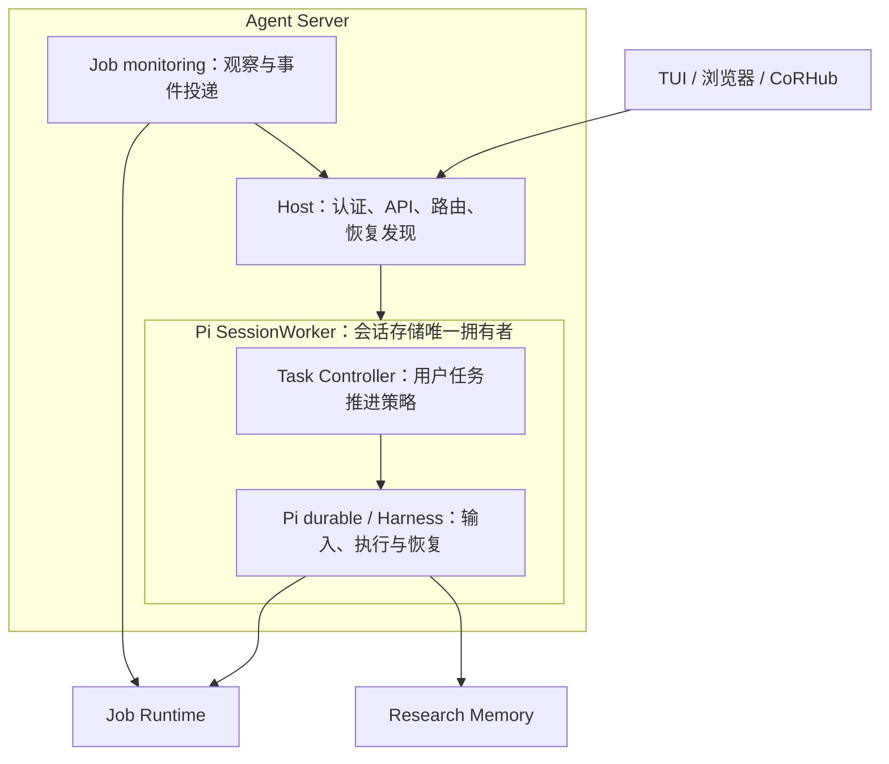

# Monitor、用户任务持续推进与执行诊断实施记录

日期：2026-10-10。运行时基线：Pi v1.1.0，commit `abe508e1b89912adde45528136c3221eb69acdd7`，protocol 8。

状态：任务持续推进、统一 Monitor 接口与终端视图正在本分支实现和验收。本文记录已经选择并落入源码的设计，以及仍需独立验收的范围；不将原规划的全部发布目标视为已经完成。验证结果以统一测试运行器的最新报告为准。

## 1. 本次解决的问题

Pi durable 能恢复未完成的执行，但一次正常回答结束后，不会自动判断用户的整个研究是否完成。Job monitoring 能投递计算事件，但没有新 Job 事件时也不能替研究项目承担推进责任。

新增 Task Controller 保存独立的用户任务状态：已授权工作尚未完成时，应继续执行，或明确等待、暂停、阻塞、取消、完成。它复用 Pi durable，不建设第二个 Agent loop、第二份运行状态或第二个调度协议。

持续推进只保证下一步有执行或可解释的停止状态，不保证科学结论正确。t005 中的领域计算、几何判断、结果解释等问题不因控制器上线而自动修复。

## 2. 名称、所有权与进程关系

| 对象/组件 | 所有权与职责 |
| --- | --- |
| 用户任务 / User Task | 保存委托目标、用户来源、交付条件、进展和控制状态；身份为 `user_task_id` |
| 计算作业 / Job | Job Runtime 保存派发、执行、取消、收集和回执；身份为 `job_id` |
| Pi 内部 Task | Pi 保存模型生成、工具执行等运行状态；诊断身份为 `pi_task_id` |
| Agent Server | 包含 Host、Pi SessionWorker 和后台 Job monitoring 的整体服务 |
| Host | 认证、工作区准入、API 路由、客户端绑定、恢复发现；不保存第二份用户任务状态 |
| Monitor | 统一产品入口和逻辑监督子系统，包括 Task Controller 与 Job monitoring |
| Task Controller | 位于 SessionWorker 内，复用 Pi 文档、事务、输入接纳和执行恢复 |
| Research Memory | Node、不可变 Result、科学解释与证据；不决定何时唤醒模型 |

首期每个 session 最多一个非终态用户任务；一个任务跨多个 Pi run、Node 和 Job。任务暂停或阻塞时仍占据当前任务位置，普通“继续”不产生重复任务。只有 SessionWorker 打开并写自己的 Pi SQLite，Host 和 Monitor 不直接写库。

## 3. 唯一推进路径：现有 admission 上的 next_run

本次只实现一种自动续跑入口：通过既有 input admission 接纳受信任的下一轮输入。正常工具循环仍由 Pi 自己继续，不加 `onYield` 自动延续 hook，也不维护两套续跑计数或竞争机制。

选择该边界是因为原子接纳、来源、版本检查、去重和恢复可以落在同一个 Pi commit 内；不声称已证明 `onYield` 所有来源与暂停竞争语义。本次不把另建 `onYield` 路径作为后续阶段的默认工作。

两个受信任 producer 共用同一接纳边界：

- `monitor`：投递实际 Job 事件，保留固定批次与原始事件身份。
- `task_controller`：推进现有用户任务，不提供新的用户授权。

外部客户端不能声明上述内部 producer。原始用户输入保持 `user` 来源。内部输入即使用 user role 进入模型上下文，也不被记录成用户的原始要求。

## 4. 持久状态与模型工具

`apps/agent/tasks/controller.mjs` 定义 Pi durable 的用户任务文档、当前任务索引与控制回执。索引只保存引用，不复制 Pi submission 或 Job 的生命周期。

任务包括目标、实际用户 submission 引用、交付条件、控制版本、等待/阻塞、进展证据、continuation reservation、完成依据、取消回执引用与控制审计。完整公开 DTO 见 [Monitor 合同](../contracts/monitor/README.md)。

模型工具：

| 工具 | 行为 |
| --- | --- |
| `task_begin` | 引用实际用户 submission，登记已授权的持续工作及交付条件 |
| `task_read` | 读取当前任务 |
| `task_update` | 修订目标、记录进展、等待归属 Job、阻塞、提出完成 |

普通问答和状态查询不自动创建永久任务，不新增分类模型循环。首轮持续研究必须显式登记；UI 在没有 durable 任务时显示“无当前任务”，不假称后台推进已开启。

模型不能自行恢复用户暂停，也不能把内部 continuation 当成新授权。预算和截止时间的独立结构化准入尚不在本次完成范围；用户约束必须保留在原始要求与任务目标中，不能宣称已有安装级预算执行器。

## 5. 状态与用户控制

| 状态 | 含义 |
| --- | --- |
| `active` | 仍有可执行工作 |
| `waiting` | 等待明确归属 Job 的 all/any 条件 |
| `paused` | 用户暂停或打断，禁止新的自动工作 |
| `blocked` | 缺必要信息、执行失败或持续无进展，给出具体原因 |
| `completing` | 完成条件已有证据，等待最终回复交付 |
| `completed` | 证据覆盖交付条件，关联最终回复成功结束 |
| `cancelled` | 用户结束委托；已有 Job 的取消结果独立核对 |

“模型执行中”“准备继续”“核对中”“断线”是视图标签，不保存成第二份任务生命周期。

| 操作 | 当前执行 | 自动推进 | 已运行 Job |
| --- | --- | --- | --- |
| 暂停任务 | 当前已发出的请求可收尾 | 关闭 | 保留运行与观察 |
| 停止回复 / 聊天 Esc | 打断指定 run | 同时暂停任务 | 保留运行与观察 |
| 恢复任务 | 核对状态后执行 | 用户明确重新开放 | 读取已有事实，不重复派发 |
| 取消任务 | 请求停止当前工作 | 永久结束当前委托 | 必须选择保留或请求取消 |
| 取消单个 Job | 不直接替代任务控制 | 不隐式暂停/恢复任务 | 按 Job Runtime 回执确认 |
| 退出客户端 | 不变 | 不变 | 不变 |

控制请求带稳定 `request_id` 和当前 `expected_revision`。用户任务状态与回执由 Worker 同一个事务保存，Host 不另写文件回执。

取消多个 Job 不声称跨 Job 原子性。任务先持久化取消目标；部分失败保存逐项错误，重启后继续核对。取消结果不明确时保留 uncertain，不能显示为已停止。旧任务取消的网络错误不应阻止新任务继续工作。

## 6. 持续推进与竞争处理

Task Controller 使用 Pi commit 通知和默认 30 秒周期进行核对：

1. 读取任务、Pi live/inbox 与必要的 Job 事实。
2. 有当前 run 或排队用户输入时，不再接纳自动输入。
3. waiting 的 all/any 条件未满足时，不调用模型；单个 Job 的提前事件不能清除整个等待条件。
4. 暂停、阻塞、取消或完成时不自动继续。
5. 在短 Pi commit 中复核任务版本、control epoch、空闲状态和 reservation，原子写入 submission、来源与推进引用。
6. 首次模型请求前检查控制状态与事件资格；领域 IO 在 commit 外，消费写入须在 IO 后重新检查暂停竞争。
7. run 结束后清理已结算 reservation，继续核对；`submission.done` 本身不等于用户任务完成。

用户输入、暂停、取消和恢复改变控制依据。旧 continuation 不能覆盖新用户要求。重复事件与并发核对最多产生一个尚未结算的自动推进 reservation。

连续三次自动 run 没有新的进展证据时进入 blocked，并提示复核方法。自动观察与显式 progress 共用持久 `progress_identities`：Result ID、Artifact 内容摘要及归属 Job 的实际里程碑首次计入；改计划、追加 note、新建 Node 或换引用组合不重置计数。不要求每轮写 Memory checkpoint。该保护不是科学正确性证明，也不是 token/时间预算。

## 7. 事件丢失、中断与历史任务

任务 waiting 时周期性查询实际 Job 状态，因此完成通知丢失或先于 wait 登记也不应永久悬挂。

事件批次保持固定身份和成员。历史任务事件不驱动新任务；混合批次只将当前任务事实交给模型，旧事实按原批次回执结算，不轮换事件身份。

事件输入在消费前被用户暂停时，原 Pi submission 可以正常保持 `unanswered`。恢复后的 canonical task continuation 引用未消费事件，在原 provenance 上记录 `successor_consumption`。原 Pi 终态不被篡改，原批次也不获得新的事件身份；恢复后的消费再确认 outbox。

任务 completed/cancelled、Job terminal、事件 delivered、科学结果被分析分别是不同事实。发送一封阶段邮件不自动完成整个研究。

## 8. 研究上下文与 Job 绑定

请求前的 `GenerationTask.beforeRequest` 注入用户任务投影，随后复用已有研究上下文投影。投影区分原始目标和实际用户 submission、当前任务控制状态、内部事件来源；原始要求不会被最新一句“可以的”覆盖。

UserTask 唯一 schema 为 `coragent-user-task/2`，保存 `research.entry_node_ids` 和 `research.focus_node_ids`；`task_update` 的 `set_research` 完整替换这两份列表。请求前把完整引用传入唯一 `research-snapshot/3`，在预算内保留结构与计划。Node/Result 核心模型不变，不新增 PlanStep 或研究调度器。旧 Task 文档不迁移、不补兼容默认值。

任务请求投影按 JSON 序列化字节限制字段与集合长度，保留原始来源和最近修订的摘录。省略项带计数和明确读取要求；完整事实通过 `task_read` 获取，截断不放宽授权或完成条件。

工具适配层从可信任务上下文绑定 `user_task_id`，模型不能通过 `job_start` 参数选择别人的任务。Node/revision 的科学归属仍由研究工具表达，两个身份不混用。Job Runtime 通用执行内核不因此依赖研究模型。

新 Job 的关联不可变。旧无任务关联 Job 保持原意图摘要；不通过改写旧 intent 强行归属。

Skill 与系统提示词教导登记持续委托、证据、显式等待和完成条件；运行可靠性由 durable 控制逻辑负责，不靠“每轮记得继续”的提示词兜底。

## 9. 唯一 Monitor UI 与命令

`/monitor` 是统一入口。用户界面显示“任务”和“作业”；Task Controller 是内部组件名。Pi generation/tool Task 只在用户任务的执行详情中展示。

| 命令 | 功能 |
| --- | --- |
| `/monitor` | 当前任务、自动推进、作业和执行状态 |
| `/monitor tasks [--limit N] [--cursor C]` | 当前和历史任务 |
| `/monitor task <task-id>` | 任务详情 |
| `/monitor task pause <task-id>` | 暂停 |
| `/monitor task resume <task-id>` | 恢复 |
| `/monitor task cancel <task-id> --keep-jobs` | 取消委托，保留作业 |
| `/monitor task cancel <task-id> --cancel-jobs` | 取消委托并请求取消归属作业 |
| `/monitor jobs [--task <task-id>]` | 作业列表 |
| `/monitor job <job-id>` | 作业状态与已有回执 |
| `/monitor job cancel <job-id>` | 请求取消单个作业 |
| `/monitor runs [--task <task-id>]` | 按 run 分组的执行记录 |
| `/monitor run <run-id>` | 模型/工具内部执行诊断 |
| `/monitor health` | Task Controller、恢复与后台服务健康 |

只读命令不经过模型。终端采用现有面板与状态行，面板 Esc 不穿透为聊天打断。查询失败明确显示不可用，不显示过期信息为当前状态。

执行状态、材料收集和科学解释分开；没有分析记录时显示未记录，不能从 Job success 推断科学分析完成。

## 10. Host 与跨端合同

Host、浏览器和终端共用 `apps/agent/contracts/monitor.mjs` 的方法目录：

- `monitor/overview`、`monitor/tasks`、`monitor/task/read`。
- `monitor/task/pause`、`monitor/task/resume`、`monitor/task/cancel`。
- `monitor/jobs`、`monitor/job/read`、`monitor/job/cancel`。
- `monitor/runs`、`monitor/run/read`、`monitor/health`。

沿用 `coragent-host/2`，不新增第二种 RPC envelope。Worker 只有 `coragent.monitor.handle({method, params}, context)` 这个服务入口，method 与 snake_case 参数不再翻译成另一套业务协议。

旧公共 `monitor/list`、`monitor/status`、`monitor/enable`、`monitor/disable` 已移除，无别名、无自动回退。Job monitoring 的底层观察/投递 CLI 是内部执行适配，不提供第二套用户任务暂停/恢复开关。

请求与 DTO 见 [完整 Monitor API 合同](../contracts/monitor/README.md)。沿用现有 `session/event`、`monitor/event`、cursor 和 epoch；通知是刷新提示，重连读取快照，不创建第二份持久重放日志。

聚合结果来自不同事实源，不声称跨 Pi 与 Job Runtime 原子一致。历史 run 索引仅覆盖已记录执行；未索引的旧记录不从当前活跃 taskGraph 伪造。工具详情展示结构化状态和错误，不展示隐式思维或默认导出完整工具载荷。

## 11. 恢复发现、升级与关闭

Host 复用 Pi 现有 session catalog，最多并行打开四个 Worker；恢复失败在健康状态中可见。Worker 打开时既恢复未完成 Pi 执行，也核对已正常结束 run 后仍活跃的用户任务。没有客户端也应承担推进责任。

`CORAGENT_AUTOMATIC_CONTINUATION=0` 禁止新增自动输入，保留用户输入、读取与已有 Job 观察。它不会撤回已经发出的模型请求。

旧会话没有用户任务时显示无当前任务，不把任意最后一句话自动迁移成长期委托。用户明确恢复研究后，Agent 应引用可验证的原始要求建立任务。

新 Monitor binding 不再写 enabled。v2 schema 只容许旧记录中可选的 `enabled: true` 惰性元数据，不读取它控制投递；`enabled: false` 明确返回迁移错误。已有禁用 binding 必须在升级恢复前由用户显式解决暂停意图，不能静默重新启用，也不能伪造一个没有授权来源的用户任务。不恢复被移除的公共开关作为兼容层。

## 12. 源码分工与验收

| 位置 | 交付内容 |
| --- | --- |
| `apps/agent/tasks/` | durable 用户任务、工具、控制策略、Monitor 读取与诊断 |
| `apps/agent/host/admission/` | 原子输入来源、任务门禁、事件消费、用户打断 |
| `apps/agent/pi/setup.mjs` | 单一 Pi loop 内装配、上下文、工具进展与服务 |
| `apps/agent/pi/backend.mjs` | Worker 服务路由、限并发会话恢复 |
| `apps/agent/host/monitor/`、`transport/browser.mjs` | 唯一公共接口、内部 Job 事件与健康 |
| `apps/agent/terminal/`、`contracts/commands/slash.json` | 统一命令、状态行、任务/作业/执行详情 |
| Python application、Job 工具与合同 | 不可变任务归属、查询与事件关联 |
| prompts / research Skills | 方法与任务控制边界，不替代调度 |

所有测试通过 `tools/test/runner.py` 运行，环境、缓存、临时文件、日志、证据位于 `local_debug/`。使用本地确定性模型与假凭据，不外发私有材料。运行器必须报告清理通过；源码在捕获后变化的 stale 运行不能作为最终验收。

关键确定性场景：

- 无 Job 的阶段回复自动继续；普通聊天不建任务。
- all/any Job 等待、事件先到和通知丢失；未就绪时零模型请求。
- 重复事件、并发核对、固定混合批次与历史任务事件。
- 暂停发生在接纳前、消费前、外部事件核对中；恢复不被旧 reservation 卡住。
- 最终回复成功才 completed；提供方拒绝保留证据并 blocked。
- 多 Job 取消部分失败、unknown 回执、重启核对与新任务不被旧错误阻塞。
- Worker/Host 重启、无客户端恢复、上下文原始要求和内部来源。
- 只读命令、旧接口拒绝、浏览器固定作用域和稳定变更身份。
- 执行诊断分页、工具错误、终端状态与草稿/焦点。

## 13. 不应提前宣称完成的范围

以下需要独立实现或完整发布验收，不能由核心单元测试代替：

1. 结构化项目预算、截止时间、安装级多会话资源限额和精细 provider 退避策略。
2. 在长期大规模会话下验证任务审计、完整来源和执行索引的分页存储与读接口帧大小；已实现的请求投影字节限制不能替代这项存储验收。
3. 所有交付系统的自动回执验证，尤其外部报告/邮件不确定发送后的业务核对；当前最终回复交付并不自动证明每种外部动作完成。
4. 真实量子化学计算、方法精度及 t005 科学结论的重新计算；几何、对称性、Gaussian 证据、修正结果与计算能力的确定性回归已补齐，见[领域科学回归](SCIENTIFIC_REGRESSIONS.zh-CN.md)。
5. CoRHub 独立仓库中的实际 Web/手机页面与真实 Dart 客户端、设备联调。
6. 完整发行安装产物的持续研究、服务重启、升级、卸载与清理验收。

发布“持续研究”能力前，应结合这些范围明确版本承诺；不得把有面板、Job 全结束或邮件已发送当成项目全部完成。
