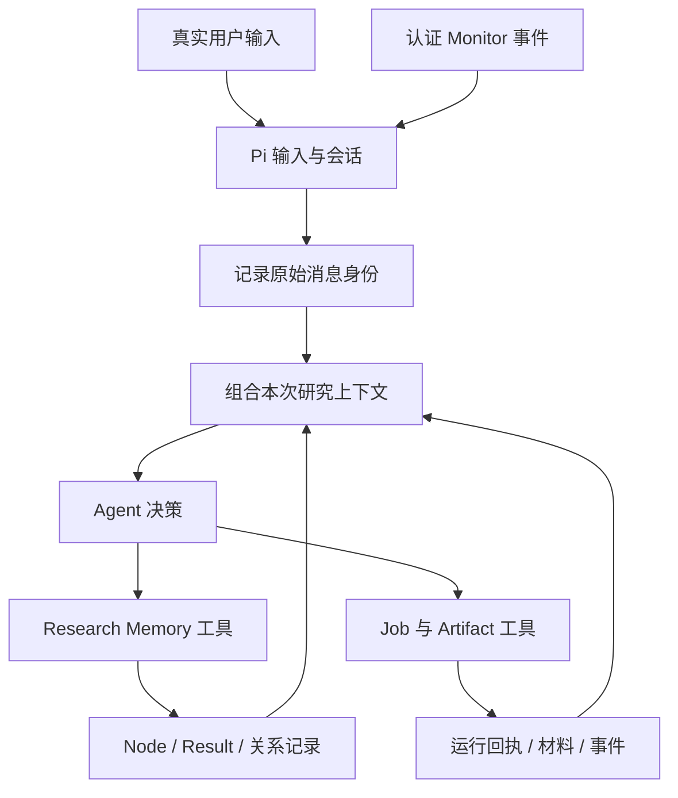
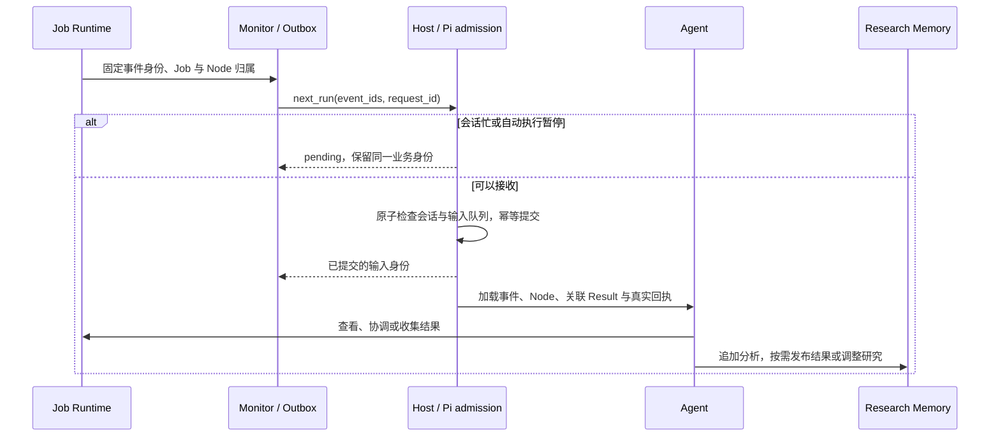

# Research Memory 整体设计与实施计划

状态：已实施并通过本地验收。日期：2026-10-09。详见[验收记录](RESEARCH_MEMORY_VALIDATION.zh-CN.md)。

本计划基于当前工作树中的“研究日志＋全局进度摘要”实现，以及本轮关于 Node、假设、反复尝试、Result、关系 map、Workspace 和 next_run 的讨论。本文保留批准时的设计与实施分解；当前实现及测试证据见验收记录。章节 2 保留实施前的源码基线，不能作为当前实现状态。现有研究工作区不自动迁移，本次未进行生产部署。

## 1. 设计结论

建议将这一能力统一命名为 **Research Memory**：它是 Workspace 内可持久化、可追溯、可检索的研究记忆，向 Agent 提供当前研究的上下文。Research State 表示这份记忆在某个时点的状态视图，不再作为另一套独立业务系统。

保留两个模型需要理解的研究实体：

- **ResearchNode**：围绕一个局部研究问题持续推进的研究单元，承载目标、当前假设或解决思路、方案、进展和多次尝试。
- **ResearchResult**：某个 Node 形成的一份不可变、可被其他研究引用的产出，包含观察、判断、限制和文件引用。

使用这两个名称，不使用 SubresearchNode/SubresearchResult。顶层问题和局部问题使用同一种 Node；是否属于另一项研究由明确关系表达，与是否使用子 Agent 无关。

其他内容是存储或运行机制：原始用户消息、历史记录、关系记录、检索索引、运行回执、上下文读取依据等，不需要全部变成 Agent 必须创建和维护的研究对象。

基本原则：

1. Node 是稳定的研究组织和检索单位，不能把每次工具调用、每次失败或每条笔记都变成新 Node。
2. 科学关系明确保存。模型不用每轮重新猜测关系，也不能把自动猜测当作确定关系。
3. 模型表达目标、思路、判断及必要的研究联系；框架维护身份、来源、版本、反向查询和持久化一致性。
4. 科学判断由 Agent 和领域 Skill 完成。Job 成功、文件齐全、Node 关闭均不能自动证明科学结论。
5. Research Memory 支持决策与恢复，不成为通用工具调用的科学审批系统。
6. Workspace 是持久容器；执行、文件和投递各有唯一权威，统一读取不等于统一接管。
7. next_run 是显式、可恢复的事件调度语义，不依赖研究笔记版本或回合结束 checkpoint。
8. 采用不兼容重构，不保留旧研究图接口或当前全局 progress 协议的兼容层，不改写已有工作区。

## 2. 当前实现与目标之间的差距

以下是对当前源码的观察，不是对目标行为的假设。

| 当前实现 | 目标调整 |
| --- | --- |
| `research_state/notebook.py` 保存 user/runtime/agent 记录及全局 progress | 保留不可变记录，增加稳定 Node 和不可变 Result，取消必须维护的全局进度摘要 |
| `research_agent.research/decision_context.py` 直接拼接任务、progress 和 Job 文件 | 以明确关系选择 Node，组合对应结果与最新执行事实；组合入口由运行适配层负责 |
| Workspace 初始化、目录、catalog 位于 `research_state` | 明确 Workspace 生命周期由 Host 发起，持久合同由 Research Memory workspace 模块提供 |
| 原生研究工具只有 read/search/update | 改为少量职责单一的读取、创建、记事和发布结果接口，避免通用 ChangeSet |
| Job 不再关联 Node | 恢复提交时的研究归属，并固定 Node 的当时版本；不恢复旧 Attempt/Gate 合同 |
| Monitor 的事件传输仍标记 `next_run`，但内部接收分支没有使用该参数 | 给内部调度明确实现和校验，不能把字段当作无作用标签 |
| `job_monitor.pending/assess` 仍读取 notebook sequence 和 deferred_state | 删除与研究日志版本的耦合，改用独立投递身份和消费回执 |
| `decision-context.mjs` 从消息文本匹配 event_id | 使用已认证的输入来源和结构化事件身份，不能从普通用户文本推导 Monitor 权限或上下文归属 |
| 当前 Monitor 合同说明仍有 Node/Attempt/interpretation/checkpoint 的旧准入描述 | 按新语义重写文档、schema 和测试，不能只修改名词 |
| Artifact Store 已独立保存 payload/manifest，共用基础事务层 | 保留该边界，补充 Node 与 Result 的可追溯引用 |
| 邮件回执已负责去重，研究日志失败不触发重发 | 保留并纳入新记忆投影，不让 Memory 重新成为发送准入者 |

当前回归测试通过只能证明已经覆盖的当前行为，不能证明上述目标已经完成。特别是“真实 Worker 能收到事件”与“next_run 参数确实控制调度”必须分别验收。

## 3. Workspace、Research Memory、Session 的关系

### 3.1 Workspace 是研究的持久容器

一个 Workspace 具有稳定身份和物理目录，容纳：

- 原始用户要求及后续补充；一个工作区内可以有多个相关要求。
- Node、Result、显式关系与研究历史。
- 输入文件、计算运行目录、正式材料和交付文件。
- 执行回执、恢复信息和 Monitor 待投递事件。

Workspace 不强制等同于一个 Node，也不强制等同于一次会话。创建工作区时不自动制造一个“总研究 Node”，收到每条用户消息时也不自动制造 Node。

研究概览是原始要求、选定 Node 和当前事实的视图。可以有生成的 Workspace README，但它不是一份必须由模型重复维护的全局科学状态。

### 3.2 所有权

| 信息或动作 | 唯一权威 | Research Memory 的角色 |
| --- | --- | --- |
| Workspace 创建、登记、附着与执行暂停 | Host 调用规范 workspace 服务 | 保存/验证工作区身份，提供研究内容 |
| 会话、输入队列、模型回合、上下文压缩 | Pi Harness / Agent Server | 记录真实用户来源，提供本次请求的研究上下文 |
| 原始要求、Node、Result、显式研究关系 | Research Memory | 主存储与读写合同 |
| Job 派发、运行、取消、协调、收集 | Job Runtime，经 `research_agent.application` 接入 | 关联归属、索引事实、引用回执 |
| 文件内容、摘要和来源 manifest | Artifact Store | 引用，不另存一套文件真实性元数据 |
| Monitor 事件、投递租约、消费身份 | Monitor / Host / Pi 输入层 | 提供事件关联 Node 的研究内容 |
| 邮件是否已发、是否不确定 | Email Skill 的投递回执 | 记录可检索的事实和报告引用 |
| Node 排序、关系反向索引、上下文、Markdown | 可重建投影 | 不拥有新的科学事实 |

“Research Memory 是 Workspace 的一部分”描述物理与持久范围；“Workspace 出现在 Memory API 中”描述统一入口。两者不要求 Memory 接管 Host 或运行时的全部生命周期。

### 3.3 Session 是访问研究的执行上下文

多个 Session 可以访问同一个 Workspace，原始消息保留 `session_id/message_id`。Node 不归属于唯一 Session；Job 的唤醒目标仍固定到提交会话，不能随当前界面焦点改变。

会话历史由 Pi 保存，研究记忆在会话结束后继续存在。会话总结不能替换原始用户要求或执行回执。不同工作区之间不直接建立裸 ID 关系；第一版需要显式导入材料并保留外部来源。

## 4. Node：问题、假设、方案和尝试

### 4.1 科学内容的区分

| 内容 | 要回答的问题 | 例子 |
| --- | --- | --- |
| goal | 研究什么 | 确定 A 到 B 是否存在合理的协同路径 |
| proposal | 当前假设或解决思路是什么 | 可能通过某种协同成键过渡态 |
| plan | 怎样研究、关注哪些证据 | 搜索候选、检查虚频和 IRC，并比较竞争路径 |
| progress | 做到了哪里 | 候选已找到，IRC 尚未完成 |
| assessment | 综合现有结果，目前如何判断 | 目前支持路径存在，但不能判断是否主导 |

proposal 可为空。准备输入、生成报告等动作可以只有解决方案，不强行包装为科学假设。验证关注点用自然语言写入 plan，第一版不恢复 Gate 或硬编码领域通过条件。

goal 通常稳定。修正思路和更换方法可以留在同一个 Node；若研究目标本身发生实质改变，应新建 Node 并明确与原研究的联系。

### 4.2 何时新建 Node

| 场景 | 处理 |
| --- | --- |
| 调参数、换初始构型、同一目标下重试 | 留在原 Node，追加记录 |
| 为同一判断补充证据 | 通常留在原 Node |
| 独立比较协同与分步路径 | 两个关联 Node，各自形成结果 |
| 发现自旋态选择等独立问题 | 新建 Node，并声明必要关系 |
| 一个动作需要独立跟踪其中一部分 | 拆出 Node；已有历史保持原归属，引用而非搬迁 |
| 工具报错、读取一个文件 | 不因此自动创建 Node |

不能仅按“使用了不同软件”“执行了不同 Job”或文本相似度自动拆分、合并 Node。系统可以建议相似 Node，由 Agent 选择继续或新建。

### 4.3 Node 内部字段

下表是内部数据需求，不是模型创建时的必填表单。

| 字段 | 内容 | 管理方式 |
| --- | --- | --- |
| id、workspace_id | 稳定身份 | 框架生成/绑定 |
| title、goal | 简短名称与局部问题 | 创建只要求 goal；缺少 title 时提供可编辑的确定性短标题 |
| proposal、plan | 当前思路和方案 | Agent 按需提供，不要求一次填写完整 |
| status | open / paused / closed | 默认 open；Agent 可明确调整 |
| progress | 当前推进说明 | Agent 按需更新，保留历史 |
| assessment_ref | 综合判断对应的不可变笔记或 Result，可为空 | 明确设置；不以最后一次失败覆盖已有判断 |
| source_refs | 相关原始要求 | Host 提供来源候选，Agent 可明确关联；保留原文 |
| revision | Agent 对当前内容的修订版本 | 框架维护 |
| created_at、updated_at、作者 | 来源与时间 | 框架维护 |

jobs、results、incoming/outgoing links、未收集输出、最新事实、排序理由等是查询字段，不在多个位置分别维护。

本计划将之前讨论的 planned/active/waiting/done/cancelled 简化为三个研究状态。运行中、排队和失败属于 Job；等待原因写在 progress，并展示真实 Job 状态。closed 表示不再主动推进该动作，不自动等于假设成立或整个任务完成。关闭时可以记录放弃、证据不足或已有结论，无需通过形式化科学关卡。

Node paused 与 Host 暂停自动执行是不同概念。前者是研究组织信息，不丢弃真实 Job 事件；后者才决定是否自动启动模型请求。Node 关闭也不隐式取消正在运行的 Job。

### 4.4 尝试的存储

尝试是 Node 的执行和分析历史，不新增模型必须操作的 Attempt 实体。

一次尝试可以包含多个 Job，也可能完全是分析已有材料。执行记录固定提交时的 Node、方案修订、实际输入和 Job 身份；研究笔记引用这些记录表达方法调整与解释。界面可以按操作链或明确的笔记关联聚合尝试，但不通过时间接近就宣称多个 Job 属于同一次科学尝试。

同一个请求的重试复用原 Job；改变输入或参数进行新的科学尝试，需要新提交身份，并保留与前一次执行的关系。框架不能因为笔记中出现“再试一次”就自动重新提交计算。

## 5. ResearchResult：不可变的阶段产出

### 5.1 定义

Result 是值得被独立理解、检索和引用的一份研究产出。它可以支持某种解释、削弱某种解释，或者记录证据不足。没有证据的初步想法优先写作 proposal/笔记，不伪装成已验证结果。

Job 输出属于执行事实和材料；Agent 结合这些内容形成 Result。每次工具调用和每次尝试都不强制发布 Result。

### 5.2 字段

| 字段 | 内容 | 谁提供 |
| --- | --- | --- |
| id、node_id | 身份与唯一产出 Node | 框架生成，Agent 选择 Node |
| summary | 检索用短摘要 | Agent 可选；缺省使用明确截断的 conclusion 摘录 |
| observation | 实际观察到了什么 | Agent 可选，引用原始事实 |
| conclusion | 当前判断/产出说明 | Agent 必需，允许写“目前无法判断” |
| limitations | 不确定性、方法范围、未验证内容 | Agent 可选；空值不代表没有限制 |
| inputs | 实际采用的 Result/Artifact 具体版本 | 明确引用，并从关联执行记录补充确证来源 |
| evidence_refs | 结论所引用的记录、回执或材料 | Agent 明确选择；读取过不自动算采用 |
| files | 名称、用途与 artifact_ref | Agent 选择已有材料，框架核实身份 |
| supersedes | 被本次修正的旧 Result，可为空 | Agent 明确表达；禁止推断“较新即替代” |
| authored_node_revision | 发布时看到的 Node 版本 | 框架记录 |
| basis_refs | 实际计算时固定的方案版本和输入来源 | 从所引用的执行记录取得，不冒充最新方案 |
| 作者、时间 | 创建来源 | 框架维护 |

不增加全局 supported/rejected 枚举作为自动执行依据。科学判断的范围写在 conclusion 和 limitations 中，避免把“一个候选不成立”扩展成“整条路径不存在”。

### 5.3 多结果与综合判断

Node 对应多份 Result。Result 发布后不可原地修改，修正时创建新 Result，显式填写 supersedes；旧引用继续指向旧版本。普通的补充实验结果不自动取代此前结果。

取消“最新 Result 就是 Node 全部当前结论”的假设。Node 的 assessment_ref 可引用一份综合结果或笔记，其中引用多个 Result；新发布的局部结果先作为新增结果展示。发布者可显式要求把新 Result 设为综合判断，框架负责单次提交中的选择与并发检查。

A 发布新结果后，引用旧结果的 B 不自动更换输入或重跑。系统展示“存在新上游结果”及精确差异来源；只有明确 supersedes 或输入版本变化，才标记对应的复核提示。普通新增但无关的结果不让所有下游自动失效。

## 6. 研究 Map 与关系的合同

### 6.1 保留明确关系

关系是持久数据，不让 Agent 每次根据上下文猜测。减少的是机械维护，不是删除关系字段。

第一版关系分为两组：

| 关系 | 语义 | 来源 |
| --- | --- | --- |
| part_of | 一个局部问题服务于更大问题 | Agent 明确声明 |
| requires | 推进需要另一 Node 提供某种结果 | Agent 明确声明，并可写 reason |
| alternative_to | 两个独立思路需要比较 | Agent 明确声明 |
| uses / cites | 实际使用具体材料或明确引用某份 Result | 运行回执或明确引用自动记录 |

supports/refutes 暂不成为通用调度关系，先由 Result 的判断和证据表达。语义检索可以提供候选关联，但候选不混入已确认关系，不触发执行。

### 6.2 单一写入位置

每条关系内部保存 `id/source/kind/target/origin/basis_refs/created_at`；人工声明的可撤回关系还有撤回记录。模型只需要给出 `kind/target`，reason 可选，source 从本次 Node 操作取得。

关系只登记一次，反向边由索引生成。不要在 A.children、B.parent、全局 edges 和调度配置中要求模型各修改一次。关系存于 Node 之外的可重建 map 视图，规范来源是追加的关系记录；Node 读取响应可以便利地显示 depends_on 等投影字段。

alternative_to 为对称关系，规范化端点后去重。part_of 可有多个上级研究视角，禁止自包含和包含环；目录始终按 Node ID 平铺，不因组织关系移动文件。requires 的闭环产生“当前存在相互等待”的诊断，不让整个研究系统不可读，也不自动把其中任何 Node 标成失败。

### 6.3 区分关系层次

- 研究 map 可以有反馈、共享输入和多条路径，不要求整个 map 是 DAG。
- 每份 Result 的实际 inputs 指向已存在的不可变版本，形成有时间方向的来源链。
- A 的研究依赖 B，不等于 A 的所有 Result 都使用 B；必须保留实际输入。
- 读取、搜索、目录位置和文件名相似均不构成“使用”证据。
- 原生脚本绕过受管输入路径时，能证明的来源就记录，不能证明的标为未追踪；不伪造来源。
- 同一次读取多个 Node 不产生依赖关系。被加载到上下文不代表结论采用了它们。

### 6.4 requires 不恢复科学 Gate

requires 用来表达研究意图、解释等待和帮助排序。当上游有 Result 时，状态是“有新结果可检查”，不自动宣称“依赖已科学满足”。Agent 可以调整关系、使用替代材料或继续其他工作，不需要先完成固定的状态迁移才能调用 read/bash/job_status。

真实的文件不存在、输入摘要错误、跨工作区引用错误等仍由对应工具校验。这是执行完整性检查，不是研究阶段准入。

## 7. 模型接口：少量语义操作，系统字段不外溢

### 7.1 建议公开五个工具

| 工具 | 最小请求 | 可选能力 |
| --- | --- | --- |
| research_read | `{}` | 指定 Node/Result/记录 ref，分页，邻接关系 |
| research_search | `{query}` | 类型、Node、来源过滤和分页 |
| research_create | `{goal}` | title、proposal、plan、输入引用及初始关系 |
| research_update | `{node_id, note}` | 按需修改 proposal/plan/progress/status，添加/撤回少量显式关系，选择综合判断 |
| research_result | `{node_id, conclusion}` | 观察、限制、输入、证据、文件、supersedes，以及是否设为综合判断 |

五个工具是目标接口，不增加通用 JSON Patch 或任意 ChangeSet。create/update/result 分工固定；追加笔记不要求先创建 Attempt、绑定 Artifact、记录解释再 checkpoint。

命名保持 research_，产品与 Skill 名称统一为 Research Memory。工具数量不是压缩目标；让常见动作有稳定的小合同才是目标。

### 7.2 常见操作示意

以下字段为拟定合同，ID 是示意。工具返回可直接复用的精确引用，模型不拼接哈希或路径。

```json
{"goal":"找到连接 A 与 B 的过渡态","proposal":"可能存在协同成键路径"}
```

```json
{"node_id":"node_ts","note":"构型 X 优化未收敛，尚不能判断假设。准备尝试构型 Y。"}
```

```json
{"node_id":"node_barrier","note":"比较需要先获得过渡态结果。","add_relations":[{"kind":"requires","target":"node_ts","reason":"需要可比较的过渡态能量与结构"}]}
```

```json
{"node_id":"node_ts","conclusion":"当前候选的 IRC 未连接目标产物。","evidence_refs":["result_endpoint","a7"],"limitations":"只检查了一个候选，不能排除其他构型。"}
```

关系的删除使用工具返回的关系 ID，只表达撤回意图，不需要维护反向边。字段省略表示保持不变；显式清空使用合同中明确允许的 null，不能把空字符串、空数组和省略混为一谈。

### 7.3 框架承担的合同

- workspace_root、workspace_id、作者、session、请求身份由 Host 绑定，模型不能重定向工作区或冒充运行时来源。
- Node/Result/关系身份和时间由系统生成。公开请求不要求模型填写事务字段。
- Job 研究归属优先使用明确 node_id。多个 Node 同时出现在上下文时不得静默选择“最近一个”。
- 保留无 Node 的准备、诊断和普通文件操作；未关联的执行事实在 Workspace 层可见，不能悄悄丢弃或自动分配给相似 Node。
- 常规研究 Job 应显式关联 Node；一次提交只设一个主要研究归属，其他 Node 通过使用结果建立联系。
- 普通笔记追加不要求版本匹配。修改 Node 当前内容使用服务器保存的读取依据，后台 Job 事件不增加 Node 的 Agent 修订版本。
- 原生 Pi read/write/edit/bash 不要求填写研究生命周期字段。框架不假装能理解所有任意脚本的科学用途。

### 7.4 读取依据与并发

不能把 expected_version 从参数中隐藏后改成最后写入覆盖。Agent Server 必须持久化模型实际收到的 Node 读取依据：对象 ID、修订号、包含的字段及请求身份。只有摘要被加载时，不能宣称完整方案已被读取。

create、成功 update 和详细 read 的返回内容都可以建立新的读取依据，不要求每次操作前重复读取。只读了生成的 Markdown 或通过任意脚本读取文件时，不伪造受管版本依据；需要替换当前字段且没有依据时，返回具体 Node 的读取入口。纯追加仍然可以执行。

追加笔记和不可变 Result 可以并发。替换 goal/proposal/plan/progress/status 或综合判断，需要对应字段可用的最新读取依据；发生冲突时返回当前差异与重读路径，不自动重新解释或合并两个科学判断。

带字段替换的 research_update 作为一次原子操作：发生冲突不部分修改。模型可以重读后重试，或单独追加笔记。

research_result 的不可变产出保存与“设为综合判断”分开报告：若追加成功但综合判断选择发生并发冲突，返回 `result_saved=true, assessment_selected=false` 及现有引用。不得报成完全失败而诱导重复产出，也不得静默覆盖另一个会话的判断。其重复请求始终返回同一保存结果；后续选择可用 research_update 完成。

请求去重依据由 Pi 会话、工具调用身份和内容绑定，跨重启恢复同一回执。同一身份换内容必须拒绝。不能把模型的新科学尝试误判为网络重试。

## 8. 目录布局、记录权威与恢复

### 8.1 目标目录

```text
workspace/
├── workspace_manifest.json             工作区身份与格式版本
├── inputs/                             原始材料和导入文件
├── research/
│   ├── README.md                       生成的工作区研究概览
│   ├── journal.json                    记录顺序索引
│   ├── records/<record_id>.json         不可变用户原文、研究变更、关系记录
│   ├── map.json                        生成的当前节点与关系索引
│   ├── search/                         可重建检索数据
│   └── nodes/<node_id>/
│       ├── node.json                   当前 Node 物化视图
│       ├── README.md                   生成的可读详情
│       ├── work/                       可修改的草稿、输入准备与分析脚本
│       └── results/<result_id>.json     不可变研究产出
├── runs/jobs/<job_id>/                  真实执行目录、输入、日志和原始输出
├── artifacts/<artifact_id>/
│   ├── payload                         固定版本的文件内容
│   └── manifest.json                   摘要、文件属性和来源
├── reports/                            面向用户的报告工作文件
├── operations/
│   ├── jobs/ executions/ results/      派发意图、状态、收集回执
│   ├── monitors/                       事件、投递队列、租约和回执
│   ├── events/                         可重放的运行事实及记忆投影待办
│   ├── references/                     aN/pN 等精确引用
│   ├── contexts/                       模型实际收到的上下文与读取依据
│   └── transactions/                   提交与恢复信息
└── environments/                       执行环境
```

这里的 `research/.../results` 是研究解释与产出，`operations/results` 是 Job 收集回执，响应中明确标为 research result 与 collection receipt。二者不得共用 schema 或被同一个模糊 result ID 解析器混淆。

### 8.2 哪些能重建，哪些不能删除

规范研究事实包括不可变 records 与 Result 文件。Result 发布记录引用 Result 文件及摘要，同一事务提交；不把“索引里有指针但正文不存在”当作成功。

journal 顺序索引、node.json、map.json、search 和 Markdown 可以从规范记录重建。重建顺序使用已提交记录的 sequence，检查缺口和重复，不按文件修改时间排序。Node 当前字段及关系撤回均必须有对应的不可变记录。

Artifact payload/manifest、运行回执、投递身份、事务恢复记录不是可随意删除的索引。读取实时执行事实以 Job Runtime 回执为准，即使 Memory 的投影落后也不能显示虚假的完成。

Markdown 由框架渲染，列出目标、思路、关系、最近尝试、综合判断、结果和实际文件路径。不要求模型同时编辑 JSON 与 Markdown。直接修改生成文件不改变规范记忆；doctor 显示投影差异并可重建。

### 8.3 可修改工作文件与正式材料

Node work 和 reports 中的文件可以修改。正式结果引用 Artifact 固定版本，不能只引用未来可能被覆盖的工作文件路径。大体积 checkpoint、轨迹和日志不再复制到每个 Node 目录；README 提供明确材料引用及可读取路径。

同一材料可以被多个 Node 使用，不需要转移产出归属。Result 的文字本身存放在 Research Memory；报告、图和数据文件由 Artifact Store 保存。

### 8.4 事务与外部副作用

沿用基础层持久事务和 redo 恢复。追加记录、Node 物化视图、Result 文件及必要指针在同一工作区事务内提交。搜索与 Markdown 可异步重建，失败要可诊断，不改变已提交研究事实。

外部计算和邮件无法随文件事务回滚。执行层先持久化意图，再执行，再保存真实回执。运行事实投影通过持久事件/待办重放：Memory 写入失败不导致再次执行 Job 或再次发送邮件。上下文读取应直接补充运行回执，并显示投影延迟。

Node 的 Agent revision、研究记录 sequence、运行事件序号、投递状态分开管理，禁止再用一个全局版本协调全部系统。

## 9. 检索、排序与请求上下文

### 9.1 读取入口

research_read 默认返回当前请求所需的 Workspace 研究视图；指定 Node 返回它的目标、思路、综合判断、明确关系、结果摘要和相关运行事实；指定 Result 返回不可变正文和来源。

Workspace 原始消息按身份逐字保留。用户后续改变要求时，保留旧要求与新要求的顺序；系统不通过删除旧消息制造一致性。Agent 的解读不得覆盖用户原文。

### 9.2 候选排序

第一版使用可解释的确定性优先级，不要求向量服务，也不让模型填写全局排名：

1. 本次认证 Monitor 事件关联的 Node，以及用户明确指定的 Node。
2. 相关 Node 的未收集输出、执行冲突及新到事实。
3. 当前会话明确在推进的问题，及其直接使用的上游结果。
4. 阻塞相关研究的显式 requires 关系。
5. 上游有新结果可检查的后续 Node。
6. 与当前问题文本匹配、近期活动或有较多相关下游引用的 Node。

同一等级确定性排序，并返回 reason。仅按最近更新或 graph degree 排名会让噪音节点挤掉关键问题，不采用该策略。

第一版检索索引使用可重建的 SQLite 表保存对象摘要、可检索正文、来源、Node 归属和引用，不要求 FTS 或额外数据库服务。精确 ID、来源和 Node 查询使用索引，文本查询保持可解释的子串匹配。索引保存已处理的研究与运行事件游标；落后时明确显示，并直接补充本次触发事件。数据库不作为第二份科学权威，也不承载执行去重回执。

### 9.3 分层加载与预算

先加载原始要求的必要片段、关键 Node 短视图、综合判断和事件摘要，再按预算展开一跳依赖或比较分支；完整日志、轨迹、历史尝试和长 Result 按需读取。

预算不足时必须保留触发事件的身份、对象索引、遗漏数量和读取入口，不能静默删掉触发原因。多个同时完成的 Job 超出预算时展示批次摘要并分页，不把“未展示”当作“未发生”。

字节预算与模型 token 预算分开检查，使用现有模型估算能力。Node 太长应截取有标记的摘要；中文、多字节文本和大批量事件必须有独立验收。

快照读取在短时工作区锁内固定当前研究视图和本地运行回执，返回各来源的游标；远端状态探测在锁外完成。Python/文件读取也不放入 Pi 的输入提交事务。生成后到达的新事件在下一次请求补充，不能声称某一份快照包含未来变化。

### 9.4 看到、引用和处理不是同一个状态

上下文收据只能证明某段内容被提供给了模型，不能证明模型完成了科学分析。引用 Result 表示明确采用或讨论，不能因为一次 read 就自动建立 uses。

未收集输出、未解决执行冲突是运行时可判断的状态；某个事件是否已被充分解释，需要明确笔记或 Result 的依据。第一版不靠一个全局 observed_sequence 将所有 Node 的事件统一标为“已经处理”。

Context 是本次模型请求的附加视图，不是新的用户指令，不写回聊天原文；材料中的指令性文本作为数据处理。压缩后重新构建上下文，不把压缩摘要升级为运行事实。

## 10. Agent Server 与 Job Runtime 的接入

### 10.1 请求路径



beforeRequest 顺序：确认输入来源 → 幂等记录真实用户原文或读取事件身份 → 获取研究与运行视图 → 记录读取依据 → 注入有预算的上下文。Monitor 文本不能被当作新的用户要求。

Agent Server 通过规范命令服务读写 Memory；JS 不直接维护第二套 Node JSON 或关系算法。Python 桥接仅负责传输、工作区绑定和事务入口。

### 10.2 Node 绑定与并行

不得使用工作区全局可变的 current_node。一次 Job 提交固定 `workspace_id/node_id/node_revision/session_id/request_id`，后续切换界面或处理另一个事件不改变归属。

研究工具显式 node_id 是允许的最小语义字段。只有一个已由 Host 绑定且对模型可见的目标时，可以由适配器填充；歧义时返回候选，不推测。第一版优先采用显式 node_id，避免隐藏焦点规则。

通用 JobRuntime 保持领域无关：研究归属通过受管 metadata 或适配器 receipt 存储，不能让平台启动器导入 Research Memory 的科学对象。

### 10.3 方案版本与输入来源

准备请求、暂存输入和提交时固定方案与材料版本。运行过程中 Node 修改 proposal，不改变已提交 Job 的解释基础。Result 引用这个 Job 时能看到它实际检验的旧方案。

自动 uses 关系必须有输入 manifest、精确材料引用或其他确证依据。相同哈希可以证明字节相同，不能在多个同内容来源间擅自选择一个科学来源。

### 10.4 故障与诊断

- Memory 查询失败：向模型明确提供降级信息，允许诊断和读取实际回执；不凭缺失上下文推断研究完成。
- Node 创建或更新失败：保证无半成品规范记录，返回对象及失败字段，不输出只有内部 traceback 的消息。
- Job 提交回执不确定：复用原身份协调，不因 Node note 更新再派发一次。
- Result 追加成功后界面渲染失败：查询原请求回执恢复，不能重复创建或重新计算。
- 不恢复 onYield 强制研究 checkpoint，不因为 Node 仍 open 而自动追加无限续跑提示。

## 11. Monitor 与 next_run 的完整语义

### 11.1 next_run 的定义

`next_run` 表示：把已认证事件持久保留，在所属会话可以接收时启动下一次 Agent 执行，本次上下文优先恢复事件关联的研究。

它是 Host/Monitor 输入调度策略，不是 Node 的 next_step 文本、下一次轮询时间，也不是 Research Memory 的生命周期 disposition。

内部 Monitor 请求必须实际验证和使用 mode=next_run。普通用户 follow_up/steer 仍是用户输入策略，不能用用户文本或参数冒充内部 Monitor 来源。

### 11.2 事件内容

执行事件携带 event_id、workspace_id、session_id、job_id、可为空的 node_id、提交时的研究依据、执行状态和回执引用。Monitor 只保存确证的状态变化、终止、失联或排队超时等事件，不生成科学结论。

Memory 更新不能改变已生成事件的身份和归属。Node 被关闭、摘要被改写或某个 Result 被替代，都不能把尚未投递的执行失败静默标成过期。

### 11.3 投递流程



必须区分三个进度：事件已在 outbox 持久化、输入已被 Pi 接收/消费、研究内容已被 Agent 分析。不能把“Host 收到请求”写成“研究已经处理”。

同一会话多个事件可以形成固定批次。首次尝试提交后，成员集合和请求身份不变；后来到达的事件进入新批次。重试使用同一身份，忙时释放租约但不创建新的 Pi 输入。

### 11.4 去重与恢复

- Host/Pi 原子检查 run 和 inbox，保证忙时不会偷偷插入另一条 follow-up。
- 接收回复丢失时，按原 request_id 查询，不直接轮换身份。
- Worker 重启恢复同一个 Pi submission；模型首次消费身份持久化。
- 已接收但模型调用失败时，恢复或诊断现有执行；不能由 Monitor 无限生成新回合。
- 会话被删除或无法恢复时，事件进入可诊断的未投递状态，不自动转交其他会话。
- 用户明确暂停自动执行时记录事实但不调用模型；恢复后处理积压事件。
- 没有新事件时，不因为 Node open、waiting 文本或关系可达就持续自我唤醒。

删除 deferred_state 与 notebook sequence 的比较，删除“等待下一次 State revision/checkpoint 再投递”的分支。若保留投递评估 token，它只反映事件/投递身份，不包含研究摘要版本。

### 11.5 后续研究与自动续行的边界

Agent 在当前授权范围内可以继续当前回合，依据 Result 选择其他 Node。第一版 next_run 的自动触发来源限定为明确的执行事件；一条普通 note、proposal 修改或 Node 创建不自动产生模型回合。

纯推理任务若以后需要显式跨回合续行，应扩展 Host 的持久调度入口，携带原因、Node 和幂等身份，并设定明确的重试终止条件。该能力不通过 Memory 写入暗中触发，也不在第一版恢复旧的 state-continuation。

## 12. Skill、邮件和用户界面

### 12.1 Skill 分层

继续使用 Pi 原生 Skill 加载。ResearchAgent 提供已登记资源目录、资源摘要校验和准确的 skill 路径解析，不再实现另一套领域 Skill 搜索/执行循环。

核心 Skill 改名为 research-memory，说明五种常见行为：恢复上下文、创建局部问题、继续尝试、表达少量关系、保存有依据的结果。orchestration 说明如何在 Memory、Job、Artifact 和原生文件工具之间工作。

领域 Skill 负责方法和科学解释，例如频率、IRC、误差与反例；它可以建议 Node 粒度和预期观察，但不规定通用状态字段必须按某套生命周期填写。

工具名称、最小请求、错误恢复示例由公开 schema 生成。更新扩展 manifest、资源清单和 package 入口；保留 chemical-input/references/reaction_mapping.md 的准确归属，并测试发布包中实际可读。

### 12.2 邮件与报告

报告可以作为某个交付 Node 的材料和 Result。邮件发送仍使用用户已有授权与独立投递回执，不以 Node closed 或 ResearchResult “通过”为授权依据。

发送成功但 Memory 投影失败时，显示投递事实并重放投影；不得重发。报告内容是否充分由 Agent 根据原始要求与结果判断，不恢复隐藏的 delivery_requirements_unmet 科学准入层。

### 12.3 CLI / TUI / Web

统一使用同一 Memory 查询响应：Workspace 概览、Node map/列表、Node 详情、Result、材料引用与事件。Web 第一版提供可读列表与关系导航即可，不以复杂图形布局阻塞核心实现。

Node 详情同时展示：当前思路、综合判断、明确关系、正在运行的 Job、新结果与历史尝试。明确标识 Agent 判断、运行事实、生成摘要和推断候选，不能混成一个“已完成”标签。

保留 Context 无 ≈ 的展示修正。所有客户端停止引用旧 graph/progress 合同，错误消息给出当前对象和可执行的读取入口。

## 13. 包与源码边界

产品统一命名后，将 `research_state` 和当前只做快照的 `research_agent.research` 收敛到一个 `research_agent.research` Python namespace。目标模块按职责拆分，而不是按科学类型无限扩展：

```text
research_agent.research/
  workspace.py          工作区合同、初始化与检查
  workspace_catalog.py  共享发现与登记
  records.py            不可变来源与研究变更
  nodes.py              Node 内容与投影
  results.py            不可变产出
  relations.py          显式关系与来源索引
  retrieval.py          查询、排序、邻接展开
  views.py              可读视图与 Markdown
  doctor.py             一致性诊断和重建
```

具体 Job/Artifact 查询由 `research_agent.application` 的上下文组合与适配器完成，再把规范 DTO 传入 Memory 检索/视图层。Memory 不导入平台执行器或 `research_agent.application`；Artifact Store 和通用 JobRuntime 不导入 Memory。运行适配层可以向 Memory 的窄记录接口发布事实引用。

共享锁、事务和安全文件 IO 继续位于 `research_agent.foundation`。Python bridge 实际承载 workspace、研究、Job 和材料命令，建议同步更名为中性的 runtime bridge，移除旧研究状态 port 命名；不保留双入口兼容适配。

| 当前路径 | 计划变更 |
| --- | --- |
| `packages/research-state/research_state/` | 拆入统一 research_agent.research 后删除旧 namespace |
| `packages/research-memory/research_agent.research/` | 承担完整 Memory 域，去除“只有快照”的定位 |
| `packages/research-state-bridge/` | 更名并统一为运行命令传输，更新所有调用方 |
| `apps/agent/host/workspace.mjs`、workspace catalog | 同步新 manifest；Host/Monitor/Web 继续共享同一身份规则 |
| `backend/src/research_agent/application/api.py`、command_catalog | 新研究命令、上下文组合入口与 DTO 验证 |
| `execution.py`、references.py、job_state.py、evidence.py | 提交归属、实际输入来源、运行事实持久事件 |
| `job_monitor.py` | Node 关联、移除 Memory sequence 投递条件 |
| `apps/agent/tools/registry.mjs`、host-api/tools | 五个小研究接口，系统字段由适配层提供 |
| `pi-session-worker.mjs`、user-sources、decision-context | 原始消息、认证事件、读取依据与按 Node 注入 |
| `research-agent-host.mjs`、research-agent-harness-backend、input-admission、monitor-admission、pi-monitor-worker | 真正落实 next_run 与独立投递恢复 |
| `contracts/research-agent-monitor/1/` | 为破坏性字段/语义变更发布新版本，不沿用旧版本伪装兼容 |
| `extensions/core/skills/`、领域与邮件 Skill | 按新交互重写示例，更新资源摘要 |
| `components/ts-web/`、contracts/ts-web、CLI/TUI | Workspace/Node/Result/map 的统一读取 |
| package.json、pyproject、inventory、构建脚本 | namespace、合同、资源和删除清单同步 |

新工作区 manifest 建议使用 `research_workspace/2`，明确 Memory 布局版本。研究记录、Node、Result 和投递合同各有自己的版本，不靠 package 版本猜测磁盘格式。Node 身份不能仅由 goal 文本哈希决定，以免把同目标的独立分支合并。

## 14. 端到端场景

### 14.1 多次尝试回答一个问题

1. 原始用户要求由输入层保存。
2. Agent 用一个 goal 创建 Node，可补充 proposal/plan。
3. Job 提交固定 Node 与当时方案，输入暂存固定摘要。
4. 首次 Job 失败；Monitor 保存事实并通过 next_run 唤醒。
5. Agent 记录“执行未得到可用证据”，调整同一 Node 的 plan。
6. 新参数产生新请求身份；第二次执行与第一次都可追溯。
7. 得到可用证据后发布 Result，必要时设为 Node 综合判断。
8. 不产生强制解释、关闭、checkpoint 的额外工具链。

### 14.2 竞争方案与汇总

1. 为协同路径和分步路径创建两个 Node，显式 alternative_to。
2. 两者共享某份反应物构象 Result 的固定版本。
3. 分别运行不同 Job，进度互不覆盖。
4. 比较 Node 声明必要 requires，实际比较时固定两份 Result 版本。
5. 比较产出综合 Result，不能因某一路径率先完成就自动关闭另一条。

### 14.3 上游修正与反馈

1. B 使用 A 的 R1。
2. A 发布 R2 并明确 supersedes R1。
3. B 获得“输入依据已有修正”的提示，原 Result 保持不变。
4. Agent 判断复核是否影响结论；需要时在 B 内继续尝试，或创建独立新问题。
5. 研究 map 有反馈，具体证据链仍引用明确的历史版本。

### 14.4 重启与消息并发

1. Job 运行时用户补充要求，同时另一个会话更新某个 Node。
2. Host 重启后恢复 Workspace、Pi 会话和 Monitor outbox。
3. 新事件恢复其提交时 Node 归属，不使用重启后的界面焦点。
4. 新用户要求优先显示，旧 Result 不被自动判为满足新要求。
5. Node 替换发生并发冲突时保留两方可读记录，要求明确合并；普通追加不互相阻塞。

## 15. 实施阶段与可审查产物

阶段之间按合同依赖推进。每个阶段有可验证产物；不能以“模型应该能理解”代替接口验收。

| 阶段 | 工作 | 交付与通过条件 |
| --- | --- | --- |
| P0 合同收敛 | 固定命名、Workspace 范围、Node/Result 语义、五个工具、关系类型、next_run 语义 | 最小请求和完整往返示例；错误与并发行为可逐项审查 |
| P1 持久核心 | 统一 namespace，records/Node/Result/relations，manifest 与事务恢复 | 无 Job 也能创建、反复记事、发布、引用、重启与重建；旧工作区明确拒绝且不修改 |
| P2 执行关联 | 提交归属、方案/输入版本、Artifact 关联和运行事件投影 | 同一 Node 多 Job、多个 Node 并行、同字节不同来源均可区分；不影响派发幂等 |
| P3 检索与上下文 | Node 排序、来源链、邻接展开、预算、读取依据 | 关键 Node 在大量噪音记录中仍被选中，缺失内容有可用读取入口 |
| P4 Agent Server | 原生工具、认证来源、精确绑定、结构化错误和冲突处理 | Pi Worker 完成创建—执行—记录—产出，不需要旧生命周期工具 |
| P5 Monitor | 独立 outbox、next_run 忙闲策略、消费去重、重启恢复 | 不读取 Memory sequence；无新事件不反复唤醒；暂停/恢复和未知投递可诊断 |
| P6 Skill 与客户端 | 核心/领域/邮件 Skill、TUI/Web/CLI、文档生成与资源清单 | 示例均能执行；原生 Skill 精确路径读取；用户能从目录查看研究 |
| P7 删除与发布验证 | 删除旧模块、旧合同/测试假设，构建 wheel/Agent/Web 包 | 安装后的完整回归、原生恢复、包清单与全仓残留检查通过 |

先通过 P0 再实现核心。不得先增加大量字段，再让 Skill 教模型如何维护这些字段。实施时保留当前已经验证的派发、收集、事务和邮件可靠性能力；通过适配新归属，而不是把这些能力随研究对象一起重写。

## 16. 验收矩阵

### 16.1 研究模型与接口

- 仅提供 goal 可以创建 Node；没有 proposal、关系或预期结果也可继续工作。
- 仅提供 node_id 与 note 可以追加研究记录，不需要版本、阶段、Attempt 或 checkpoint。
- 同一问题多次尝试不会自动生成多个 Node；独立分支不会因目标文本类似而合并。
- 笔记可以记录纯失败、否定结果和不确定性，不要求编造成功结论。
- 发布 Result 不必关闭 Node；关闭 Node 不自动证明任务完成。
- 新失败不覆盖旧有效证据；局部 Result 不自动替代综合判断。
- 修改假设后，旧 Job 和 Result 仍绑定真实的原方案版本。

### 16.2 关系和来源

- 模型只声明一条关系，两个方向的查询都正确；撤回可追溯。
- 使用确证输入产生 uses；单纯 read/search 不产生 uses。
- 无法证明文件来源时不伪造生产 Node；相同字节不自动合并科学来源。
- 部分关系有环不使整个 map 不可用；当前相互等待可诊断。
- 替代假设和研究依赖明确保存，不依赖每轮模型重新猜测。
- 上游修正提示精确到被使用的 Result；不自动更换下游输入和重跑。

### 16.3 Workspace 与存储

- 空工作区、多个原始要求、多个 Session、未关联操作均可正常展示。
- 崩溃发生在 Result/record/node 事务发布任一步时，恢复后没有半份结果。
- 删除可重建索引后，原始消息、Node、关系和 Result 能恢复；恢复不触碰执行回执。
- Node 改标题、变组织关系或 Session 重启，不移动正式文件或更换身份。
- 路径逃逸、符号链接、跨工作区引用和被覆盖的工作文件不会被当作固定材料。
- 旧图与当前 notebook 工作区不自动迁移、覆盖或混写。

### 16.4 并发与性能

- 后台 Job 更新不造成无关 Node 内容修改冲突。
- 同时修改同一 Node 的科学判断不能静默互相覆盖。
- 重放同一工具调用只产生一个记录/Result，内容变化不能复用原幂等身份。
- 以 1,000 个 Node 和 10,000 条记录验证候选选择、分页和重建；预热查询不逐次读取全部记录正文。
- 预算中同时包含关键事件、必要用户要求和目标 Node；大量旧笔记不能挤掉触发原因。
- 中文、多字节、大材料引用与长结论读取后能完整重组，明确字节与字符的计量单位。

### 16.5 Monitor 与真实 Pi

- 参数 next_run 确实走独立的忙闲调度策略，而非只验证字符串出现。
- 忙时不新增 Pi 输入；空闲时同一事件只提交一次。
- 多事件固定批次、丢失回复、租约过期、Host/Worker 重启不造成重复模型输入。
- 消费回执不等于科学解释完成；未收集结果持续可见，但不会形成无限唤醒循环。
- 用户暂停期间无模型调用；恢复后事件仍在。
- Node 关闭或 Memory 投影失败不丢失 Job 终止事件。
- 原生 Worker 恢复后读取正确 Node 和 Skill，收集结果、发布 Result，结束时不出现 disposition 修复提示。

### 16.6 交付与包

- 邮件已发而 Memory 写入失败，重试不重发；不确定运输结果仍需协调。
- 核心 Skill 示例覆盖创建、重试、关系、结果、冲突和新事件恢复。
- wheel、Agent 与 Web 发布包包含新模块和资源，删除旧 namespace/生命周期接口。
- 保留现有科学解析、输入暂存、远端执行、监控认证、会话隔离与邮件去重回归。

测试路径现按用户最新要求统一为 `/home/iaw/project/TSPi/local_debug`（旧测试根已删除），该目录禁止提交与外发。测试服务必须在 finally/teardown 中停止并删除；不使用生产工作区、真实邮件或未经配置的外部计算来验证本计划。

## 17. 第一版明确不做的事情

- 不恢复 Requirement/Claim/Finding/Gate/Attempt 的全套模型操作合同。
- 不让自由文本解析器自动生成确定的科学依赖、支持或反驳关系。
- 不以 Node 状态、关系完整性或摘要新旧限制原生基础工具。
- 不从 Node open 或一句 next_step 自动循环调度模型。
- 不要求语义向量数据库、独立工作流服务或新的 Agent 循环。
- 不实现跨工作区裸引用、自动旧格式迁移或新旧工具双轨运行。
- 不在第一版做任意图查询语言、通用边类型编辑器或复杂图形化编排器。

后续是否加入显式跨回合推理调度、跨工作区研究引用和向量召回，应在基础合同与恢复能力验证后分别设计，不通过增加 Node 必填字段解决。

## 18. 实施前的审查重点

本计划已给出可实现的默认方案。实施前应重点审查这些实质取舍，而非再扩展字段目录：

1. goal、proposal、plan 的区别是否足以表达实际研究，又不强迫每个动作科学假设化。
2. 一次日常记录是否真的只需 node_id 与 note，关系是否只有在需要表达研究意图时才填写。
3. 原始要求、研究判断、运行事实与文件内容是否仍有清楚的唯一来源。
4. 能否从 Node 的目录和结果版本恢复多次尝试，而无需扫描整场对话。
5. map 的已确认关系是否来自明确声明或确证使用，推断是否被清楚标记。
6. next_run 是否可以在完全没有研究摘要版本变化的情况下正常投递、恢复和去重。
7. 移除 Memory 索引或临时失去 Memory 服务时，是否仍能安全查看、收集和协调现有 Job。

对应当前实现应保留的是不可变记录、原始消息捕获、基础事务、Job 回执、Artifact Store 和邮件去重；应替换的是全局 progress 中心、缺少 Node 的上下文组织，以及 Monitor 中残留的研究状态准入耦合。
