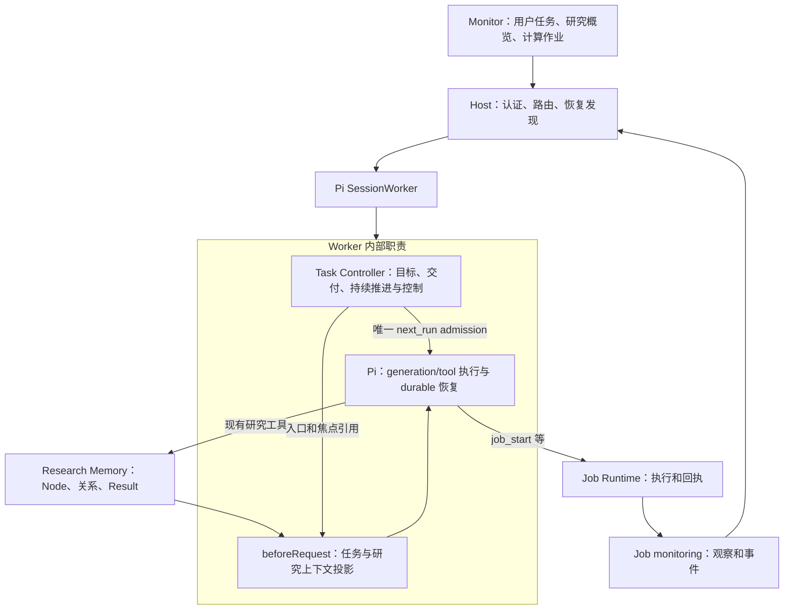

# 研究问题图、渐进规划与持续推进方案

日期：2026-10-10。状态：**本分支已实施**。本地确定性验收覆盖运行、协议和恢复；真实模型的自主研究质量、远程计算与 CoRHub 页面不在本次完成范围内。

历史代码基线：Git `30bbcfc0`（随后本地提交只涉及另行保留的规划文档和品牌素材）。实现基线包含本工作区的 Task Controller、统一 Monitor、领域科学回归及本次研究图改动。本文保留历史依据与设计边界；第 12 节列出实施范围和验收场景，具体通过范围以测试运行器报告为准。任务控制见 [Task Controller 实施记录](MONITOR_TASK_CONTROLLER_PLAN.zh-CN.md)。

## 1. 推荐决策

保留 Node，但明确其单位是**可以独立推进和解释的研究问题**，不是命令、计算步骤、固定阶段或调度任务。研究可以按问题组织为树，也可以具有共享问题、依赖、替代方案和证据引用；底层继续使用现有研究图。

具体选择：

1. **不强制总根 Node。** 简单研究可以只有一个 Node；复杂研究可以有一个总问题和若干子问题；组合委托可以直接引用多个研究入口。
2. **不新增 Plan/PlanStep 持久对象。** Node 的 `plan` 保存局部调查方法，已有 Node 与关系表达整体分解；界面中的“研究计划”是这些事实的投影。
3. **Task 保存研究入口与焦点引用。** Task Controller 负责未完成委托的持续推进和用户控制，不选择研究分支，不执行研究 DAG。
4. **Agent 在正常执行中渐进规划。** 开始时分解已知问题，证据出现后调整；不增加规划模型循环、每轮 checkpoint 或创建节点的审批关卡。
5. **回溯是重新考虑研究判断。** 保留失败证据、修订方案、重访问题、切换分支；不回滚外部操作，不抹掉历史，不自动重算全部下游。
6. **最小运行时增量是 Task 引用、请求前图投影，以及进展计数修正。** 复用现有工具、存储、Monitor 和唯一 `next_run` 路径，不恢复旧 tree/Decision/Gate 协议。

预期效果不是让所有研究长得像同一套流程，而是让下一次请求仍能回答：整个委托要交付什么、当前在回答什么、哪些问题尚未解决、为什么下一步值得做。

## 2. Git 历史：真正固化工作流的是什么

以下为对应提交快照中的代码和文档证据。历史路径、行号不代表当前文件位置，可用 `git show <commit>:<path>` 复核。历史经历过多次解耦和重新加约束，不能概括为单向恶化。

| 提交 | 具体证据 | 对本方案的启示 |
| --- | --- | --- |
| `3c78d978` | `references/tree_schema.md:143–150,175–186`：单父谱系加多输入引用；回溯记录跨边，不改原 parent。`tool/record_backtrack.py` 位于 `src/transition_state_workflow/`，156–185 行保存来源、重访点、理由和证据 | 早期树的价值是失败记忆、分支来源和重访可追踪，应保留这些能力 |
| `3c78d978` | `src/transition_state_workflow/tool/plan_next.py:194–208` 生成 phase、allowed/forbidden、blocking gates；`references/tree_schema.md:158–161` 将 candidate 声明绑定上游 endpoint readiness | 最早版本已含领域流程规定；规划包的建议与执行端硬校验必须区分 |
| `77d15f40` | `ts_workspace/validators/decision_context.py:35–65`：首节点必须 `n000`，phase 必须 endpoint/preflight；在最近 unresolved 节点外开分支必须提交特定 backtrack | 创建顺序和“最后节点”被写进研究合法性，跨分支探索增加手续 |
| `0e6540a8` → `9a04caf4` | ontology 引入 intake/mechanism/candidate_search/validation/audit；后者 `ts_workspace/validators/decision_context.py:70–78,103–129,151–195` 检查首节点、假设状态、prediction scope、类型专属 closure 和 branch_context | 类型有助于说明，但不应决定能否探索、记录反例或重访被否定的想法；清理 v1/v2 双协议本身应保留 |
| `bb02fd2d` | `ts_workspace/decision_validator_v3.py:95–103` 放开 n000/type 路由；241–253 行仍要求 Claim supported 满足 required gates | 这是一次真实的解耦；“能否宣称成立”与“能否记录、研究”应分开 |
| `b6b3906d` | `docs/adr/0001-dag-research-kernel-v4.md:55–62` 明确 DAG 不选择下一步，Claim 关系不授权流程转移；140–151 行要求有界 frontier/context | 多依赖、历史引用和研究焦点可以支持回溯，而不成为调度器 |
| `c05e47e1` | `docs/adr/0002-phase-node-research-kernel-v5.md:38–56` 明确 Phase 不是生命周期、Gate 或固定顺序；schema 又要求每 Node 必须有 `phase_ref` | 不能说这一版强制按 Phase 顺序运行；准确问题是额外的强制组织层 |
| `f6ef5531` | `ts_workspace/decision.py:148–198` 新增每 Decision 最多创建一个 Phase、开始/结束一个 Node；同时结束 A、开始 B 必须声明 B 依赖 A | 把同一事务发生的操作误当科学依赖。切到独立分支需拆事务或制造依赖，这是具体的流程僵化机制 |
| `363d26cb` | `python/ts_agent/workspace/decision.py:482–504,570–595`：冻结 ProofSpec 需要已登记 predictions/falsifiers，接受 Claim 需要相应证明与策略 | 严格接受结论有理由；不能把这种要求扩展到所有试算、观察和诊断。此证据只证明 ProofSpec/acceptance 的门槛 |
| `6358260d` | `packages/ts-agent-kernel/ts_agent/workspace/engine.py:404–430`：存在 NodeGate 时，关闭 Node 要有最新 passing result，未按 terminal outcome 区分 | 失败或不确定分支也可能因没有 pass 无法收尾。节点停止、结论成立、任务完成必须分离 |
| `75c6c168` → `020e426c` | ResearchMap 成为规范研究状态；后者 `packages/ts-agent-kernel/ts_agent/research/model.py:67,120` 增加 ContinuationRecord，`apps/app-server/pi-native-tools.mjs:151,156` 按义务追加有限轮次 | 有研究义务不代表可靠承担整个用户委托；独立 continuation 账本也容易与执行状态重复 |
| `72cf86fd` → `c2c3195e` | 前者 `packages/ts-agent-runtime/host-api/lifecycle.mjs:23,146–155,178–205` 按 orient/advance/prepare/execute/interpret/checkpoint 的有限阶段图限制工具，checkpoint 阶段只准 checkpoint，并非所有阶段必须线性经过；后者 `apps/app-server/pi-native-tools.mjs:147–197` 仍主要针对缺 checkpoint 追加跟进 | 研究恢复依赖补齐流程手续，可能形成修 checkpoint 的控制循环 |
| `d0a4f8b2` → `75afda55` | State outbox 经 Host 发送 `next_run`；后者 `packages/research-state/research_state/admission.py:5–19,32–54` 将依赖、strategy、Gate/exemption 接到新 Job 与 Node-scoped Skill 副作用准入 | `next_run` 只是传输入的机制；把研究流程 Gate 放到它周边，才造成执行与研究手续耦合 |
| `697b8160` → `e1413254` | 前者 `packages/research-state/research_state/assessments.py:117–160` 依据证据/Gate 版本判断当前性；后者 `requirements.py:312,350` 与 `delivery.py:9–21` 接入来源、要求和交付消费 | 版本变化传播到验证与交付判定；需要保留来源与证据，但不能将任意版本变动等同科学结论失效 |
| `ed4b8b14` | 仍保留 lifecycle、checkpoint 和 State continuation；`apps/app-server/research-control-loop.mjs:1,34` 增加连续读/checkpoint 的 6 次警告、12 次停止 | 提交标题里的“收敛”不等于旧控制框架已移除；停止循环的补丁不等于研究已经能继续 |
| **`2765f0c1`** | 删除 `packages/research-state/research_state/admission.py`、`packages/agent-runtime/host-api/lifecycle.mjs`、`apps/app-server/state-continuation.mjs` 等；新增当前路径的 Node/Result 核心 | 这是转到轻量 Memory、移除旧控制体系的关键提交，应在这个基础上补能力 |
| `8de18cc7` → `6da2f113` | 前者 `backend/src/research_agent/research/context.py:1,24–43` 明确只产生 review notices，不做 truth gates；后者系统提示不允许 mandatory checkpoint 或 separate planning loop | 保留字段版本完整性、证据修订与复核提示，研究关系继续不作为执行许可证 |

**树本身不必然固化流程。** 固化主要来自把领域阶段、预登记、节点关闭、操作顺序与执行许可耦合。反过来，只删 Gate、只保留“同一问题反复尝试”，也不能保证 Agent 会合理分解大问题。

旧代码可证实的是验证当前性与准入限制的传播；本次未发现自动改写所有下游报告或回滚全部研究结果的实现。本文提出“不自动回滚/重算”是新方案的边界，不将它误写成旧版本已经发生的事实。

上述历史证据不能单独证明 t005 的实际中断因果。此次没有重新读取私有运行日志；“大量工作集中在一个 Node”来自用户观察，下面给出的是可由当前源码支持的机制分析和待验收方案。

## 3. 当前为什么容易形成一个过大的 Node

| 当前位置 | 已有能力或缺口 | 影响 |
| --- | --- | --- |
| `backend/src/research_agent/research/nodes.py` | `goal/proposal/plan/progress` 已有；Node 被定义为跨尝试的研究问题 | 可以表达计划，但不负责识别最初问题是否过大 |
| `prompts/coragent.md`、Research Memory Skill | 强调同问题重试留在一个 Node，独立问题才新建 | 若首个 goal 是“完成整个机理研究”，后续很容易被解释成同问题的尝试；缺少配对的分解示例 |
| `apps/agent/tasks/controller.mjs` | Task 有目标、交付条件和控制状态，没有稳定研究入口或焦点 | 恢复任务时缺少“本委托关联哪些研究问题”的显式线索 |
| `apps/agent/pi/setup.mjs`、`tools/user-sources.mjs` | `beforeRequest` 先读取任务，再注入 Memory；输入来源提取当前只返回 `event_ids` | 已有 focus 通路没有接上 Task 的持久关联 |
| `backend/src/research_agent/research/views.py` | 按事件、会话、活动等排序；反向关系优先级未包含 `part_of` | 聚焦总问题时，子问题不一定优先进入预算 |
| 同上 | Node 卡片不带关系；大 Node 的紧凑卡片省略 `plan`，也没有稳定整体结构区 | 上下文压缩后可能只看见“刚做过什么”，看不见整体分解和下一步方案 |
| `apps/agent/tasks/controller.mjs::observeToolResults` | 成功的 `research_create/update` 等不同返回可增加 progress | 不断写计划或 note 可能掩盖无进展；拆成更多 Node 并不会自动改善 |

因此不能只加一句“先写 plan”。需要同时让 Agent 知道何时拆分、让上下文保留图结构、让控制器不把纯记录活动当作持续有进展。

## 4. Node 的通用划分方法

### 4.1 用可独立解释的问题划分，不用命令数量划分

考虑拆分的信号：

- 两部分有各自的结论和适用范围，完成一个仍不能回答另一个。
- 可以独立暂停、比较、分配资源或采用不同方法。
- 一部分证据会被多个后续问题复用。
- 一个局部方案失败，仍应清晰保留其它独立路线。
- 当前 `plan/progress` 长期混合多个互不相同的问题，恢复时难以识别仍缺什么。

通常保留在同一 Node：同一目标下调参数、重试、换初始构型、诊断收敛问题，以及同一统计问题的重复采样。不同方法也不必然意味着不同 Node；只有需要独立推进或解释时才拆分。

每个有实际工作的 Node 应能用自然语言说明：要回答什么、依据什么判断、准备怎么调查、当前还缺什么。分别使用已有 `goal/plan/progress/Result`，不新增四个必填结构或要求预知最终答案。`proposal` 可为空；准备数据、纯推导和报告不必虚构假设。

不设置最少节点数、固定深度、每节点 Job 上限或“每轮必须创建节点”。单 Node 本身不是缺陷。

### 4.2 不同理论计算的适用性

| 研究类型 | 合理组织示例 | 不应强制的拆分 |
| --- | --- | --- |
| 单分子单点能/性质 | 一个性质问题，若干诊断或重复 Job，一个解释结果 | 输入准备、运行、解析各建 Node |
| 势能面/反应机理 | 可选总问题；需要分别推进的路径 A/B；共享结构或方法验证；比较与综合 | 每次优化/频率/IRC 一律建节点，所有研究都固定 opt→freq→IRC |
| 周期 DFT | 某性质是否数值收敛为一个问题；扫描配置和结果表为 Artifact；不同物理相按需要独立研究 | 每个 k 点/截断能值建节点，套用分子端点协议 |
| MD 与自由能 | 平衡性、采样充分性、不同态的比较可分问题；重复轨迹属于采样尝试 | 每条轨迹、每个时间块建节点；Job 正常结束等于统计收敛 |
| 模型拟合/方法比较 | 可共享数据质量或误差研究；不同模型是否独立分支取决于比较目标 | 每组超参数必建 Node；自动把所有模型视为互斥假设 |
| 解析推导、理论证明 | 引理或近似适用性按独立性组织；推导材料和结论为 Artifact/Result，可以零 Job | 必须提交计算，必须登记实验预测，必须有数值 Gate |
| 文献综合/报告 | 多证据支持一个综合问题；报告通常是 Result/Artifact | 复制所有旧 Node；每个交付条件创建一个影子节点 |

通用的是问题、方法、证据、结论和修订关系；收敛判据、误差估计、结构身份、守恒关系等科学要求由相应领域方法决定。Memory 不应自行裁定这些科学结论。

### 4.3 树只是视图，根节点是可选的

现有 `part_of` 是包含关系：子节点指向总问题，禁止包含环，允许多父节点。`requires` 表达研究依赖，环产生诊断而不拒绝工具；`alternative_to` 是对称关系。不能把这些关系统一称为一个严格 DAG：只有包含结构必须无环。

示例：

```text
任务：在给定方法和预算内解释反应路径及局限
  研究入口 R：哪些路径与现有证据相容？（这个总问题可选）
    A：路径 A 是否连通目标状态？
    B：路径 B 是否连通目标状态？
    C：现有证据是否足够比较两条路径？
  共享问题 V：方法误差是否影响比较？

A part_of R；B part_of R；C part_of R
C requires A/B/V；A alternative_to B（仅在确实是替代方案时）
具体比较引用 A/B/V 的精确 Result，而不是只引用“最新节点”。
```

另一任务可以复用 V；完成一个任务不应自动关闭 V。没有总问题 R 时，任务可以直接绑定 A、B、C 为入口。归属视图可以呈现为树，但共享节点显示为引用，不复制对象或另存 `parent_id`。

## 5. 与当前框架的职责适配



| 对象 | 唯一责任 | 不承担的责任 |
| --- | --- | --- |
| User Task | 用户委托、真实授权来源、交付条件、控制状态；关联研究入口和焦点 | 镜像 Node 的计划、节点状态或科学结论 |
| Node / 研究问题图 | 局部问题、方案、进度、证据判断、分支和共享关系 | 决定何时运行模型，批准资源开销 |
| Result / Artifact | 不可变结论、材料与具体来源 | 自动证明科学正确，代替用户授权 |
| Job | 执行意图、状态、收集、取消与回执 | 定义研究问题，成功退出即宣告任务完成 |
| Pi generation/tool Task | 一次模型或工具执行的持久恢复 | 独立保存另一个研究计划或用户任务生命周期 |
| Host / Monitor | 统一访问、控制与展示；Job 观察及事件接纳 | 写另一份研究图、执行 DAG 或新增续跑协议 |

Task 控制“还需不需要继续”，Agent 根据证据判断“具体做什么”。焦点是上下文选择，不是执行锁；可以同时关注多个问题，在其它问题运行 Job 时推进独立研究。

## 6. 最小协议增量

### 6.1 Task 只增加一组研究引用

规范 UserTask DTO 保存：

```json
{
  "research": {
    "entry_node_ids": ["node_…"],
    "focus_node_ids": ["node_…"]
  }
}
```

- 入口用于从当前委托恢复研究图，焦点用于选择下一次请求的相关内容；两者都是已有 Node ID 的唯一列表。
- 允许空列表、一个入口或多个入口。不要求焦点是入口的严格后代，因为可能正在复核共享问题或新分支。
- 引用不是排他所有权或权限范围；共享节点照常适用 Memory 的读取版本检查。范围关联也不等于允许提交任意高成本 Job。
- 不在 Node 增加反向 `task_id`、`is_root`、`is_step`，不复制 Task objective，不建立第三份计划状态。

规范容量为入口最多 128 项、焦点最多 16 项；入口沿用现有 Memory 引用集合的 128 项量级，焦点保持小集合。这是导航列表的容量，不限制研究图总节点数。这两个数已固定在唯一合同源，各层不另设不同上限；超限明确报错，不静默截断存储。`task_read` 返回完整引用，请求投影按预算摘录并报告省略数量，研究图投影有自己的总字节预算。

现有 `task_update` 使用唯一关联动作 `set_research`，携带完整入口/焦点列表，复用 `expected_revision`、稳定请求身份和回执。创建任务时保持空关联；Agent 创建或选取已有节点后绑定。首期不同时再给 `task_begin` 增加另一套绑定写入口。

替换列表适合其“小范围引用”语义，不提供第二套 add/remove 协议。节点内容及图关系仍只通过现有 `research_create/update` 修改。`set_research` 不改变任务等待、暂停、完成条件，也不计作新科学进展。

### 6.2 读协议和唯一实现

| 层 | 增量 | 继续保持 |
| --- | --- | --- |
| `task_read`、Task Monitor DTO | 返回同一组研究引用 | 不展开独立 PlanStep，不复制研究状态 |
| 内部 `research.read` 概览参数 | 增加可选 `entry_node_ids`，复用已有 `focus_node_ids` | 模型工具 `research_read` 继续使用已有 `ref/field/offset/limit`，不另开公开概览参数 |
| `research-snapshot` | 增加有界结构投影、关系摘录、入口/焦点标识及省略信息 | 原始研究记录为唯一事实源，投影可重建 |
| `beforeRequest` | 从当前 Task 传递入口/焦点，并结合实际事件 | 每次模型请求前注入，不写进对话历史 |
| Monitor 展示 | 任务详情用现有研究读边界按 Task 引用取得同类投影 | 一个 Monitor 协议、一个图投影实现 |

不增加 `plan_*`、`node_start/finish`、`backtrack_*`、`phase_*` 工具，不引入“规划完成后才可用 bash/job”的准入条件。Task 工具和 Monitor 合同是当前 Worker 层合同，不应为此再向 Python 后端创建一套任务写协议。

首期协议成本限定为：**零个新持久对象类型、零个新模型工具、一项 Task 更新动作、两组 Node 引用、一个概览读取参数，以及现有快照的结构摘要。** 关联改变时才写 Task；普通调参、每次工具调用、每轮回复不需更新焦点。简单单问题研究至多多一次初始绑定，不为创建计划而先走 Phase/Claim/Strategy/Gate 链条。

现有 ID、workspace 校验、读取依据、幂等回执和事务边界继续保留。这些处理实际存在的并发与恢复问题；不增加双读兼容、按标题猜测、异常时自动创建替代节点或任意次数重试等兜底逻辑。

### 6.3 创建与关联跨两个持久边界

Memory 创建 Node 与 Pi 更新 Task 不能伪装成一个原子事务。采用现有操作身份和恢复机制：

1. `research_create` 返回并持久保留 Node 身份；已有节点可以直接使用。
2. `set_research` 在 Pi commit 外通过规范研究读验证引用属于当前 workspace。
3. Pi commit 内重新检查 Task revision 和用户控制状态，再保存引用与回执；暂停或并发修改不能被外部 IO 前的旧状态覆盖。
4. 若在创建后、关联前崩溃，恢复原 Pi 工具执行/回执，核对已经创建的 Node，再补关联。研究写请求身份由 session、Pi operation 和 provider call ID 一起确定；重放同操作不重复创建，不同操作复用 call ID 不会碰撞。
5. 节点可被别的研究修改；引用身份校验不声称锁定其内容。内容更新仍依赖 Memory 的实际字段读取与 revision。

真实 SQLite Harness 与 Python Memory bridge 的恢复测试覆盖创建成功、尚未关联时关闭，再以同身份恢复工具操作并补关联。任务关联的既有成功回执先于外部引用验证读取，避免重放依赖新的 Memory 可用性；没有另建规划事务或按标题猜测去重。

## 7. 请求前上下文：同时看见全局与当前问题

### 7.1 注入时机

仍放在 `GenerationTask.beforeRequest`：读取真实输入来源及事件 → 读取当前 UserTask → 构造任务投影 → 使用入口/焦点读取 Memory 投影 → 检查预算与控制状态 → 发给模型。工具调用返回后的下一次模型请求同样刷新；不只在任务开始或 Job 完成时刷新。

不把快照当用户消息、授权或触发器。`next_run` 接纳决定何时执行；快照决定执行时能读到哪些事实。两者没有新的互相唤醒机制。

### 7.2 有界投影

在现有 16 KB 研究快照预算内，先预留结构与关键执行事实，再填详情。具体配额用大小测试确定；首期建议为结构/方案保留约四分之一，允许未用额度给其它内容，不新增用户可配置的预算系统。

| 内容 | 需要保留的信息 |
| --- | --- |
| 结构概览 | 入口、焦点、相关 `part_of/requires/alternative_to` 边，ID、标题、原有 Node status、assessment 引用 |
| 局部研究 | 焦点的 goal/plan/progress 摘录、最新相关 Result、尚待复核的事实 |
| 执行事实 | 唤醒事件、未收集/不确定/运行中 Job 的精确身份与读取入口 |
| 省略与恢复 | 省略数量、截断标志、revision、精确读取引用；重要区域缺失时明确告知 |

从入口向下查看 `part_of`，从焦点查看父问题、直接依赖与替代问题。只扩展有界邻域；不能把全工作区可达图灌进上下文，也不能让无关最近活动挤掉本任务整体结构。大图的遗漏通过既有 `research_read {ref, field:"relations"}`、字段分页和 `research_search` 继续读取。Agent 只有真正改变研究关注点时才调用 `set_research`，下一次 `beforeRequest` 自动聚焦；不能为只读浏览反复写 Task。Monitor 可以调用内部同一投影查看局部图，不修改任务焦点。首期不增加另一套全图分页游标；跨次读取显示版本，不宣称获得了全图的原子快照。

不在投影中推断新状态 `ready/succeeded/failed` 或保存“下一步候选队列”。`open` 也不等于可立即执行：等待、科学判断和用户约束仍需结合实际材料判断。

大 Node 卡片要包含有界 `plan` 摘录，或明确标明计划被省略并提供字段读取入口。**摘要不得签发完整字段的替换依据。** 继续保留现有 `read_basis` 和逐字段完整读取规则；这是并发数据完整性，不是研究方法 Gate。

## 8. Agent 的规划与回溯行为

### 8.1 初次开始

识别用户目标和交付约束，按现有工具登记持续 Task。随后判断任务是一个问题，还是包含可以独立解释的子问题。创建当前已知、马上有用的问题并建立关系；远期未知工作可以先写进局部 plan，等实际形成独立问题再建 Node。

研究记录要留下当前行动的依据，但不要求单独一次“计划批准”、固定长篇 plan 或每轮更新图。几次正常的研究操作足以创建初始结构，不为此新增批量 Decision 协议。

### 8.2 每次恢复与取得证据后

先恢复委托和当前问题，检查未处理事件及结果；判断是在原问题上继续、打开独立分支、综合已有证据，还是需要等待。只在问题、方法、证据判断或关注对象实际改变时更新相应记录。

如果一个分支在计算而其它问题可推进，继续独立工作。只有无其它有价值且获授权的工作、确需等待已归属 Job 时，才把整个 Task 设为 waiting。Node 状态不能替代 Task wait。

### 8.3 回溯映射到既有操作

| 情形 | 采用操作 | 保留的边界 |
| --- | --- | --- |
| 环境错误/未收敛 | 检查 Job/输出；在原 Node 修订方法和尝试计划，说明原因 | 执行失败不直接否定科学假设 |
| 某候选被证据排除 | 发布否定或有限结论；继续同问题的其它尝试或独立分支 | 负面 Result 是有效产出，允许关闭该分支 |
| 发现原假设有问题 | 原 Node 更新 proposal/plan；独立问题才新建 Node，记录来源和理由 | 不强制“被反驳假设不能成为历史来源” |
| 回到以前的问题 | `research_update` 重开已有 Node、记录重访理由及涉及证据，更新 Task 焦点 | 不重写旧 parent，不重置 Job 或删除失败记录 |
| 修订已发布判断 | 新 Result 使用 `supersedes`，按需选择 `as_assessment` | 旧 Result 不可变；跨 Node 的新发现用引用，不能伪造同节点修订 |
| 上游结论被修订 | 查看现有复核提醒，判断下游报告/比较是否需要更新 | 不自动递归否定、关闭、取消或重算 |

回溯理由通常是一条带引用的研究 note；关系只按真实语义声明。两个步骤相继发生不等于存在 `requires`。首期不新增专用 backtrack edge 或事件工具；现有历史和证据引用已足以说明“为什么重访”。

### 8.4 持续推进和停止

局部路线失败后，Agent 检查剩余有依据的授权路线；Task Controller 继续沿既有 `next_run` 接纳推进。没有可行工作时明确等待、阻塞、达到约束后停止，或按交付条件交付负面/不确定结论。持续推进不意味着必须无限搜索到正结果。

研究策略调整不自动修改用户交付条件。若结论只能是“不足以证明”，应核对这是否满足原委托；不能偷偷把“证明 X”改成“做过一些计算”以完成任务。

## 9. 避免“持续运行但没有研究进展”

现有三轮无进展控制主要识别没有新工具产出；不同 note、plan、Node 创建返回可能刷新计数。增加图结构前应先修正这个具体漏洞。

推荐最小改动：

- 保留单一 Task 控制生命周期和现有停滞核对。`research_create/update`、`set_research` 的成功本身记作活动，不重置有效进展计数。
- `task_update progress` 可以描述规划，但引用可变 Node 或仅新增 note 不因此获得无限续跑额度。推进依据需区分固定 Result/Artifact、真实 Job 执行/收集里程碑和其它已有可验证产出，按稳定身份去重。
- 参数重试、Job 状态查询、已有 Result 重读、重复相同交付不反复加分；更改标题或创建更多空节点也不加分。
- 纯推导、文献综合、计划交付任务可以用实际新增的推导、来源材料、完整方案 Result/Artifact 表达产出，不要求 Job。长时间仅在内部思考而没有可恢复产出，仍需要留下有用结果或明确限制。
- 停滞时展示最近几次实际动作、重复尝试及缺少的依据，让 Agent/用户能判断原因。不增加一个自动“评审模型”或领域无关的科学打分器。

去重必须由自动工具观察与 `task_update progress` **共用同一规则和持久集合**，不是分别散列工具返回和引用数组：

| 依据 | 去重身份与计入方式 |
| --- | --- |
| Result | 单项不可变 `result_id`；换引用组合、换调用入口、重复读取不再次计入 |
| Artifact | 规范固定材料身份；同内容重复登记不能仅凭新包装引用再次计入 |
| Job | `job_id + milestone`；提交被接受、首次实际终态、完成收集分别核对既有回执，查询次数和返回时间戳不计入 |
| Node/研究 note/关联修改 | 可以报告活动，但不作为重置无进展计数的产出身份 |

沿用 Task 的持久进展记录，将当前指纹字段替换为已计入单项身份集合；自动观察和显式进展更新在同一 Pi 事务规则下查重并追加。不因重启或最近 128 项窗口淘汰而忘记任务此前已计入的依据；该集合不全量注入模型上下文。组合 `[R1]`、`[R1,R2]`、`[R2]` 只允许 R1、R2 各首次计入一次。纯说明、控制更新和相同证据的重新排布不改变计数。

这个规则只能排除明显的记账循环，不能证明新 Result 的科学价值；反复制造低价值 Artifact 或不断发起新 Job 仍可能看似有产出。要控制资源上限，继续遵守用户明确的预算和尝试限制。当前没有安装级结构化预算执行器，本文不把 Node 划分说成它的替代品。

任务完成同样不能由根 Node closed、所有 Node closed 或全部 Job 成功自动推导。最终判断应引用支持各交付条件的不可变 Result/Artifact/交付回执，并说明限制；Controller 验证引用与交付事实，科学适用性仍由 Agent 和领域验证负责。共享问题可以保持 open，已完成任务的关联只用于查看，不自动重新唤醒。

## 10. Monitor 与界面呈现

仍以 `/monitor` 为统一入口，任务和作业分别显示。用户任务详情增加“研究问题”区域，展示入口、当前关注问题、相关问题的已有状态、方法摘要和证据/Job 链接。Pi 内部 generation/tool Task 继续放在执行诊断。

不为本功能新增 `/plan`、`/node run`、`/backtrack` 或第二套研究控制命令。查看详情沿用现有 Monitor task read/选择流程，修改研究仍由现有研究工具完成。

展示原则：

- 可以缩进显示包含结构，跨父节点的共享问题标记引用；依赖和替代单独说明，不画成强制执行顺序。
- `closed` 显示为“已结束”，科学结论单独显示；不把它涂成默认“验证通过”。
- 不显示“完成 3/5 节点 = 60% 研究进度”。若显示数量，明确只是节点状态统计。
- 焦点只表示当前关注，可以多个；既不隐藏其它未完成问题，也不把晚到事件当成切换任务的授权。
- 整理旧大节点后，历史结果仍显示原归属，新增问题可以链接旧证据。

CoRHub 页面继续延期。本方案只规划终端/现有 Monitor 的最小读视图和共用投影，未来 CoRHub 消费同一事实源。

## 11. 新安装与单协议切换

按用户明确要求，本次不兼容现有 workspace，不实施自动迁移或旧大 Node 整理。

- UserTask 唯一 schema 为 `coragent-user-task/2`，初始化即含研究引用；研究快照唯一版本为 `research-snapshot/3`。
- Node/Result schema 保持现有语义。Task DTO、研究概览、生成合同和所有消费者一起切换，不保留旧版读取分支、别名或双写。
- 不恢复旧 `tree.json`、ResearchPhase、Decision checkpoint 或 Gate 接口；生成文档仍为可重建视图。
- 不复制旧 Task、重写旧 Job/Result 归属，或根据最近活动猜研究关联。重新安装后创建新任务和研究记录。
- 创建 Node 与关联 Task 间的中断恢复仍属于新协议的正常运行保障：恢复同一操作身份并补关联，不重建 Node、不重复发 Job。

## 12. 实施拆分和验收

### P0：锁定语义与测试场景

确认本文的单问题粒度、可选多入口、引用非所有权、回溯不回滚、节点结束不等于成功。建立确定性场景夹具，覆盖不同理论计算和分支行为；不以“必须生成 N 个节点”作为模型质量指标。

产出：明确的新字段/动作/快照结构及场景预期；列出旧对象和旧接口不得重新引入的检查项。

### P1：Task 引用与上下文贯通

修改范围：

- `apps/agent/tasks/{controller,tools,projection}.mjs`：唯一引用写动作、验证、回执、任务投影。
- `apps/agent/pi/setup.mjs`、`apps/agent/tools/decision-context.mjs`：请求前读取当前入口/焦点并注入。
- `backend/src/research_agent/research/{retrieval,views}.py`：结构/方案有界投影、双向包含遍历与现有字段分页的读取入口；同时更新 `application/` 中既有命令分派的参数传递。
- `contracts/commands/{research,results,shared}.json`、Monitor 合同与对应生成文件：只更新规范读写合同，不另造兼容入口。

验收：重启和压缩后仍恢复整体及焦点；大图有界且可继续读取；任务范围明确；摘要没有完整编辑权限；创建与绑定间崩溃不复制 Node。

### P2：规划指导、进展识别和回溯回归

修改 `prompts/coragent.md`、Research Memory/Workflow 的中英文 Skill 与按需示例：增加成对的“应该拆分/不应拆分”案例、动态规划和失败后继续。保持短核心说明，理论计算细例放参考文档，不把所有领域模板塞进系统提示。

同步修正 Task 进展识别，将纯规划活动与可核对产出区别处理；不新增科学成功状态机。已有 `supersedes`、复核提醒、read basis 与 Job 恢复边界继续使用。

验收：单问题不碎片化，复杂问题有可解释分解；失败后重访/改路；纯推导可推进；反复改 plan/note 不无限延长任务；任务完成需要交付证据。

### P3：终端和文档

修改现有 Monitor 任务详情与状态呈现，消费 P1 的共同投影；同步架构、终端和公开工具文档。CoRHub 仍不实施。

验收：任务、问题、Job、Pi 执行可区分；共享节点不复制；无双接口/双状态；只查看不唤醒模型。

### P4：科学场景与模型行为验收

先使用本地确定性模型验证控制/恢复，再单独评估 Agent 的实际规划能力。脚本化模型按预设顺序创建节点，只能证明协议能运行，不能证明模型会自主分解研究。

| 场景 | 要验证的行为 |
| --- | --- |
| 单点计算、参数扫描 | 可以使用一个 Node；参数集合和多 Job 不强行膨胀为步骤树 |
| 多路径机理 | 独立路线可分别推进，共享证据可复用，比较结果精确引用 |
| 周期 DFT、MD 统计 | 不要求分子专属阶段；计算成功与科学收敛分开 |
| 纯推导/模型拟合 | 零 Job 合法；独立引理/模型按研究需要拆分 |
| 分支失败后继续 | 记录负面证据，改方法或选择另一授权路线，不将全任务直接结束 |
| 上游修订 | 下游收到复核提示，保持旧证据；必要时更新报告，不自动重算 |
| 跨任务共享 | 同 Node 可以被复用；结束/取消某任务不自动关闭共享研究 |
| 多入口、关系反馈 | 多父包含合法；包含环拒绝；requires 环提示但不封锁工具 |
| 上下文压缩/超大图 | 稳定保留目标、结构和计划读取入口；省略明确，分页无伪完整性 |
| 创建与关联间崩溃 | 恢复同一 Node，补全引用，没有重复 Job 或重复根 |
| 暂停竞争、晚到 Job 事件 | 规划更新或事件不能恢复用户已暂停/取消的任务 |
| 纯记账循环与去重 | 改标题、计划、note、空节点不能持续重置计数；同证据换组合、跨两个入口、重启或超过 128 项后再次出现不重复计入 |
| 完成判断 | 全节点 closed 但缺交付仍不能完成；交付充分时不要求关闭共享节点 |
| 已有研究复用 | 新任务显式关联本协议中已经存在的 Node，引用旧结果而不重写归属；不涉及旧 workspace 迁移 |

模型行为评估使用公共或人工构造、可外发的任务材料；真实远程模型测试需另行明确授权，不发送 `local_debug/` 内容。测试环境、缓存、证据和服务均按仓库 AGENTS 约束，通过统一测试运行器管理和清理。

实施依赖为 P0 → P1/P2 → P3/P4。Worker 关联、Python 图投影、指导和 Monitor 已按共同合同并行实施；合并后统一生成合同并进行端到端验收。P4 的确定性测试验证控制行为，不能替代真实模型的自主规划质量评估。

## 13. 首期明确不做的扩展

不新增 Phase、结构化 PlanStep、自动 DAG scheduler、必填 hypothesis、研究 Gate、全局 current_node、专门回溯服务、计划审批状态、基于节点数的进度百分比或独立规划代理。也不尝试自动把所有历史研究重构成漂亮的树。

只有当实际场景证明已有 Node/关系/Result 无法表达某个事实，才增加对应数据语义；不能仅为了 UI 排列或让 Agent “看起来在按步骤工作”而扩大持久协议。

## 14. 交付判断

本方案的成功标准是：**一次正常回复结束、上下文压缩、计算失败或分支被否定之后，Agent 仍能恢复整个委托，找到有证据依据且符合授权的下一步，或者给出可核对的停止原因。**

Task Controller 保障持续责任，研究图保障工作记忆，Agent 与领域方法负责研究判断。三者各自补齐，才能改善 t005 类问题；仅恢复树状 UI、增加节点数或要求更长的计划，都不足以达到这个目标。
