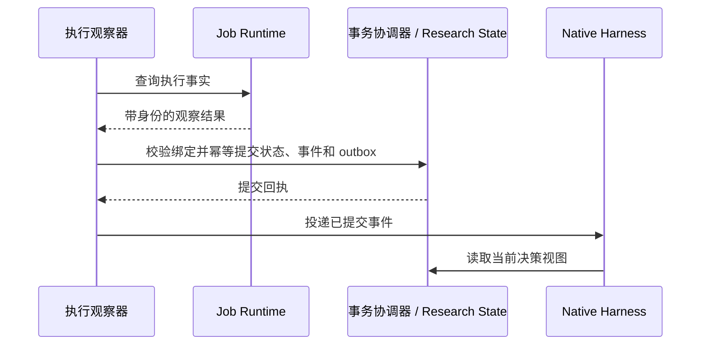

# t003 暴露问题的修复与验收规划

日期：2026-10-08（北京时间）。源码基线：`4e17f8c6`。

状态：P1–P5 已形成源码候选，P6 本地确定性回归、真实 Native 请求检查、wheel 隔离验证与有限模型对照评估已实施；验收证据和未覆盖项见 [修复验证记录](T003_RELIABILITY_VALIDATION.zh-CN.md)。P7 生产切换、历史归档和重新计算尚未执行。以下保留完整设计目标；具体交付范围以验证记录为准，不能将规划中的全部指标视为已经验证。

后续补齐：旧参数封闭校验、Monitor Job 协议链路与 Artifact 类型声明已清理；全部 Node 测试纳入维护清单，增加错误写入拒绝后的真实模型多轮恢复验证。详见 `T003_RELIABILITY_VALIDATION.zh-CN.md` 的后续章节。

升级原则：按用户要求，本次采用不向后兼容的直接升级。只实现一套新契约，不保留旧 API、旧字段别名、旧 schema 读取器、旧会话续接或数据迁移逻辑。旧运行数据只作离线审查和回归材料；历史记录留存不等于运行时兼容。

## 1. 目标与范围

修复 t003 暴露的证据错配、状态漂移、无效重试、上下文截断及 Gaussian 输出误读，使研究代理能够基于当前事实作决策，同时保持公共运行时领域无关。

成功标准：

1. 错误任务的输出不能作为当前 Attempt 的直接执行证据写入。
2. Job 已经结束时，即使模型未主动查询，执行观察也能最终收敛到对应 Attempt；未知状态不伪装成结束。
3. 工作区不能在仍有未核实活动计算时被标记为全局终态。
4. 模型请求中的当前目标、约束、待处理事件与状态缺口不会被历史 Artifact 元数据挤掉。
5. 相同请求不会重复派发；刻意重复实验仍可表达和执行。
6. 领域规则、科学路径及验证算法不进入公共 Research State 或 Job Runtime。
7. 完成确定性场景回放、安装包验证及受控模型评估后，才开展新的科学计算。

本次不新增 Agent loop、第二份 ResearchMap、通用规则语言或新的常驻服务；不把研究固定为某种计算流程；不把模型文字判断升级为机器验证事实。

## 2. 已确认问题与现有能力

| 编号 | 已确认事实 | 修复归属 |
| --- | --- | --- |
| F1 | `research.locate/detail` 使用未定义的 `_string`；locate 另调用 `_json_text`，需一并审查 | 公共查询实现 |
| F2 | Gaussian 将 `SCF=Tight` 折行，解析器拼成 `SCF=Ti ght`，报 route 不一致 | Gaussian 扩展 |
| F3 | `99aaa86a…` 被错误解释为 QPErr，所引 Artifact 实际来自 `76570008…` | 证据与解释契约 |
| F4 | Job 已失败，但对应 Attempt 仍为 started；最终 workspace 为 terminal | 执行观察与终态约束 |
| F5 | 约 5 分半内发生 24 次错误 Job ID 的 collect 调用 | 查询能力与失败恢复 |
| F6 | 三次有效 TS 搜索使用相同坐标和参数，最后一次仅改 route 换行 | 请求身份与重复执行决策 |
| F7 | entry 932 的 context 工具输出丢弃 840 行、37,157 字节；截断发生在旧 Attempt 内 | 决策上下文投影 |
| F8 | 压缩摘要保留错误失败诊断；声明的验证目标没有对应 Gate 实例 | 上下文更新与完成条件 |
| F9 | 向 node_delivery 调用 artifact_link 返回 unknown evidence subject | 公共关联契约说明 |

同时保留现有有效机制：同 Job ID 的请求幂等、先提交派发 intent 再启动进程、Artifact 的生产者身份、workspace 事务协调器、NodeGate 的完成检查、Monitor 的 durable outbox。改造以补齐这些机制之间的连接为主。

修复前核实的代码行为：

- `tspi_runtime/execution.py` 的 status/collect/reconcile 会调用 `job_state.observe_attempt`；Monitor tick 直接查询 JobRuntime，未调用这条状态同步路径。
- `create_interpretation` 主要检查引用存在，没有检查直接证据与被解释 Attempt 的生产者关系。
- terminal checkpoint 检查 Node 是否关闭，没有排除范围内仍活动的 Attempt。
- `research.context` 返回完整状态对象；Native Harness 的 beforeRequest 没有刷新决策视图，主要依赖模型主动读取。
- ContextBuilder 已存在，但未接入当前 Native 请求路径；不能以组件存在替代实际链路验证。
- `research.validate` 当前直接返回 valid=true；应纳入真实一致性检查，而非作为健康证明。

Gaussian 失败的首个确定信号是优化步数耗尽；随后出现 segmentation violation。不能据后者推定独立程序缺陷。请求 MaxCycles=200 而在 114 步结束的原因仍待领域诊断，本规划不假定根因已经确定。

## 3. 责任边界

| 层级 | 负责 | 不负责 |
| --- | --- | --- |
| Job Runtime | 派发、进程/调度器观察、取消、收集、恢复 | 科学结论、研究策略 |
| tspi_runtime 适配层 | Job→Attempt 事实同步、结果回执、可信生产者关联 | Gaussian 关键词、分子判断 |
| Research State | 身份、关系、状态转换、证据角色、完成条件及事务校验 | 输出领域解析、科学路径选择 |
| Research Memory / 投影 | 从权威状态生成有限、最新的决策视图 | 保存第二份科学事实、自动编造总结 |
| Native Harness | 将视图纳入真实模型请求，限制重复无效调用 | 自行实现另一套科学状态规则 |
| 领域扩展 | 输入校验、输出解析、验证器、领域条件模板 | 修改公共生命周期语义 |
| 模型 | 建立/修订计划、比较策略、解释证据、作有依据的研究决策 | 自行认证执行结果或机器验证来源 |

新模块若确有必要，应放在已有包内；公共层不得反向导入 chemical 扩展。CLI、Native、Web 查询沿用同一 Python 权威边界，不在各传输适配器复制规则。

## 4. 执行事实与结果回执

### 4.1 统一执行观察入口

复用 `job_state.observe_attempt`，将 status、collect、reconcile、Monitor 观察统一转换为带版本的执行观察记录。执行状态、收集状态和科学验证状态分别表示，不能合并成一个 succeeded。

执行观察至少含：workspace/job/attempt 身份、观察标识、来源、执行状态、退出码、平台提供的起止时间、观察时间及原始回执引用。平台未提供结束时间时保持未知，不把采集时间冒充真实结束时间。

状态规则：

- 重复观察幂等；旧 queued/running 消息不能覆盖新终态。
- UNKNOWN 不自动转换成失败、成功或取消；进程/远程状态无法确认时保留不确定性。
- 同一任务的相互冲突终态需要 reconcile 记录，不以最后到达的消息静默覆盖。
- 用户取消请求与已经确认取消是两个不同事实。
- 运行时事实写入使用受约束的执行观察身份；不允许普通 research_change 任意篡改受管 Job 的执行事实。非 Job 的通用 Attempt 保留显式来源与合法状态操作。

### 4.2 观察、状态提交与通知的顺序

将平台 I/O 放在 workspace 长锁之外；在事务中重新核对绑定与观察版本，再提交 Attempt 状态和 durable event/outbox。对现有 Monitor 事务边界作必要重构，避免持锁等待 SSH 或文件传输。



崩溃恢复复用现有事务日志与 outbox。事务提交成功、唤醒失败时只重投事件，不重提计算。相同平台状态也要检查是否存在未完成的状态投影，不能因 last_state 未变而跳过恢复。

不要求 Monitor 下载全部结果或执行领域解析；观察终态与完成收集相互独立。启动恢复和显式 reconcile 覆盖 Monitor 临时不可用、绑定缺失等情况，不另起服务。

### 4.3 结果回执

直接重定义 collect 返回契约，提供可持久引用的 `job-result/1` 回执，不保留旧返回形状或降级分支，关联：

```json
{
  "schema_version": "job-result/1",
  "receipt_id": "result_example",
  "workspace_id": "workspace_example",
  "job_id": "job_example",
  "attempt_id": "attempt_example",
  "execution_observation_ref": "observation_example",
  "execution_state": "failed",
  "collection_state": "complete",
  "artifact_refs": ["art_example"],
  "output_manifest_digest": "sha256:..."
}
```

字段名为拟议契约，在第一阶段统一冻结。回执由执行适配层生成，不能只验证模型提交对象的字段齐全。失败运行也可以完整收集；成功退出也可能缺失输出。

重复 collect 对相同输出集合返回相同身份；部分收集、后续补齐使用关联的回执版本。派生输出必须保留可遍历的输入谱系。

补强登记边界：原始 Job 输出的来源路径/清单必须确属该任务的收集结果。仅在任意文件上附加 job_id 不足以认证生产者。模型生成的文字可登记为代理产物，但不能伪装成原始计算输出或验证器回执。

## 5. 证据和解释的确定性校验

在现有 interpretation 模型上增加证据角色，避免再造证据系统：

- `direct_evidence_refs`：支持当前 Attempt 结果描述的证据。
- `comparison_evidence_refs`：其他任务的比较证据。
- `background_evidence_refs`：背景信息。
- `result_receipt_ref`：结果解释对应的执行/收集回执。
- 解释种类区分最终结果解释、进行中的观察和执行问题；未产出文件的启动失败可引用运行时错误观察，不能强制虚构科学 Artifact。

核心校验由 Research State 完成：

1. Attempt、Node、Claim 关系一致，所有引用属于可访问的当前工作区或显式导入记录。
2. 对受管 Job，直接证据来自该 Attempt 的认证输出，或来自谱系包含该输出的实际派生产物。
3. 比较证据可以跨 Attempt，但不可以替代当前任务所需的直接证据；参考角色必须明确。
4. 最终解释依赖对应结果版本；输出被补齐、更正或验证器变化时，受影响解释标为待复核。
5. 不接受把模型文字 `passed=true`、自填 producer 或未执行的 derivation descriptor 当作已执行验证。
6. 更正通过新记录引用旧记录的 supersedes/retracts 关系完成，不删除原始审计记录。

例如 F3 应返回 `evidence_producer_mismatch`，包含被解释 Attempt、实际生产者和准确查询入口，拒绝这次写入。不能只提醒后仍接受提交。

校验不声称理解全部自然语言：模型即便引用正确文件，也可能理解错内容。代码保证身份、谱系和结构化事实自洽；科学解释的正确性仍依赖领域检查和评估。

## 6. 完成条件和生命周期

复用 Gate/criteria/evaluations，补充来源类型、输入版本与失效规则，不建立通用规则 DSL。

- `runtime_fact`：由运行时事实满足，例如 Job 已退出、输出已收集。
- `validator_result`：由领域扩展执行指定验证器并返回结果；公共层只核对身份、版本、输入摘要和证据。
- `agent_assessment`：需要模型判断；明确显示为代理评估，不伪装成机器证明。

领域验证器经现有扩展注册机制声明身份和入口。可信工具边界记录实际执行、脚本版本及输入/输出 digest；普通模型 JSON 不可伪造其来源。该机制是操作来源约束，不宣称在任意 shell/文件写权限下提供对恶意代理的完整安全隔离。

模型或领域模板建立任务特定 Gate。公共层只要求可执行研究范围有显式完成条件或明确的豁免理由，不解析自然语言目标来猜测是否必须做 IRC。条件、适用范围和评估方式需在启动相关工作前登记；修改条件保留原因、旧版本及对原目标的影响，不能删除失败条件后悄然宣布成功。

终态检查：

1. 全局 terminal 覆盖整个工作区；局部节点关闭只覆盖该节点及其明确依赖。
2. 范围内不存在活动或尚未核实的受管 Job/Attempt；需要取消则先完成取消与核实。
3. 执行终态与收集状态分开检查。未收集结果可以在失败结题时明确列为限制，但不得当作已检查结果。
4. completed 要求当前版本的完成条件满足；inconclusive/failed/cancelled 可以结束研究，但必须保留未满足条件和停止理由。
5. 原始科学目标、计算执行结果和报告交付结果分别呈现；邮件发送成功不使科学目标自动完成。
6. 全局 UNKNOWN 计算未核实前可处于 blocked 或等待状态，不能为了结束对话强制改为 terminal；不阻塞独立只读诊断和无关工作。

`research.validate` 改为只读真实校验，返回具体矛盾、引用和可行恢复操作，不自动修改状态。终态检查调用同一组规则，避免验证接口与提交入口各有一套逻辑。

## 7. 请求身份、查询与重试

### 7.1 标识查询

修复 locate/detail 的缺失 helper；locate 支持 Attempt/Artifact/Job 相关定位，evidence 支持准确 attempt_id/job_id 过滤及分页。公开工具、命令和持久对象统一使用 snake_case 字段，所有项目内调用方同步更新，删除 camelCase 别名和自动猜测字段的回退逻辑。第三方 Pi API 的固定字段仅在其适配边界转换，不成为 TSPi 的双字段契约。

为 job_status/collect/reconcile 增加明确 selector，允许通过 job_id、attempt_id 或 event_id 选择；多个 selector 同时提供时必须解析到同一绑定。模型无需从历史长文本重抄 Job ID。

未知标识返回机器可读 `job_not_found` 和范围内候选查询入口；不按字符串相似度自动替换任务。合法的大小写、身份和工作区边界不可模糊化。

F9 优先沿用现有 Node.artifact_refs 关联路径，明确 artifact_link 支持哪些 subject，并返回可操作错误；不为消除一次错误任意扩展证据 subject 语义。

### 7.2 两种不同的重复

**请求重放**：在新契约内部，相同 request_id 与请求内容必须复用已有 intent、Job 和回执；相同 ID 配不同内容拒绝。启动结果未知时只能核实，不能自动重新派发。这是当前版本的可靠性保证，不承担旧版本事务重放。

**内容相同的新实验**：建立 execution fingerprint，涵盖暂存输入字节、命令、程序/脚本版本、相关环境和计算配置；排除 request_id/work_id 等纯身份字段。输入复制时校验 digest，避免准备后被修改。

公共层识别精确重复，不声称识别化学等价性。检测到新身份但相同执行内容时，返回既有任务信息，要求选择复用或显式 repeat；repeat 记录前驱、重复目的和预算。瞬时故障后的合理重试、随机实验重复都保留通路。

非重复运行的 fingerprint 变化不自动证明重试有科学价值。领域扩展可以提供额外的版本化语义摘要，例如 route 换行是否改变设置；公共层不自行删空格、改坐标或判定分子等价。

环境不能完整识别时标记 fingerprint 不完整，不据此承诺两个执行完全等价；敏感配置只保存必要的不可逆摘要或绑定版本，不进入上下文正文。

### 7.3 无效工具循环

在 Harness 工具边界记录同一作用域下的规范化参数摘要、错误类别和相关状态版本。对同一状态下再次出现的确定不可重试调用，直接返回缓存错误及恢复入口，不再次访问执行后端。

相关状态变化或参数修正后解除限制；无关 Node 的 revision 变化不应清除当前错误记录。可重试网络故障与身份错误分开处理，网络重试有上限和退避。

无效循环不能只变成无限缓存回复：在有限次数内要求进入一次查询/恢复决策；没有可行恢复时仅标记受影响操作 blocked，保持独立工作可执行。阈值集中配置并用场景评估确定，不为 t003 写特例。

## 8. 模型决策上下文

### 8.1 完整状态与有限投影采用新契约

完整 `research_map/context.json` 继续是唯一权威数据，使用新状态 schema。直接将 `research.context` / `research_read mode=context` 定义为有预算的决策视图，并更新响应 schema；Native 请求注入复用同一实现。不另增仅为保持旧语义而存在的 decision_context 命令，不保留旧的全量 context 返回分支。

完整快照仍可供内部一致性校验和离线审计导出使用；这属于新设计的管理能力，不是旧 full-context API。模型需要详情时使用新契约下的 detail/evidence/decisions 分页查询。

Research State 提供同一锁内的一致状态快照；Research Memory 负责投影和预算，不反向写科学事实。复用已有 builder 能力，避免并存多个未使用的上下文构建实现。

优先顺序：

1. 用户目标、约束和当前授权范围的原始引用及结构化摘要。
2. 当前 focus、计划版本、未满足完成条件。
3. 当前唤醒事件绑定的 Job/Attempt、执行事实、收集状态和待处理问题。
4. 尚未处理的变化、矛盾、无效解释与决策义务。
5. 当前决策需要的精简直接证据及准确读取入口。
6. 可选历史摘要、其他研究分支；完整命令、哈希清单和旧 Artifact 元数据按需查询。

原始目标和后续范围变化必须有来源；模型摘要保留来源标识和 revision。目标抽取本身可能出错，公共层不把它当作完整理解用户意图的证明。

### 8.2 预算与真实请求链路

初始默认投影预算 4,000 tokens，配置允许调整；按实际模型容量扣除固定提示、工具、对话和输出预留。能使用运行时 tokenizer 时使用它，否则记录估算并采用保守字节上限。

关键字段具有保留预算；大量事件采用分批处理与 cursor，不截断半个对象。必要信息仍放不下时返回明确的预算/作用域问题并转入定向查询，不偷偷丢掉当前任务。外部日志/报告文本以证据数据展示，不成为新的系统指令。

Native beforeRequest 每次检查 workspace 及事件版本，在开始一轮、状态变更、Monitor 唤醒、压缩恢复后刷新投影。状态未变化时复用缓存。通过固定版本 Pi 的受支持 hook/section 接入；若 API 能力不足，先做最小适配验证，不新增第二个上下文/会话运行时。

投影在请求中作为可替换的当前状态段，不持续追加整份快照污染 transcript。每次记录 context_id、revision、事件/观察版本、内容 digest 和预算指标，以便还原模型实际看到了什么。

模型请求后状态仍可能变化。写入使用 expected_revision 或其依赖对象版本校验；冲突时返回最小差异供重读，不让无关异步更新引发全局写入饥饿。

### 8.3 压缩和历史错误

压缩摘要只保存推理脉络、选择理由和引用。执行状态、未完成条件、当前事件从权威投影重建，历史摘要不能覆盖这些字段。

已发现的错误解释标明失效并关联更正；上下文展示更正及影响，不仅刷新执行状态却继续保留错误叙述。

验收必须在 fake provider 捕获的实际模型请求上断言，覆盖真实工具结果截断及 compaction 路径；只测 builder 返回了正确对象不算完成接入。

## 9. Gaussian 扩展修复

修改限定在 `extensions/chemical` 及其测试中：

1. 处理 Gaussian route 输出的固定宽度折行，覆盖 Tight、已知关键词和边界情况；保留原始 route 与归一化结果。
2. 不能通过删除全部空白掩盖真实关键词、数值或路线变化；输入解析和日志 readback 使用各自正确规则。
3. 输入提交前校验 route/title/charge/坐标区边界，阻止坐标混入 route 的已知错误。
4. 输出结构化记录 primary_failure、后续诊断、优化步数、收敛条件、是否有频率与驻点；证据定位指向原始日志。
5. 将 optimization_limit、input_syntax、SCF/convergence、signal/unknown 等分开；有更早明确失败信号时不让末尾 segmentation violation 覆盖它。
6. 已支持的 minimum/saddle/IRC 验证逐步返回版本化验证回执；没有对应验证器的科学条件显示 agent_assessment 或未验证，不制造“自动通过”。

针对 114/200 步差异单独诊断，保留不确定结论。更改初始几何、搜索算法或增加计算额度属于后续科学决策，不与程序修复混成一次自动重跑。

## 10. 拆分实施阶段

每阶段形成可单独审查的提交或 PR；后续阶段通过后仍需整体验收。阶段间可以使用新契约的测试桩，但不为中间版本部署构建兼容桥；P1–P5 集成为同一候选版本后统一发布。

| 阶段 | 工作与主要文件 | 依赖 | 阶段退出条件 |
| --- | --- | --- | --- |
| P0：固定回归与契约 | 从审查记录提炼最小脱敏 fixture；盘点 tool schema、command catalog、状态模型；冻结唯一的新字段/schema、错误码和旧接口删除清单 | 无 | 每个 F 编号映射测试/责任层；调用方更新清单齐全，生产数据不被改写 |
| P1：明确实现错误 | `api.py`、Gaussian `gaussian_io.py`/`input_job.py`、关联工具错误说明 | P0 | locate/detail 可用，route 折行与真实差异可区分，畸形输入可定位 |
| P2：运行事实收敛 | `execution.py`、`job_state.py`、`job_monitor.py`、事务与终态/validate 入口 | P0 | 不依赖模型的终态同步；崩溃重放不重复派发；全局终态无活动 Attempt |
| P3：来源与解释 | `evidence.py`、State interpretation/Gate、operation registry、tools/schema | P2 | 错配证据拒绝，合法比较通过，机器验证来源不可由普通字段自填 |
| P4：决策上下文 | State 快照、`research_memory/service.py`、`pi-session-worker.mjs`、Native 工具投影 | P2、P3 的契约 | 真正模型请求中有最新重点视图；大状态、压缩和事件批次不丢当前任务 |
| P5：查询和重试 | selector、执行 fingerprint、prepared-job 契约、Harness 错误恢复 | P1、P2 | 同请求只派发一次；新身份精确重复需显式选择；合法重复与瞬时恢复可行 |
| P6：验证与发布准备 | 全链路回放、全新隔离安装、旧契约拒绝测试、受控模型评估、文档与包清单 | P1–P5 | 达到第 11 节验收指标；新契约调用链完整、旧分支已删除 |
| P7：直接切换与历史归档 | 停止旧运行入口并归档；新建工作区/会话/状态目录；新版本健康检查 | P6；实际部署按当时授权执行 | 新环境独立运行，不续接旧状态；是否启动新研究另作明确决策 |

P1 与 P2 可以在独立变更中推进；P4 可先实现快照投影，再接 P3 新字段。优先完成 P1–P4，防止继续产生错误状态；P5 不应拖延这些修复。

跨层契约同步覆盖 `command_catalog.json`、`host-api/tools.mjs` 及类型、operation registry、Research State schema/model、扩展注册契约、CLI/Web 和中英文公开说明。新 schema 进入现有包清单与发布检查，不只在源码 checkout 可用。项目内调用方、示例、fixture 和客户端统一更新；删除旧 schema、别名、默认补字段、双写及 fallback。外部客户端若尚未更新，则明确拒绝接入，不为其保留旧协议。

## 11. 验证计划

### 11.1 场景矩阵

| 场景 | 必须观察到的行为 |
| --- | --- |
| 按新契约重建 F3 的错误 Artifact 归属场景 | 写入被拒绝，无半提交；返回正确绑定入口 |
| 合法跨 Attempt 的比较、派生谱系 | 比较被接受；当前任务的直接证据要求仍成立 |
| 代理自填 validator passed 或错误 producer | 不获得机器验证地位，来源不一致拒绝 |
| 无原始输出的启动失败、部分结果、运行中观察 | 能真实登记失败/局部事实，不强制虚构 Artifact |
| Monitor 已观察失败，模型从不调用 job_status | Attempt 最终失败，事件与状态一致 |
| 观察提交、收集登记、outbox 各边界注入崩溃 | 恢复幂等、事件不丢失、计算不重复启动 |
| 乱序观察、远程断连、PID 消失、取消竞争 | 旧状态不倒灌；unknown 不被当成功；取消不覆盖已完成事实 |
| terminal 含活动任务、局部关闭含其他活动分支 | 全局错误被拒绝，合法局部关闭可行 |
| Gate 失败后的 inconclusive 与无证据 completed | 前者可合法结题；后者被拒绝或明确未验证 |
| 相同请求、新 ID 相同输入、显式重复实验 | 重放复用；精确重复需选择；明确重复可执行且可追溯 |
| 准备后输入变动、同名程序版本变化 | digest 不匹配或 fingerprint 变化被识别 |
| 错误 ID 连续调用与一次真实恢复 | 后端无重复无效执行，恢复后可正常使用 |
| 大量 Artifact、当前任务位于原始 JSON 尾部 | 模型请求仍包含当前 Job、目标、未完成条件和查询入口 |
| 错误压缩摘要叠加正确新状态 | 当前事实与更正优先；旧错误不会恢复有效地位 |
| 决策视图后状态变化、跨客户端并发 | 冲突可恢复，不写入过期依赖，不陷入永久 revision 重试 |
| Gaussian 折行、真实 route 变化、步数耗尽 | 不误判排版为参数变化，不掩盖真实差异，根因分类保留证据 |
| 不加载 chemical 扩展的通用数据任务、light 模式 | 公共层可正常工作；light 不被强加 ResearchMap 或科学 Gate |
| 旧 API、旧字段别名、旧 schema 或旧会话连接 | 明确返回不支持或 schema 校验错误；不读取旧业务数据，不迁移、降级或隐式补字段 |
| 全新安装、当前版本崩溃恢复、直接切换 | 新工作区初始化完整；当前版本恢复幂等；旧目录未被覆盖且不参与新运行 |

### 11.2 测试层次与位置

- Python 定向测试优先扩展 `test_job_recovery.py`、`test_job_monitor.py`、`test_research_context.py`、`test_gaussian_explicit_input.py` 及 State 契约测试。
- Native 定向测试扩展 `research-interpretation-contract.test.mjs`、`worker-research-flow.test.mjs`、`monitor-admission.test.mjs` 和工具呈现测试；捕获模型真实请求。
- 确定性完整回放用可脚本化 provider、假本地/远程平台和合成日志，按新契约重建 8 个 Job 的关键失败模式，无需加载旧工作区或重跑原始 Gaussian 长任务。旧格式仅用于拒绝输入的负向测试，不保留“旧数据继续可用”的测试承诺。
- 受控模型评估使用相同场景集比较修复前后，记录错误调用、错配证据、缺失收集、重复派发、无进展轮次、token 用量和恢复成功率。模型不能保证零失误，但禁止错误状态落盘的硬规则必须 100% 通过。
- live-eval 已增加有界上下文对照入口，使用独立测试目录和合成事实；它尚不构成长程研究或旧新运行时的完整效果评估，见验证记录。
- 检查 fixture 的许可与隐私：仓库只纳入脱敏合成数据或许可允许的最小片段，不提交整个 Gaussian 日志、收件人、认证信息或生产会话库。

### 11.3 环境和命令

所有新增测试环境、Python、Pi checkout、依赖安装、缓存、工作区及临时安装放在 `/home/iaw/debug/tspi-test-env`，按批次建立子目录。系统已有软件按 `/home/iaw/soft` 的既有约定使用。

测试设置 TMPDIR、pytest basetemp 等，确保临时数据也留在测试根目录。使用独立端口/socket/systemd unit 名称，不借用生产 Host。每个启动动作记录 PID/服务身份并注册 finally/trap；结束后停止且删除自己创建的服务、socket 和临时运行配置，检查残留进程。保留验收日志和必要 fixture。

先定向检查，再按改动范围执行仓库既有入口：

```bash
python3 tools/test/runner.py --env-root /home/iaw/debug/tspi-test-env fast -- -q
python3 tools/test/runner.py --env-root /home/iaw/debug/tspi-test-env source -- -q
python3 tools/test/runner.py native-pi
python3 tools/test/runner.py package
npm run lint:public
npm run lint:architecture
npm run lint:skills
npm run typecheck
```

以上 python3/npm/node 应来自测试准备确认的环境；Native lane 先将 `TSPI_TEST_PI_RUNTIME_ROOT` 指向测试根目录下经过 verify 的固定版本 checkout。独立测试可并行，涉及同一工作区、端口或部署切换的操作串行。

硬性验收：上述确定性场景全部通过；错误写入和重复副作用为零；旧契约被明确拒绝且无兼容执行路径；新工作区从零初始化及当前版本恢复通过；必要上下文字段在预算边界下不丢失；公共运行时不导入化学扩展；测试服务残留为零。

## 12. 单一新契约与直接切换

1. 发布唯一的新 API、工具字段和状态 schema；受影响 schema 提升版本，旧版本在入口明确拒绝。读取旧 schema 标识用于拒绝不等于提供旧业务对象读取器。
2. 删除旧字段别名、旧返回形状、旧 parser/model 分支、迁移脚本、双读双写及兼容开关；新字段缺失就报契约错误，不以 legacy/unverified 兜底旧记录。
3. 所有随版本发布的 Host、CLI、Web、扩展与文档同时切换。外部客户端需要匹配新契约；协议不匹配不得自动降级。
4. 先做全新隔离安装验证，再实施部署。新建工作区、会话库、事务/outbox 状态及相关运行目录；不续接旧会话、不重放旧事务、不自动扫描或注册旧工作区。
5. 切换前盘点旧运行中的本地/远程 Job，按实际授权完成等待或取消与核实，再停止旧 Host/Monitor 入口。归档旧运行材料，不删除原始数据，也不让旧 Monitor 向新会话投递事件。
6. 部署失败时可停止新版本，并在隔离的数据目录上恢复部署前的“旧程序＋旧状态”整套快照；不承诺跨版本读取、反向迁移或无缝回滚。新版本已产生的数据另行保留，不覆盖、不交给旧程序读取。
7. 当前新版本内部仍需支持崩溃恢复、幂等重放、历史修订和审计。这些能力不引入旧软件版本或旧格式支持。

## 13. t003 历史归档与回归材料

t003 作为问题证据保留，不修补为可供新版本继续运行的旧工作区。删除原规划中的旧状态修复工具、旧 Artifact 来源升级、替代 checkpoint 和会话迁移任务。以下归档和回归准备在后续实施时完成，本次不操作生产数据。

1. 保存原始 Job 回执、状态、Artifact、ResearchMap、checkpoint 与会话证据摘要，生成归档 manifest。SQLite 使用在线 backup 等一致快照方式，避免遗漏 WAL。
2. 在独立审查记录中说明 `99aaa86a…` 的真实终态、`interp_ts_route_error2` 的证据错配及受影响结论，不改写旧 ResearchMap、会话或邮件回执。
3. 从原始输出中提炼脱敏最小日志和因果关系，按新契约重新构造测试对象；新运行时不加载旧 Job/Attempt/事务结构。
4. 回归验证应确认：1 次 TS 输入语法失败、3 次有效 TS 优化未收敛，并区分主要停止信号与后续 segmentation 文本。更正说明与原报告分别留存。
5. 不自动重发旧邮件，不将旧发送回执当作新报告已发送。需要发送更正报告时按当时授权单独执行。
6. 若继续研究，使用新工作区和新会话，重新登记目标、约束及计划。需要复用的原始科学文件按新契约作为外部历史材料登记，保留摘要和来源；不恢复旧 Job/Attempt 身份或提升为本次执行事实。
7. 后续计算依据重新检查的初始结构、策略和授权开展，不自动重跑 t003 原输入。新工作区中的更正、恢复和版本历史按新契约正常运行。

## 14. 风险、控制与待验证事项

| 风险 | 控制 |
| --- | --- |
| 公共代码积累领域特例 | 以依赖边界检查和非化学场景验收约束；领域解析全部留在扩展 |
| 过强证据限制阻碍跨任务研究 | 区分直接/比较/背景证据，支持真实派生谱系与无文件执行失败 |
| 旧客户端或旧状态意外接入新版本 | 入口版本检查并明确拒绝；新旧目录隔离，删除自动发现旧工作区及兼容回退 |
| context 增大成本或破坏 prompt cache | 替换式短视图、revision 缓存、预算与真实请求测量 |
| 异步观察导致写入冲突 | 短事务、依赖版本检查、最小差异恢复；不用长锁包围平台 I/O |
| 重试防护使模型停滞 | 错误带准确恢复入口，有限次恢复，独立任务不被全局冻结 |
| Gate 被当成自动科学证明 | 显示评估来源，限制机器回执写入口，保持 agent_assessment 类型 |
| 文档计划先于 Pi API 能力 | P4 首先验证 pinned Harness 的注入/压缩语义，真实请求测试通过后扩展 |

仍需实测的事项：远程真实平台断连与恢复、长程自由模型研究、Gaussian 114/200 步差异。固定 Pi 1.0.4 请求注入、工具截断与压缩链路已测；预算仍采用保守字节估算。注册验证器已实现，科学覆盖范围见验证记录。

## 15. 最终交付清单

- 版本化命令、工具与状态契约，以及一致的中英文公开文档。
- 明确 bug 修复、执行观察收敛、来源校验、终态校验、决策上下文、查询与重试恢复实现。
- 可重复运行的确定性回归、Native 请求检查、隔离安装及受控模型评估结果。
- 覆盖 F1–F9 的验证报告、已知限制、候选 release、直接切换及整套快照恢复说明。
- 旧 API/schema/别名/fallback 删除清单与拒绝旧契约的测试结果。
- t003 离线归档、审查更正说明与新契约回归材料；生产切换另记录实际回执。

完成规划不等于研究已完成，也不等于生产修复已部署。实施结束时以测试回执、实际请求证据及状态差异验收，不以模型一句“已检查”作为依据。
